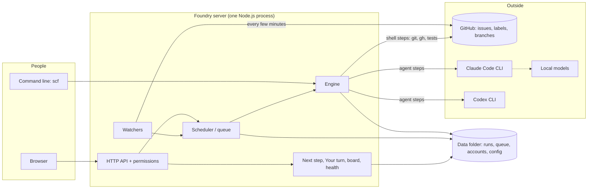
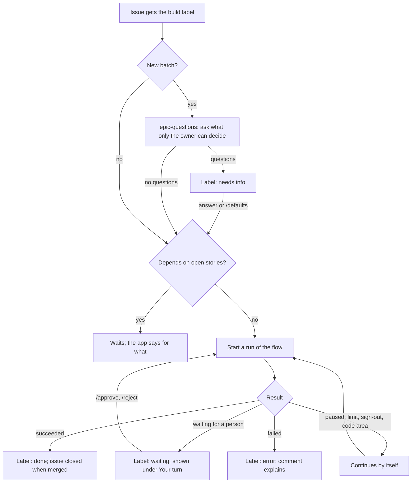
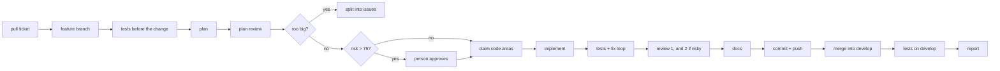
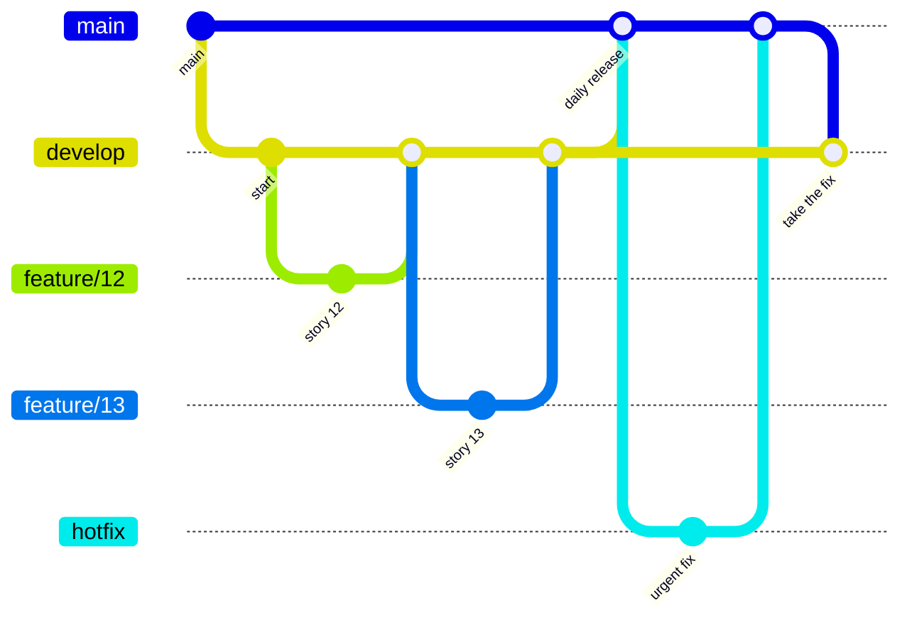

# Spaghetti Code Foundry — design

How the Foundry is built and why. For how to use it, see the [user guide](USER_GUIDE.md); for
the format of flows, [FLOW_AUTHORING.md](FLOW_AUTHORING.md); for the reasons behind many of
these choices, [LESSONS_LEARNED.md](LESSONS_LEARNED.md).

- [1. What it is](#1-what-it-is)
- [2. Design principles](#2-design-principles)
- [3. The parts](#3-the-parts)
- [4. Flows and the engine](#4-flows-and-the-engine)
- [5. Agents and models](#5-agents-and-models)
- [6. The queue](#6-the-queue)
- [7. Watchers: from GitHub issue to merged code](#7-watchers-from-github-issue-to-merged-code)
- [8. The two pipelines](#8-the-two-pipelines)
- [9. Branches: gitflow](#9-branches-gitflow)
- [10. What happens next](#10-what-happens-next)
- [11. Accounts, roles and repositories](#11-accounts-roles-and-repositories)
- [12. Safety](#12-safety)
- [13. Data on disk](#13-data-on-disk)
- [14. The server and its restarts](#14-the-server-and-its-restarts)
- [15. The web interface](#15-the-web-interface)
- [16. Tests](#16-tests)
- [17. Self-repair](#17-self-repair)
- [18. Where it is going](#18-where-it-is-going)

---

## 1. What it is

An AI coding factory that runs on one machine. Work is described as **flows**: YAML pipelines of
agent steps (Claude Code or Codex), shell steps, approvals and branches. The Foundry runs them
headlessly against git repositories — from a task someone types, or automatically from GitHub.

Its main use: put one label on a GitHub issue, and the Foundry asks the open questions, plans,
codes, tests, reviews and merges the story, asking a person only when it has to.


Node.js and TypeScript (ESM), no web framework, no database. About 15,000 lines of source and
2,100 tests.

---

## 2. Design principles

1. **Facts by code, judgement by agents.** Whatever can be checked by a shell step (tests pass,
   size is under the limit, the branch is clean, no secret is pushed) is checked by a shell step.
   Agents plan, write and review.
2. **A person only where a person is needed.** A risk score decides; questions are asked up
   front; everything else continues by itself, at once.
3. **Always say what happens next.** Every story and run has one plain sentence: who acts next
   and what they do.
4. **Runs are isolated and resumable.** Each run has its own folder and its own copy of the
   code. Any run can be continued from the step where it stopped.
5. **State lives in files and on GitHub.** No database. A run is a folder; the queue is a file;
   the backlog and its status are GitHub issues and labels.
6. **Safe by default.** Protected branches, a secret scan, budgets, read-only tools for
   reviewers, permissions enforced on the server.
7. **Text from outside is data.** Issue text, comments and step output never become part of a
   shell command.
8. **Small parts, no magic.** Plain modules, plain JavaScript in the browser, flows generated
   from shared blocks.

---

## 3. The parts



| Folder | What it holds |
|---|---|
| `src/engine/` | Runs a flow: steps, jumps, budgets, guards, resume |
| `src/steps/` | The step runners: Claude Code, Codex, shell |
| `src/agents/` | Choosing agent, provider and model; limits, retries, sign-out |
| `src/flow/` | The flow format (schema), loading, blocks, publishing to users |
| `src/queue/` | Scheduler, watchers, dependencies between issues, status comments |
| `src/server/` | HTTP API, permissions, board, health, Your turn |
| `src/auth/`, `src/credentials/` | Accounts, sessions, repositories per user, stored tokens |
| `src/next-step.ts`, `src/words.ts`, `src/errors.ts` | The one vocabulary: what happens next, status words, explained errors |
| `ui/` | The web interface: plain JavaScript modules |
| `flows/`, `blocks/`, `scripts/build-flows.mjs` | The shipped flows, the block library, and the generator |
| `tools/` | Helper programs that flows call |

---

## 4. Flows and the engine

A flow is a list of **steps**. A step has a type:

| Type | What it does |
|---|---|
| `claude` | An agent step: a prompt, a model, allowed tools. Runs on Claude Code or Codex |
| `shell` | A command. Its output and exit code decide the path |
| `approval` | Stops and waits for a person |
| `parallel` | Runs several steps at the same time |
| `flow` | Runs another flow as one step |

**The path through a flow** is decided by each step's result: `on_success`, `on_failure`,
`routes` (a pattern in the output picks the next step), `pass_if`, and the reserved targets
`next`, `end`, `fail` and `stop`. `max_visits` limits loops such as test → fix → test.
`jump_only` steps run only when another step sends the run there.

**A run** is a folder with `run.json` (status, history of steps, variables, cost), a log per
step, a readable transcript per agent step, and the workspace. The flow definition is stored
with the run, so a resume behaves the same even if the flow changed meanwhile.

**Run states:** `running`, `waiting` (for a person), `stopped` (paused, can continue),
`succeeded`, `failed`, `cancelled`.

**Workspaces.** `worktree` (a git worktree on its own branch), `empty` (the flow clones what it
needs — used by the GitHub flows) or `inplace`.

**Passing information.** A step's output is available to later steps as a template value and as
an environment variable (`$FACTORY_OUT_<STEP>`); flow variables as `$FACTORY_VAR_<NAME>`. This
is how untrusted text travels: as environment variables, never pasted into a command.

**Shipped flows are generated.** `scripts/build-flows.mjs` builds `flows/*.yaml` from shared
pieces (plan phase, test-and-fix loop, review loop, merge). The YAML files are never edited by
hand.


---

## 5. Agents and models

An agent step names what it needs (a model, an effort level, allowed tools); the Foundry decides
where it runs.

- **Two agent programs:** Claude Code and Codex, both run headlessly as child processes.
- **Model specs** such as `sonnet`, `codex:gpt-5`, `ollama:qwen3-coder`; **routing rules** can
  send steps to other models, with fallbacks.
- **Roles in the shipped flows:** a strong model plans, a different vendor's model reviews the
  plan and the code, a fast model writes the code. A reviewer from another vendor finds more
  than a model reviewing itself.
- **Reviewers are read-only.** Coding agents get edit tools and the project's build tools.
- **Failures are sorted** into: a usage limit (pause, try again later), signed out (pause until
  the user signs in), a passing capacity problem (retry after 1 and 3 minutes), or a real
  failure.
- **A clean environment.** Variables of the session that started the server are removed before
  an agent starts; secrets are never placed in an agent's environment.

---

## 6. The queue

One scheduler for all runs:

- A fixed number of **slots** (`concurrency`).
- **Locks**: a flow can ask for one run at a time per repository.
- **Fair use**: with `userLimits` and `startedToday` set (the server passes `effectiveLimits`), a
  user never has more runs active than `maxConcurrent`, and new runs wait once `maxRunsPerDay` are
  started today. `pump()` picks the next job: priority block first, then the owner with the fewest
  active runs, then the owner whose last start is oldest (kept in memory), then queue order, and
  re-evaluates after every start. Jobs without an owner are not limited and form one group.
  Resumes count for `maxConcurrent` only. Today's count comes from `src/queue/usage.ts` (run
  briefs, by run id) plus runs started in the current pump. `queue()` marks waiting entries with
  `limit` (`concurrent` or `per_day`); the status kind `user_limit` shows it without numbers, and
  `queue-stalled` ignores such jobs. The CLI and evals pass no options, so they have no limits.
- A persistent queue file, so queued work survives a restart.
- Runs that were active when the server stopped are marked *interrupted* and continued.
- When a run ends, the watchers of its repository check at once, so the next story does not
  wait for the next interval.

**Code areas.** A plan lists the areas of the code it will change. Before coding, the run claims
them with `tools/area-lock`. If another run holds one, the run **steps aside**: it stops and
frees its slot, and continues when the holding run has stopped working. Documents, Markdown
files and whole test folders are not locked.

---

## 7. Watchers: from GitHub issue to merged code

A watcher checks GitHub on an interval and starts runs. Sources: issues with a label, review
comments on the Foundry's pull requests, a red build, or a schedule.



What a watcher takes care of:

- **Labels as status.** One label is set by people (the trigger). The Foundry sets the others:
  working, done, needs info, waiting, error. At every check the labels are compared with the
  newest run and corrected.
- **Dependencies.** `Depends on` / `Blocked by` in the issue text, by number or by title. A
  story waits until what it depends on is done.
- **Answers on GitHub.** A reply to questions, `/defaults`, `/approve` and `/reject` continue
  the run.
- **GitHub lags.** Before starting anything a second time, the watcher asks GitHub for that one
  issue again.
- **A status comment** on the issue that is edited in place, not a new comment each time.
- **Tidying:** closed issues lose their status labels; runs that wait for a person end when
  their issue is closed.
- **Issue states.** At every check an issues watcher stores whether each issue with an
  unfinished run (failed, stopped, waiting or cancelled, any flow, any age) is open or closed
  (`src/issue-states.ts`). Issues in the open list of the check are stored as open without
  asking GitHub; the rest go in one batched `gh api graphql` call (more than 500 are sent in
  sequential chunks). If the call fails, nothing changes, `failedAt` is set and the watcher
  shows the error `checking closed issues: …`. `knownIssueState(repo, issue)` answers `open`,
  `closed`, `unknown` or `undefined` (no enabled issues watcher). Nothing a user sees uses it yet.


---

## 8. The two pipelines

**Gitflow pipeline (default)** — one label, one flow, a person only for risky plans:



- **Risk score 0–100** from the plan. Above 75: a person approves. Above 50: the plan is revised
  after review, and the code gets a second review.
- **Size limit** (default 15 files, 800 lines). Over it, the story is split into smaller issues;
  a low-risk split happens by itself.
- Supporting flows: `epic-questions` (questions up front) and `release-daily` (the daily pull
  request from `develop` to `main`).

**Human-in-the-loop pipeline** — for teams that want a person at each stage:
`issue-plan` (plan, person approves) → `issue-code-daily` (code on the day's branch) →
`daily-pr` (one pull request per day).

A flow that a watcher uses cannot be deleted.

---

## 9. Branches: gitflow



- Every story: a `feature/…` branch from `develop`, merged back into `develop` as soon as it is
  finished. The tests run on the merge result; conflicts are resolved by an agent and judged by
  the tests.
- Once a day: one pull request from `develop` to `main`, merged by a person.
- Urgent fixes: on `main`, then `main` is merged into `develop`. The hotfix path of `issue-gitflow`
  does this for bug stories; it is off until an admin switches on Hotfixes.
- `main` is protected: runs and agents cannot push to it.

---

## 10. What happens next

One module (`src/next-step.ts`) turns the state of a story or run into one record: **who** acts
next (you, the Foundry, another story, GitHub), **what** they do, **why**, **where** to do it,
and since when. Everything that shows status uses that record:

- **Your turn** — only the items where *you* are next, one button each, sorted by how much work
  they unblock.
- **The board** — every story of a repository in columns.
- **The health line** — problems of the Foundry itself, under the top bar on every page.
- **Since you last looked**, notifications, the status comment on GitHub, and the run page.

Rules of the module: name the root cause (if A waits for B and B waits for you, A says so);
say "nothing — it continues by itself" when that is true; use one vocabulary
(`src/words.ts`); explain errors as *what happened, why, what you can do* (`src/errors.ts`).


---

## 11. Accounts, roles and repositories

- **Sign-in is required** for the web interface. The first account is the admin.
- **Passwords.** A password has 12 to 200 characters and is not on a short list of common ones
  (`common-passwords.ts`). An admin's **reset** removes the hash, ends the sessions and stores a
  24-hour one-time link (only its SHA-256 is kept). Wrong tries are throttled in memory
  (`sign-in-throttle.ts`), not in `users.json`: one counter per e-mail (shared by sign-in and Change
  password) and one per client address. A try is counted before the slow check, so tries that arrive
  together cannot pass the limit; it is given back when the password was right. Entries of stored
  accounts are never dropped for room. A restart clears waits and locks.
- **Two roles.** An **admin** makes flows, watchers and settings and sees everything. A **user**
  runs the flows an admin published, on their own repositories, and sees only their own runs —
  no costs, no setup. Each role has its own display (`/` for admins, `/user/` for users); the
  server still decides what a call may do.
- **Published flows.** An admin decides per flow which variables a user may fill in, which are
  shown read-only and which stay hidden.
- **Repositories per user**, each with its own way of signing in. Tokens are stored encrypted,
  with the key in the macOS Keychain; they never appear in API answers, logs or agent
  environments.
- **Runs sign in with the repository's token.** `executeStep()` asks `stepRepoAccess()`
  (`src/engine/repo-access.ts`) when a shell step has `repo_access` (or is the old by-name
  refinement grant). The lookup happens when the step starts. `repoTokenEnv()` puts the token in
  the step's environment only: `GH_TOKEN`, an empty `gh` folder, and git config entries added
  after the engine's `core.hooksPath` (an empty `credential.helper`, a helper for the repository's
  host that prints the name and token from the environment, no extra header), https only, no
  prompt. A refusal ends the run (`Engine.accessFailed` skips `on_failure`).
  A **deploy key** step gets `<runDir>/sign-in/` (0700) with `key` (0600, via `sshKeyEnv()`), a
  `holder` note (pid and start time) and a `gh` stand-in that leaves a marker and fails with a
  fixed sentence; `repoKeyEnv()` sets ssh-only git, no agent and no `GH_TOKEN`, and the marker
  fails the step after it ends, whatever the script did with the exit code. A **GitHub App** step
  asks `appTokenAccess()` for a fresh token limited to the repository (never cached), used like a
  token; a refusal after its expiry gives the one-hour sentence. A step that holds a credential
  runs in its own process group, killed when the step ends. The folder is removed (key first, one
  chmod retry, a link removed as a link) in the step's `finally`, in `finish()`, in
  `cancelWaitingRun()`, at the start of `drive()` and by `sweepSignInDirs()` at server start,
  which keeps a folder only while its holder's pid runs with the recorded start time. Removal
  fails closed: a folder that stays fails the step or the resume (`SIGN_IN_NOT_REMOVED`).
  Limits: the `gh` stand-in catches `gh` by name only, and a process that leaves its group is not stopped.
- **Runs that never use the machine's login.** `stepIsolated()` (`src/engine/isolation.ts`) is true for
  every run with a user owner and for an admin's run on a repository with a stored sign-in
  (`hasStoredSignIn()`), and fails closed (unknown owner, unreadable file). It is asked per step from the
  scope's `github_repo`. For such a step `isolationEnv()` removes every token variable (`tokenVarNames()`,
  the bot's own included), gives `gh` an empty folder of its own, `GIT_CONFIG_GLOBAL=/dev/null`, no system
  config, no ssh agent or `GIT_SSH`, https and file only, no prompts, `user.useConfigOnly` and a credential
  helper reset (appended after the engine's own `GIT_CONFIG_*` entries, so `core.hooksPath` stays), and sets
  the commit name from `commitIdentity()` (bot name and e-mail from Settings, field by field, else
  `getUser(owner)`). With no identity the step is refused (`NO_COMMIT_IDENTITY`). `engine.botEnv()` gives the
  bot's token and name once per run, only to steps that keep the machine's login. In agent steps
  `agentEnv(spec, true)` ignores `ISOLATED_AGENT_ENV` names, Claude agents are always isolated
  (`--strict-mcp-config`), and a token variable is never an anthropic-compatible provider key. Since #304
  and #305 a user's run is also held by an OS sandbox profile (`os-sandbox.ts`); its agent steps get their
  own agent folders in the run folder and sign in by a token variable only (`src/agents/boxed.ts`).
  Limits: macOS only, and `sandbox-exec` is deprecated; the token is visible to the agent's shell tool; the
  lock and hooks folders can be read; a Codex read-only step is held by the outer profile only; Docker
  steps are held by the container; with `sandbox.user_runs: off` nothing is held; the push hook does not
  run in a Docker step.
- **Permissions are enforced on the server.** Every API route has a rule in
  `src/server/permissions.ts`, and a test fails when a route has none.
- **Blocking** an account signs it out at once, optionally stopping its work.
- An audit log records sign-ins, account changes and what signed-in people do in the web interface. Lines older than `audit.retention_days` (default 180) are removed by the server, in a chunked scan under `auth.lock`.

---

## 12. Safety

| Risk | Measure |
|---|---|
| An agent pushes to `main` | Protected branches: git pushes to them are refused during runs |
| A secret is pushed | A secret scan blocks the push |
| A change touches things it should not | `forbidden_paths`, and a guard step after coding |
| A risky plan is built unseen | The risk gate: a person approves above the threshold |
| Runaway cost or loops | Budgets per run and per day (optional), `max_visits`, timeouts |
| Commands with text from an issue | Issue text and step output travel as environment variables only |
| A reviewer changes code | Reviewers get read-only tools |
| Untrusted test commands | Optional sandbox: Claude Code's sandbox or Docker |
| A run acts with the admin's GitHub login | User runs, and admin runs on a repository with a stored sign-in, get no token, an empty `gh` folder, no machine git settings or ssh, and the bot or owner's commit name; environment only, not an OS sandbox |
| An admin looks at a user's display unseen, or changes things through it | "View as user": an audit line (`view-as`) per start, written first (no line, no view); `as=` only on `GET`, only with a running view for that user, answered by the user's own rules and cut-down views; views in memory only, 30 minutes, keyed by a hash of the session, never the token |
| Someone else on the network | Listens on this machine only, unless set otherwise |
| Private data in a public place | Paths and titles are filtered from what leaves the server unasked |

---

## 13. Data on disk

Everything is in the data folder (`~/.spaghetti-code-foundry`):

| File or folder | Content |
|---|---|
| `config.yaml` | Settings and watchers |
| `runs/<run-id>/` | `run.json`, step logs, transcripts, the workspace |
| `queue.json` | Queued jobs |
| `locks/` | Code-area and run locks |
| `users.json`, `sessions.json` | Accounts and sign-in sessions |
| `notifications.json` | What was already notified |
| `issue-states/` | One file per watched repository: open or closed for each issue with an unfinished run |
| `self-update.json` | The self-update record: `pending` (an install not confirmed yet), `tested`, `failed`, `updated` |
| `flows/` | Your own flows (repository flows live in `<repo>/.claude-factory/flows`) |

Run ids are timestamps, so folders sort by time. Old workspaces are removed by `scf clean`.

---

## 14. The server and its restarts

One process serves the web interface, runs the queue and the watchers. A supervisor notices a
new build and restarts the server — but only when no run is active. Until then it starts no new
runs and tells the user why (`Scheduler.drain()` stops queued jobs from starting; they stay in
`queue.json` for the new server). Runs that were interrupted continue after the restart.

**Self-update.** With `self_update` on, the server (`SelfUpdater`) is the one that decides: it
checks `main` of the named repository, builds and tests the new commit in a git worktree, and when
the active runs are done installs that exact commit in place (`git merge --ff-only`, `npm ci` if
the lock file changed, `npm run build`). It writes a journal first (`self-update.json`, `pending`
with phase `apply`, then `installed` with the build stamp) and exits with the restart code. The
supervisor guards the first start after an install: it reads the journal, finishes going back
when an install was cut off, and puts the previous commit back once when the server stops or
does not confirm in time. The new server confirms with `GET /api/ready` (loopback only) after it
checked that `HEAD` and its build stamp are those of the install. A failed go-back is a terminal
state (`failed.backOk = false`) that a person must repair. The monitor reads the same file.

---

## 15. The web interface

Plain JavaScript modules, no build step, no framework. One page per concern:

| Page | Purpose |
|---|---|
| Your turn | What waits for you |
| Board | Where every story is |
| Flows, Library | Edit and create flows; reusable blocks |
| Runs | Every run, live log, steps and transcripts, changes |
| My repositories | Your repositories and how the Foundry signs in |
| Watchers | Automation from GitHub |
| Models | Agents, providers, routing |
| Dashboard | Cost, success rate, where runs fail |
| Settings | Budget, network, safety, notifications |


**Two displays.** The admin page is `ui/index.html` with `ui/app.js`; the user display is `ui/user/index.html` with `ui/user/app.js`, served at `/user/` and `/user`. The user script imports only shared modules by absolute path (`/auth.js`, `/dom.js`, `/runs.js`, `/repos.js`, `/refinement.js`) and its own `/user/start.js` and `/user/runs.js` (it no longer imports `/runs.js` directly; that module is reached through `/user/runs.js`), and no admin module; a test checks this. `ui/user/runs.js` draws My runs (cards, queue, Remove) and the run page of a user (Now, Log, Steps, Changes, and the Approve/Reject dialog, Retry and Cancel); it reuses the helpers of `ui/runs.js` and `ui/next.js` and draws only the server's cut-down view. `ui/user/start.js` (the Start work page) imports relatively (`../api.js`, `../auth.js`, `../dom.js`, `../repos.js`) so a test can load it; in the browser these are the same module instances as the absolute ones. Both entries call `enterDisplay` in `ui/auth.js`: it signs in, and an account of the other role is sent to its own display before any page is drawn. The redirect is in the browser and is for comfort only; the server enforces permissions on every call, and the scripts are plain static files.

Dialogs (`modal()` in `ui/dom.js`) take the focus, keep Tab inside, close once on Escape and give the focus back to the opener. `mount()` keeps the focus on the control with the same `data-focus` name when a page draws itself again.

---

## 16. Tests

- About 2,100 tests in 78 files (vitest), run before every change is accepted.
- **No real services.** Fake `claude`, `codex` and `gh` programs and a local git remote let
  whole flows run in seconds.
- Each test run has its own temporary data folder.
- Documents are checked too: flow examples in the authoring guide must validate, and the error
  texts in the user guide must match the code.

---

## 17. Self-repair

The Foundry watches itself and repairs what it can, in one loop:

```text
detectors → findings file → Reporter → bug story → goes first → hotfix → fix commit → 24-hour watch
```

- **Detectors** (`src/monitor/detectors.ts`, `work-detectors.ts`) read runs, queue, watchers and the
  server log. Findings are kept in `monitor-findings.json`.
- **The `Reporter`** (`src/monitor/report.ts`) turns a finding that lasts into one GitHub issue with
  the labels `bug` and the build label, from a fixed template, after cleaning (`clean.ts`).
- **Goes first.** The issue watcher builds a `bug` story before any other work, as a hotfix on `main`
  when Hotfixes are on. Only the unchanged built-in `issue-gitflow` may push `main`, in its step
  `push_main`.
- **The fix commit** is read from the finished run (`COMMIT:` of `push_develop`, `MAIN:` of
  `hotfix_done`). The 24-hour clock starts when the running Foundry has it; after 24 hours of normal
  work without the problem the finding is *fixed* (`src/monitor/fix.ts`).
- **Guard rails** (`guard.ts`, `breaker.ts`, `mutes.ts`): off by default, cleaning, one story per
  problem, 3 a day and 1 per check, quiet time, circuit breaker, never a story about a story, two
  tries, mutes.
- **Proof.** `tests/self-repair-incidents.test.ts` replays four real incidents with the real
  Monitor, Reporter, Watcher and flows; only the edges are fake (`gh`, `claude`, the git remote and
  the clock). `tests/self-repair-rules.test.ts` proves the five rules. See the
  [user guide](USER_GUIDE.md#13-self-repair-for-admins).

---

## 18. Where it is going

- **Refinement:** (story drafts and the session's Epic are stored in the session; `src/refinement/draft.ts`
  has the schema and the pure `saveTyped` and `preview`, and each text and list item records `typed`,
  `accepted` or `accepted-edited`. The stored `dependsOn` list is the truth; the preview is text for
  reading, not for parsing back.) (the architect's read is built: `askArchitect` in `src/refinement/architect.ts`
  queues the shipped flow `refine-brief` with source `refinement <session id>`, the only way in;
  the scheduler's `onFinished` hook and every session read settle the end of the run into the
  session, which keeps the latest brief and the current run. The question round is the shipped flow
  `refine-round`, whose `check_round` step is `tools/refine-round-check`; the token grant of
  `src/engine/guards.ts` is per flow, and `isRefinementFlow()` guards user starts, publishing and
  deletion. A round and an own question start the same way: `askArchitect(deps, actor, id, { kind })`
  with kind `brief`, `round`, `question`, `suggest` or `review` (a review needs only the draft: `ask=review`, stored beside the
  draft by `setReview` in `src/refinement/draft-review.ts` with the text each remark was about, so `reviewView` marks it `stale`;
  `moveToNotes` there moves a text with a plan or how remark to the notes; the code checks are the pure
  `src/refinement/draft-check.ts`, computed in `view()` and never stored) (a draft and a field; `ask=suggest`, the field as flow
  variable, a cost limit of $1; suggestions are stored beside the draft by `addSuggested` in
  `src/refinement/draft.ts`; the task is built by `suggestText()`, whose third line holds the ids behind
  R1/E1/D1 so an orphan run can be adopted; a criterion's `tie` must name a rule or example, checked on load)
  queues `refine-brief` or `refine-round` (`ask=round` or
  `ask=question`); the talk goes in as `task` only, built by the pure `talkText()` in
  `src/refinement/talk-text.ts` (at most 90,000 bytes: oldest rounds, then the brief, then the end are
  left out, with a notice). The end is read from the step `check_round`, checked again with zod, and
  stored by `endArchitectRun` (a round, an answer or a failed mark that leaves the talk unchanged); an
  orphan run is adopted with its kind and question read back from the job's flow and task, and a run
  keeps free the log lines its end needs. The talk — rounds, answers, waiting proposals and the map — is stored in the session (`src/refinement/talk.ts`); `recordRound` is the way in for a round's result.) Help people write good stories before they reach the backlog, in the role of
  an architect — asking, checking against a Definition of Ready, showing impact and risk. The
  person stays the author.
  A split is confirmed by `confirmSplit` in `src/refinement/draft-parts.ts`: the parts are new drafts appended in plan
  order, and the original keeps `splitInto` (the part ids) while each part has `part: { of, hint? }`. Order is by
  position: a part may depend only on an earlier part, never on a later one or on its original (`partOrderProblem`,
  checked by the schema, `saveTyped` and `acceptSuggestion`). A draft with `splitInto` is never ready and is never
  published: the plan and the publish call use `withoutSplits` (`publish.ts`), which drops the original and points drafts that depended on it at each of its parts, in memory only, and `leftBehind` reports originals that still hold criteria; a part cannot be split again; a published draft cannot be split. The import rule: `draft-parts.ts` may
  import values from `draft.ts` and `draft-split.ts`, but `draft-split.ts` imports only types from `draft.ts`.
- **Multi-user completion:** separate watchers per repository, runs with the repository's own
  credentials, fair-use limits.
- **Later:** e-mail, per-user agent accounts, more than one machine.
