# Spaghetti Code Foundry user guide

Spaghetti Code Foundry runs **flows**: pipelines of steps that code, test, review and ship
changes with AI coding agents on your own machine. Its main use: put one label on a GitHub
issue, and the Foundry asks the open questions, plans, codes, tests, reviews and merges the
story — and asks you only when it has to.

This guide walks through the web UI, writing your own flows, automating work from GitHub,
choosing models, and keeping it all safe. How it is built is in [DESIGN.md](DESIGN.md); what we
learned building it is in [LESSONS_LEARNED.md](LESSONS_LEARNED.md).

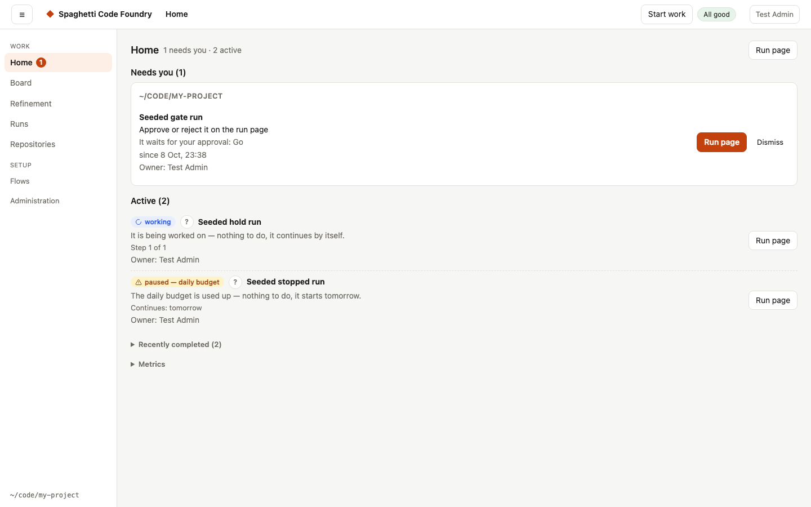

*The pictures in this guide are made from test data: the repository `acme/app`, the accounts Test Admin and Ann, and runs named "Seeded … run".*

Formerly **claude-factory**. The command is now `scf` (`factory` still works), the repository is `MeloMar-IT/spaghetti-code-foundry` and the data folder is `~/.spaghetti-code-foundry` (see [section 11](#11-upgrading-from-claude-factory)). The `<repo>/.claude-factory` folder, the labels (`claude-factory`, `factory:*`) and `factory/…` branches keep the old name.

- [1. Start](#1-start)
- [2. Run a flow](#2-run-a-flow)
- [3. Follow, approve and resume runs](#3-follow-approve-and-resume-runs)
- [4. Write your own flows](#4-write-your-own-flows) — or [let any AI write one](#let-any-ai-write-a-flow)
- [5. Models, agents and routing](#5-models-agents-and-routing)
- [6. Automate with watchers](#6-automate-with-watchers)
  - **[Label cheat sheet: which label does what](#the-label-pipeline-one-label--plan--code--one-pull-request)**
- [7. Settings and safety](#7-settings-and-safety)
- [8. Costs, dashboard and evals](#8-costs-dashboard-and-evals)
- [9. Command line](#9-command-line)
- [10. Troubleshooting](#10-troubleshooting)
- [11. Upgrading from claude-factory](#11-upgrading-from-claude-factory)
- [12. Refinement](#12-refinement)
- [13. Self-repair (for admins)](#13-self-repair-for-admins)

---

## 1. Start

Install it (see the [README](../README.md)), then start the UI from the repository you want
to work on:

```bash
cd ~/code/my-project
scf ui
```

The UI opens at **http://localhost:4777**. By default it only listens on your own machine; see
[Access from other computers](#access-from-other-computers). The path in the
top-right corner is the repository runs work on by default.

**First start.** The first time you open the UI there is no account yet, so it shows
**Create the admin account**: enter a name, an e-mail and a password (12 to 200 characters, not a common one,
twice). That signs you in. You can also create the admin in a terminal with
`scf user create --admin`; `scf ui` and `scf serve` print a hint while there is no admin. After
an upgrade from a version without sign-in, do this once; nothing else changes. The CLI, the
watchers and runs that are already going do not need an account.

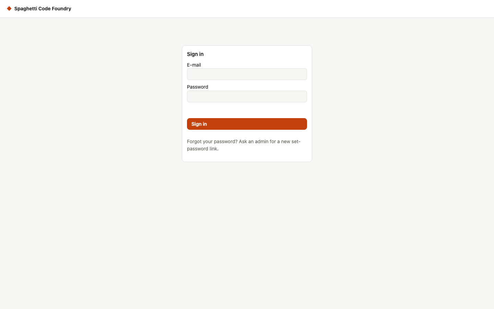

**Sign in and out.** After that, the UI shows a sign-in form. Your name and a **Sign out**
button are in the top bar. You stay signed in for 7 days, or until you sign out. A password
change or a block (`scf user password`, `scf user block`) signs that account out at once. If you
are blocked, you cannot sign in. If the session ends while a page is open, the next action
brings you back to the sign-in form.

**Forgot password.** The sign-in form says so: ask an admin for a new set-password link (the admin
uses **Reset password** on the Users page), or run `scf user password <e-mail>` on the machine.

**Change password.** **Change password** in the top bar asks for your current password and the new
one (twice). The new password follows the same rules (12 to 200 characters, not a common one).
Your session stays; every other session of your account is signed out. A wrong current password
counts like a wrong sign-in (see "Wrong passwords" in [Settings and safety](#7-settings-and-safety)).

**Appearance: theme and density.** **Appearance** in the top bar, next to **Change password**, opens a
dialog with two choices. **Theme** is System (follows your device), Light or Dark. **Density** is
Comfortable or Compact. A choice applies at once, with no reload. The chosen option has a check mark and
is announced as pressed, so it does not depend on colour. The choice is kept in this browser, per
account, and is not sent to the server: a second account in the same browser has its own, and another
browser starts with System and Comfortable. The sign-in form uses the last choice. Other open tabs pick
up a change when they reload. If the browser blocks storage, the page still works with System and
Comfortable.

**Set-password link.** A new account may get a link instead of a password. Open it in the
browser's address bar, type the password twice, and press **Set password**. Then sign in with it.
The link works once and for 24 hours. If the page says "this link is not valid any more", ask your
admin for a new one.

| Place | Pages in it | What it is for |
|---|---|---|
| **Home** | — | What needs you, what is running, what finished, and the best next step; the app opens here when something waits. The old address `#/your-turn` still works. See [Home](#home) |
| **Board** | — | Where every story is, in columns per repository |
| **Refinement** | — | Where a rough idea grows into a story before it goes to the backlog |
| **Runs** | — | Everything that ran or is running; the ones that need you on top |
| **Repositories** | — | The repositories you work in, and how the Foundry signs in to them |
| **Flows** | Flows, Library | Flows: Your flows and the built-in ones: edit, create, run. Library: Reusable blocks of steps to drop into flows |
| **Administration** | Problems, Watchers, Models, Dashboard, Users, All repositories, Credentials, Audit, Settings, Maintenance | What the monitor found. Watchers: Automatic runs from GitHub issues, PR comments, red CI, or a schedule. Models: Which agents and models are available, and which model runs which step. Dashboard: Spend, success rate, where runs fail, eval results. Users: The accounts: add, edit, block and delete them (admins only). All repositories: The repositories of all accounts, their settings, and transfer to another account. Credentials: The stored credentials of all accounts, without any secret. Audit: Who did what, with filters and a CSV export (admins only). Settings: Budget, safety, notifications, bot identity. Maintenance: Clean up old run workspaces |

**Navigation (admin display).** A sidebar on the left groups the places: **Work** has **Home**, **Board**, **Refinement**, **Runs** and **Repositories**; **Setup** has **Flows** and **Administration**. **Start work** is a button in the top bar, not a place. The top bar also has the menu button, the name of the page, the health chip and your account menu (**Change password**, **Sign out**). Press the health chip to open or close the full health line; it opens by itself when something is wrong. The number of items waiting for you shows on **Home** and on the menu button. The menu button closes and opens the sidebar, and the browser remembers your choice. On a narrow screen (up to 760 px wide) the sidebar is a menu over the page: **Close menu**, Escape, pressing outside it or choosing a link closes it, and Tab stays inside it while it is open. The current place is marked for screen readers; the main area is named after the page, focus moves to it after each page change, and the new page is announced. **Skip to content** is the first control. Under the top bar a second row groups the pages of one place: Repositories (My repositories only), Flows (Flows, Library) and Administration. Administration has labelled sections: **Operations** (Problems, Watchers, Models, Dashboard), **People and access** (Users, All repositories, Credentials, Audit) and **System** (Settings, Maintenance). A line of breadcrumbs shows where you are on detail pages (one run, one flow, one board, one refinement session); the tab title names the page. An address that is empty or unknown opens Home. All old addresses keep working.

An account with the role `user` works on its own display at `/user/`, with **Home**, **My runs**, **My repositories** and **Refinement** in a sidebar (a menu on narrow screens), **Start work** as a button in the top bar, and an account menu with **Change password** and **Sign out**. It has no admin links, folder name, health line or "since you last looked" line. If a user opens `/`, they are sent to `/user/`; the address is kept when it is Home, Start work, My runs, one run, My repositories, Refinement or one session, and dropped otherwise (an admin never keeps `#/start`). An admin who opens `/user/` is sent to `/`. With no address, a user lands on [Home](#home), which offers **Start work** when there is nothing yet.

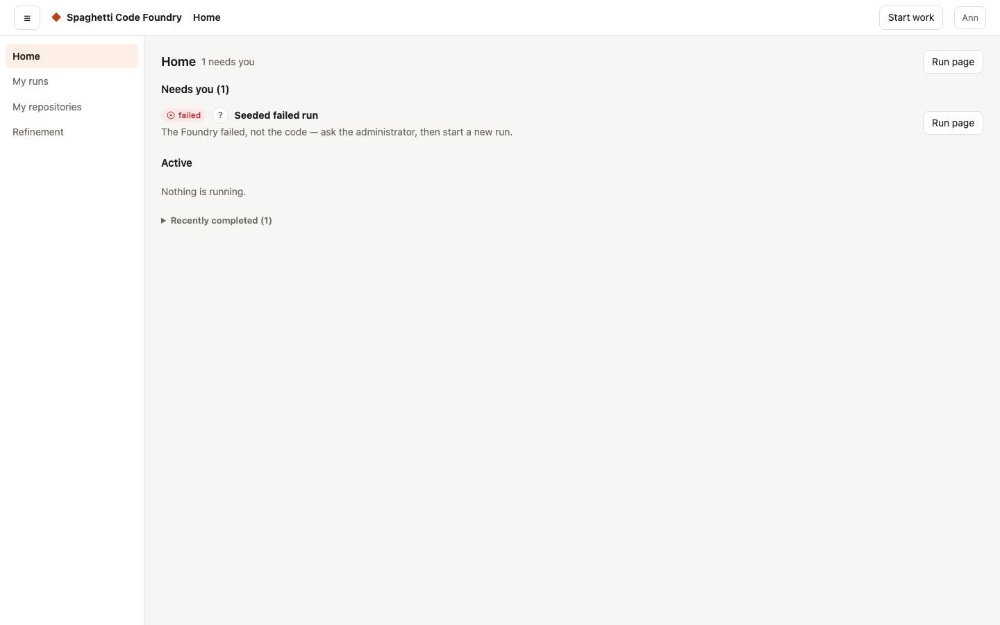

**Start work.** Three steps on one page. (1) Pick a flow: every published flow shows its title and description; the first is chosen. With none, the page says "No flows yet. Ask your administrator to publish one." (2) Pick the repository, when the flow has the input `github_repo`: your GitHub repositories as `owner/name`, each with its status (Connected, Failed or Not tested yet). **Add repository** opens the usual dialog; afterwards the list is loaded again and the new repository is chosen. With no repository the page says so. If the flow fixes the repository, it is shown and cannot be changed; with no repository field there is no step 2. (3) Fill in the details: a **Task** box when the flow uses the task, then each field the flow asks for, with its help text and default and "(required)" where it must be filled in; fixed fields are shown as text. **Start** starts the run and opens its page. An empty required field shows a message and nothing is sent; if the server refuses, its sentence is shown and what you typed stays. While the call runs the button is off. Each flow keeps what you typed when you switch to another and back. You can reach every control with Tab and send the form with Enter, or with Ctrl/⌘+Enter in the Task box.

**My runs.** Your runs as cards, newest first, with the ones that need you on top. A card shows the status (with its "?"), the flow, the first line of the task, the repository and issue, one sentence about what happens next, and when it started. The flow name is a link: reach it with Tab and open it with Enter. A queued run says "n runs ahead of you" and has a **Remove** button; it asks first, and the run does not start. The list refreshes by itself every 30 seconds and only redraws when something changed. While it loads you see placeholder cards. If a refresh fails, the cards stay and a note says "Could not refresh. Showing data from …" with **Retry**. If the list cannot be loaded at all, you see the reason with **Retry**. With no runs it says "No runs yet." and offers **Start work**.

**The run page.** A header at the top stays in place when the run updates. It shows the task as the title, the status with its "?", the repository and issue or PR, the branch, when the run started and how long it ran (or has been running), and "resumed N×". Under it come the failure card or **Now**. The page also shows **Now** (what happens next, and the step the run is at, with what that step does), the task, the repository, the branch and the flow version. Three parts: **Log** (live), **Steps** (the finished steps; they cannot be opened) and **Changes** (what the run changed, or a line that there is nothing). Buttons show when they apply. **Approve** and **Reject** open a dialog with an optional note, for a run that waits for your decision. **Retry from the failing step** is for a run that failed, stopped or was cancelled and has a step to continue at; it is the one filled button, except while the answer form is shown (then **Send answer** is the main action). **Cancel** is for a run that is running, waiting or queued, and asks first; a run that is queued can only be cancelled. If the server refuses an action, its sentence is shown and the page stays usable. A run from an architect session is continued from that session, so it has no Approve, Reject or Retry here. A failed run shows what happened, why and what you can do. A run that stopped because the planner has questions shows them as text under **Questions**: the planner's own text, the same as in the comment on the issue. The page shows the first 4,000 characters; a longer text is cut, and the whole text is in the comment. "Retry from step…", the owner, costs and raw details belong to the admin display. While the run loads you see a placeholder page. If the run does not exist (or was removed) you see "This run was not found. It may have been removed." with a link back; if you may not see it, you see that, with a link back; any other failure shows the reason with **Retry**. If the live connection to the run is lost for good, a red banner says "Lost connection to the run stream" with **Reconnect**. The page keeps showing the last head, steps and log; **Reconnect** opens the stream again, and the banner goes when the next update arrives. If the transcript or the changes cannot be loaded, the reason shows in that place with **Retry**.

**Keyboard.** Every link and button can be reached with Tab and shows a focus mark. A dialog takes the focus when it opens, keeps Tab inside, closes with Escape, and gives the focus back to the button that opened it. On a narrow screen the top bar wraps and a wide table scrolls inside its own box.

| Where | Keys |
|---|---|
| Whole page | Tab and Shift+Tab move between controls. Enter opens a link or presses a button; Space presses a button. There are no single-key shortcuts. |
| Dialogs | Escape closes. Tab stays inside. Focus returns to the button that opened it. |
| Help mark (**?**) | Enter or Space opens, Escape closes. |
| Board | Tab to a card, Enter opens it. |
| Runs table | Tab to the status link in the first cell, Enter opens the run. |
| Run log | Tab to the log, then the arrow keys, Page Up/Down, Home and End scroll it. |
| Editor | Tab moves between fields. Escape closes its dialogs. |
| Forms | Tab moves between fields. The arrow keys change a select. Enter sends the form. |

**Pages that refresh themselves.** Your focus stays on the same control after a refresh. If that control is gone, focus moves to the page heading. A refresh waits while a select or text field in it has focus, or while a dialog is open. When a run changes status while you look at it, a screen reader announces it once. The run log is read out politely as lines arrive. The Board also keeps its scroll, up and down and sideways, when it redraws, and shows "Updated HH:MM". If a refresh fails, the cards stay and a message says "Could not refresh. Showing data from …" with a Retry button; the next good refresh removes it. A hidden browser tab makes no requests; when you come back, the Board refreshes once. On the admin Home, Needs you and Active refresh on their own, so one failing does not stop the other, and each has its own Retry. If only the health request fails, Problems keep the last answer and show "Problems could not be refreshed. Showing the last answer." until the next good answer.

**Under the top bar of the admin page** (not on the user display) is the health line. It says "All good", or names what is wrong with the
Foundry itself, and on the right when each repository was last checked.

#### The day in four steps

1. Put the build label on your issues on GitHub (or let a watcher's schedule do the work).
2. Open **Home**. Answer questions and approve risky plans; one button each.
3. Look at **Board** when you want to know where a story is and why.
4. Merge the daily release pull request when it shows up under **Needs you** on Home.

Everything else continues by itself.

Everything the UI does is also available from the command line (see [section 9](#9-command-line)).

### Old and new interface

**How to switch.** There is nothing to switch. After the update every account sees the new interface. A setting to go back is not built.

**What moved where.**

| Before | Now | Address |
|---|---|---|
| Your turn | Home (Needs you) | `#/your-turn` |
| Library | Flows → Library | `#/library` |
| My repositories | Repositories → My repositories | `#/repos` |
| All repositories | Administration → All repositories | `#/all-repos` |
| Credentials | Administration → Credentials | `#/credentials` |
| Users | Administration → Users | `#/users` |
| Watchers | Administration → Watchers | `#/watchers` |
| Models | Administration → Models | `#/models` |
| Problems | Administration → Problems | `#/problems` |
| Dashboard | Administration → Dashboard | `#/dashboard` |
| Audit | Administration → Audit | `#/audit` |
| Settings | Administration → Settings | `#/settings` |

**Start work** is now a button in the top bar.

**When the old one goes away.** It already has. The old menu was replaced in place, and all old addresses keep working.

**More.** The state of the rollout is in [ui-redesign/rollout.md](ui-redesign/rollout.md).

---

## 2. Run a flow

Pick a flow on the left, press **▶ Run**, describe the task and start it.

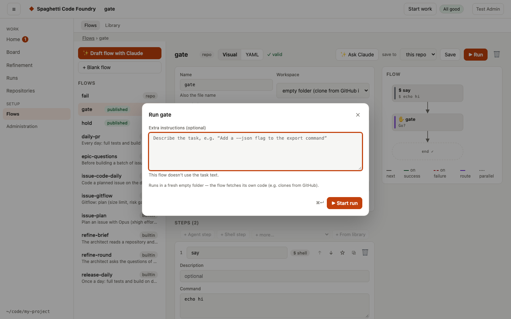

- **Task** — what you want done, in plain language. Flows use it in their prompts.
- **Repository** — the local git repository to work on.
- **Variables** — settings the flow exposes, e.g. `test_cmd`. Leave `auto` to let the Foundry
  detect the test command (npm/pnpm/yarn, pytest, Go, Cargo, Gradle, Maven, Make).

**Your checkout is never touched.** Depending on the flow's *workspace* setting, a run works in:

| Workspace | Where the run works |
|---|---|
| `worktree` (default) | A new git worktree on a `factory/<run-id>` branch of your repository |
| `empty` | An empty folder; the flow clones what it needs (used by the GitHub flows) |
| `inplace` | Directly in the repository — only for flows you trust |

When a run finishes, its branch stays in your repository. Review it, merge it, or delete it.

### Start work as an admin

An admin can also start a run the way a user does. Open **Start work** (`#/start`, before **Runs**). It lists the published flows and your repositories (My repositories), and asks for the task and the inputs the flow publishes. If no flow is published you see "No published flows yet. Publish one in the flow editor." After **Start** you land on the run page. The run is yours and shows in **Runs** with you as owner.

The same rules as for a user apply: only a published flow, only your own repositories, and no changes to the flow or its variables. The **▶ Run** button of the flow editor works as before.

---

## 3. Follow, approve and resume runs

### Home

**Home** is the first page. The top shows the counts (for example "2 need you · 1 active") and one button, the best next step: the first thing that needs you, then a problem, then a run that is active, else **Start work**.

- **Needs you:** the same list as [Your turn](#your-turn).
- **Active:** work that is running or queued. Each row says what happens next.
- **Problems (admin):** problems of the Foundry that Needs you does not already show.
- **Recently completed:** closed until you open it.
- **Metrics (admin):** closed until you open it; a link goes to the Dashboard (Administration → Dashboard).
- **Each row:** one main button and a **Details** link to the run. A section shows 5 rows and "+n more".
- **Empty and all clear:** with nothing yet, Home offers **Start work**; when nothing needs you it says "Nothing needs you."
- **Users** see only their own work: no cost, model, health or other accounts.

Home asks again every 30 seconds.

**Messages and confirmations.** After an action a short message appears and goes after a few seconds. An error message stays until you close it with ✕. A screen reader reads each message once. Anything you must still do stays on the page, not in a message. A dangerous action asks first in a dialog where focus starts on **Cancel**; Escape cancels. **Dismiss** on Home and **Drop** in Refinement show **Undo** in the message. Undo on Home brings back only the item you dismissed. Undo stays until you use it, close it or another message replaces it. A dropped session shows Undo only when it is yours.

**Repository pages.** My repositories, All repositories and Credentials show a grey table while they load. If they cannot load, you see what went wrong and **Retry**; without permission you see that instead. If the list cannot be loaded again after an action, the old list stays with a note and **Retry**. If the sign-in methods cannot be loaded, the list still shows, with a note that you cannot add a repository now. A failed connection test stays on the row ("Connection failed" with the reason) until the next test, and the button reads **Test again**. After you add a deploy-key repository, a note on the page asks you to add the public key as a deploy key on GitHub; it stays until the connection works. **Remove** and **Generate a new key** ask first in a dialog. A read-only preview shows no action buttons.

### Your turn


**Your turn** lists only what waits for you, one button each: questions to answer, approvals, failed or stopped work, a release pull request to merge, and a watcher that has an error. It never lists work that is running, queued, paused by a limit or waiting for another story, and never evaluation runs.

- **The monitor:** admins also see an item when the circuit breaker stopped bug stories, and one item per finding that needs a person (two bug stories did not fix it). That item shows the sentence, the evidence and links to the two stories. It cannot be dismissed; it goes when you press **Try again** or mute the finding on the Watchers page (Administration → Watchers; see "Two tries, then a person").
- **Owner (admins):** an item that has a run shows the owner's name, `deleted user` when the account is gone, and nothing otherwise. Users see no owner name.
- **Order:** the item that holds back the most stories comes first, then the one that waits longest. Items are grouped by repository.
- **Each item:** what it is, why it waits, the action, and since when. The button opens the place to do it (GitHub in a new tab, or the run page).
- **Runs you started yourself** (UI or `scf run`) count when they wait for approval, at any age, or when they failed or stopped in the last 7 days. Failed release, CI-fix and review runs started by a watcher show the same way. Runs of older versions have no record of who started them and are treated like watcher runs.
- **Answer and approve here:** for an item of a watcher, buttons next to the GitHub link do the work. **Show questions** has **Accept all recommendations** (only for questions asked up front) and **Answer…** (a box per question; each needs an answer, and **Use recommendation** fills one in visibly). **Show plan**, **Show split** and **Show request** show the risk and **Approve** / **Reject** (say what to change). A failed item has **Retry** and **Retry with a hint…**. Each action is a normal comment on the issue under the Foundry's GitHub login, signed with your name, so replying on GitHub still works. Approve and reject need write access for that login. The item then shows under **Done — continuing**.
- **Dismiss** hides an item. It stays hidden until its situation changes (a new question, a new approval, a new failure). **Show again** at the bottom brings all dismissed items back. Watcher errors cannot be dismissed. Dismissals are kept in `your-turn.json` in the data folder.
- **No refresh needed:** the page updates every 5 seconds. When you come back from a GitHub link, the watcher checks GitHub at once. An answer you give elsewhere shows at the next watcher check.
- **Closed on GitHub, run still working:** such an issue is listed, with a link to the run (the Runs page while the run is only queued). Cancel the run if the work is no longer wanted, or Dismiss it to let the run finish.
- **Closed issues:** a failed, stopped, waiting or cancelled run of an issue that is closed on GitHub is not listed, not counted, not a card on the Board and not in the failed list of "since", and nothing is sent for it. This holds for every run, whoever started it, except a run that closed its own issue (for example a hotfix that could not be merged back to `develop`). Its Runs page shows "Nothing — the issue is closed" and no Approve, Reject, Resume or Retry. If the last check of the issue on GitHub failed and nothing is stored, the item stays listed with the note "The state of the issue on GitHub could not be checked". If the issue is opened again, the run is listed again.
- **Retired flow:** a run that a watcher started (or that has no source) and whose flow no longer exists in any flow folder cannot be resumed. Its Runs page shows "This run's flow is retired — it cannot be resumed." and no Approve, Reject, Resume or Retry; Your turn offers no Retry for it. The record says to start over (failed) or to start a new run (stopped, cancelled, interrupted). The three API routes answer 409 `The flow "<name>" is retired — this run cannot be resumed. Start the work again with a current flow.` and `scf resume|approve|reject` refuse without `--force`. A run you started by hand is never retired. If the issue is closed, the closed message comes first.
- **Checked every minute:** the Foundry checks that the Board, the watchers, the runs and this page agree. The result is on the [Dashboard](#dashboard).
- **Empty:** it says "Nothing needs you." and, when it can, how many stories are being built and when the next release pull request is expected.
- **Badge:** the number of items shows in the navigation and in the tab title, for example "(3) Foundry". When something waits, the app opens on this page.
- **Notifications:** new items can also reach you as a macOS or Slack message; see **Notifications** under Settings.

### Since you last looked

When you open the app after a break of 30 minutes or more, a strip under the header sums up what changed since your last visit. Each line has links.

- **Stories done:** the run succeeded and committed the story.
- **Merged into develop:** the run pushed the story to `develop`. This counts even if a later step failed. A story shows under one of these two lines, from its newest run.
- **Releases to main:** a release pull request or the rolling Foundry pull request was merged. Other pull requests do not count.
- **Failed:** runs that failed. A run that a newer run of the same issue replaced, or that was interrupted, is left out.
- **Newly waiting for you:** items that started to wait for you since your last visit. The line links to **Needs you** on Home.
- **Only the newest five** of each line are listed, followed by "+N more".
- **Per browser:** the time of your last visit is kept in this browser and shared by its tabs. **Dismiss** hides the strip in all tabs. Nothing shows when nothing changed.
- **Notes:** if GitHub could not be read, or a limit was reached (20 repositories, 200 merged pull requests, 2000 finished runs), the strip says so. If that leaves it empty, it stays hidden and tries again after 5 minutes.
- Flows that have no step named `commit` or `push_develop` never show stories as done or merged.

### The health line

A line under the top bar of every page says **All good**, or the number of problems of the Foundry itself and one line for each: who has the next move, what to do, why, "Continues: …" when it continues by itself, and a link to the place to act. The sentences come from the server, so they read the same as on the other pages. It asks again on every page change and every 30 seconds while the tab is visible. A hidden tab does not refresh the line; it asks once when you return. The count in the tab title keeps updating. When the server does not answer, the line says so (once, not on every refresh).

- **A restart is waiting:** "A new version is waiting — it restarts after 2 runs." The number is the runs that are active or queued.
- **A usage limit:** one line per agent (Claude, Codex), not per run, with the time it continues. It shows for an hour after the run stopped; a watcher tries again every 30 minutes, so a limit that lasts keeps showing. A used-up daily budget is a problem too; the link goes to Settings.
- **A watcher error:** it names the repository, for example "The watcher for acme/app can't reach GitHub", with the action to check the network and `gh auth status`. Equal sentences for one repository show once. A watcher that has not checked for 3× its interval shows too, except while the server waits to restart (the watchers are stopped on purpose then).
- **An issue closed on GitHub while its run still works:** with a **Cancel run** button. A dialog asks "Cancel this run?": **Keep running** changes nothing, **Cancel the run** cancels that run and reloads the line. You can resume the run later, unless the issue is still closed (see below).
- **A run of a closed issue:** Resume, Approve, Reject, **Retry** and **Retry with a hint…** look at the issue on GitHub first. If it is closed they are refused (409) with "The issue is closed — nothing to retry. Reopen the issue if the work is still wanted.", and no label or comment is posted. After a reopen they work again. The check uses the GitHub access of the run's owner (stored token or GitHub App); a run without an owner uses the server's `gh`. With a deploy key, or when access is refused, the Foundry cannot ask GitHub. When GitHub cannot be reached, only an issue stored as closed is refused; otherwise the run continues. The answer is stored only for a repository with an enabled issues watcher. A run without an issue makes no GitHub call. `scf resume`, `scf approve` and `scf reject` print the same sentence plus "Use --force to resume it anyway."; with `--force` they run. If the check cannot be made, they print one line and continue.
- **A run that failed because of the Foundry:** the newest run per issue that no newer run replaced, from the last 7 days, at most 5. The line says "The Foundry failed, not the code" with the fix and a link to the run; the reason is on the run page.
- **Last check per repository:** each repository of an enabled watcher is listed with the time of its last successful check (the oldest, when it has several watchers), or "no successful check yet".

- **Version and update:** when the Foundry runs from a git checkout, the line ends with "Version abc1234 · date". With [self-update](#self-update) on, it adds "An update is waiting (abc1234): …" with the reason, or why self-update does nothing. This is information, not a problem: it does not change "All good".

The same data is at `GET /api/health`: `ok`, `summary` ("All good", "1 problem", "N problems"), `problems` (records like those of `GET /api/next`), `repos`, and when there is one `version` (`commit`, `date`) and `update` (`waiting`, `commit`, `text`). It holds no settings, tokens or paths, and links are only `https://…` or `#/…`.

Problems with skill folders (see [Skill sources](#skill-sources)) count as problems too: one line names the source (for example `administrator`) and the package folder, never a path. A pinned package that changed (with both digests) and an unreadable skill lock (`skill lock`) are listed first; see [Pinned versions and integrity](#pinned-versions-and-integrity). `GET /api/health` lists at most 20 as `skillProblems` (`source`, `root`, optional `package`, `reason`) and the rest as `skillProblemsMore`; `scf skills` lists all of them with full paths.

When the monitor has stored findings, the line also links to the [Problems page](#the-problems-page):
"N open findings of the monitor", or "Findings of the monitor (none open)". It does not change
**All good**. In `GET /api/health` this is `monitorFindings` (`open`, `total`, and `unreadable`
when the findings file cannot be read): counts only, never a name.

### The board

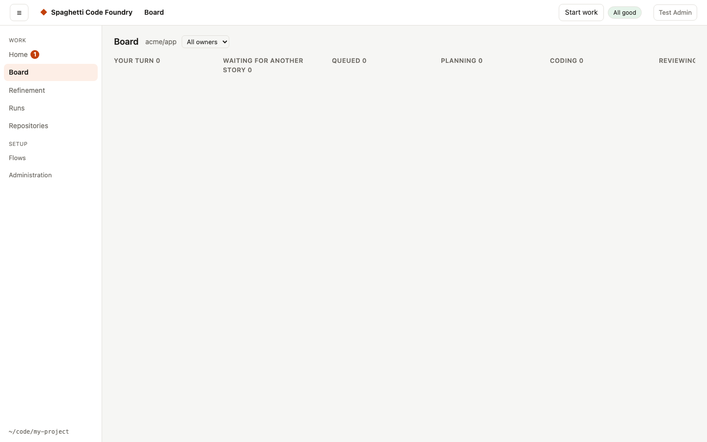

**Board** shows where every story is, like a parcel tracker. There is one board per repository; with more than one repository you get tabs.

- **Columns:** *Your turn* (something waits for you; here it also holds a run you stopped yourself, which the list on Home does not show), *Waiting for another story*, *Queued* (also paused by a limit), *Planning*, *Coding*, *Reviewing*, *Merging* (also finished work that waits for the scheduled release), *Done* (grouped Today and This week) and *Failed*.
- **Which stories show:** every issue a watcher tracks, at any age. Other runs on an issue show for 7 days after they end. Done shows the last 7 days. Evaluation runs and runs without an issue never show.
- **The card:** issue number and title, what happens next, the current step ("coding — step 12 of 29"), and the stories it waits for ("after #88"). A bug story has a "goes first" mark. Click the card to open its run page. A story that has no run yet is not a link; use the issue link on it.
- **Owner (admins):** a card that has a run shows the owner's name, `deleted user` when the account is gone, and nothing for a card without a run or owner. **All owners** above the board hides the cards of other owners in the page; it makes no new call. Users see no owner name.
- **Highlight:** "What is in the way of #89?" marks the whole chain of stories that hold it back and dims the others. The line above the board lists the chain, also stories that have no card. **Show all** clears it.
- **Updates:** the page asks every 5 seconds, so what the Foundry knows shows within 5 seconds. Changes on GitHub show after the watcher's next check; when you come back from a GitHub link, the watcher checks at once.
- **Which column running work is in:** the Foundry reads it from the step names. Steps like `plan`, `ask_for_info` and `risk_gate` are Planning; `implement` starts Coding; `review`, `review_1` and `review_2` start Reviewing; `commit`, `push…` and `open_pr` start Merging. Any other step name stays in the phase of the step before. A flow with other names shows its running work under Coding.

### Work page (redesign, off by default)

The redesigned pages are still being built. An admin turns them on in **Settings → Redesign** with the box "Show the redesigned pages (still being built)". Reload the page after you change it. With the box off, **Board** is exactly as described above.

With it on, **Board** (`#/board`, and `#/board/<repo>` for one repository) shows the **Work** page: the stories as a board or a list.

- **Filter:** by repository, owner, status (any of the nine columns), who has the next move, and a text box that matches the title and `#issue`. **N of M stories** shows when a filter hides some. If nothing matches you see "No story matches the filters." and **Clear filters**.
- **Group and order:** in the **Display** menu. Group by status (default), repository, owner, next move or none. Order by issue number (default), age (oldest first) or title. Done stays newest first when grouped by status and ordered by issue number. Each group heading shows a count.
- **Board and List:** the switch **Board | List** changes the layout. Both show the same stories, filters, grouping, order and counts; switching asks the server for nothing and keeps your filters. Board is the default. The board has one column per group, with title and count. Grouped by status, all nine columns show, also when empty, and a status filter hides stories, not columns. Grouping "none" shows the board by status, and the Display menu says so.
- **Cards:** a card shows on at most four lines: the issue (link to GitHub) and title; who has the next move and what to do; "Blocked by #88, #87" (links) when the story waits for others; repository, owner and age in small text. "goes first" and the step line stay. Hold the pointer on a card to read the full sentence. A card whose next move is yours has a mark ("Your turn"), not only a colour; a blocked card has a **Blocked** pill. Click a card, or press Enter on it, to open its run; the links inside do not open the run.
- **Display menu:** choose what a card or row shows (repository, next move, blockers, owner, age, step), **Compact cards**, group by and order by. The choices apply to board and list. The menu stays open when the page updates.
- **Rows:** issue link to GitHub, title, repository (when more than one shows), status, who has the next move and what to do, the stories it waits for, owner and age. Click a row, or press Enter on it, to open its run.
- **Keys on the board:** each column has one Tab stop (the card you used last). Up and Down move in the column; Left and Right move to the same place in the next column that has cards; Home and End go to the first and last card of the column; Enter opens the run. Tab reaches the links inside a card. Focus stays on the same card when the board updates.
- **Touch and narrow screens (up to 760 px):** columns scroll sideways and snap into place. Each column scrolls on its own, with its heading kept in view, and buttons and links in cards are at least 44 px tall. Nothing needs hover. On a large board, column bodies have a maximum height and scroll.
- **What is in the way?** A card or row with blockers has a button **What is in the way?**. It opens a side panel for that story; nothing on the board is dimmed or moved. The panel shows the title, issue link, status, the full sentence, who has the next move and where, owner, age and **Open run** when there is a run. Under "In the way of #N" every story that must finish first is listed in the order it must finish, the deepest blocker first; direct blockers are marked "directly". A story that is on the board is a button that opens it in the panel, and **Back** returns to the story before; one that is not on the board is a GitHub link. On a wide screen the panel sits next to the board and the board stays usable. Up to 760 px it covers the page and Tab stays inside it. **Escape** or **Close** closes it and focus returns to the button. A card without a run opens the panel on Enter. The panel updates every 5 seconds; if the story is gone it closes with "#N is no longer on the board". Filters, layout and scroll position do not change. The open panel is not saved.
- **Saved choices:** your layout, filters, display choices, grouping and order are kept in this browser for your account. Another account on the same browser has its own. A saved repository or owner that is gone is dropped.
- **Updates:** like the board, every 5 seconds, and a check of the watcher when you come back from a GitHub link. If loading fails you see an error and **Retry**; data already shown stays.
### Filters in the address

You can filter **Runs** and the **Board** by repository and, as an admin, by owner. The filter is
part of the address, so you can share it, and Back and Forward restore it:

- `#/runs?repo=owner%2Fname&owner=<account>` (admin Runs). `repo` and `owner` are the only keys;
  anything else is ignored. A repository must look like `owner/name`.
- The Board keeps `#/board/<repository>` and only adds `?owner=<account>`.
- On the user display, **My runs** accepts the address too and uses `repo`. `owner` is ignored
  there: a user only ever sees their own runs.

Above the list a filter bar shows one chip per active filter, each with a remove button, and
**Clear filters**. With no filter there is no bar. If nothing matches, the page names the filter
and offers **Clear filters**; this also happens for a repository your account cannot see.

The browser filters what the server already sent; no call gets a new parameter. The Runs list
holds the newest 200 runs, so with a repository filter on a full list you see "Only the newest
200 runs are searched." Older runs of that repository are not shown. The 30-second refresh keeps
the filter.

**Refinement and repositories.** The same `?repo=owner%2Fname` filter and filter bar work on
`#/refinement` (open and dropped sessions), `#/repos` (My repositories) and, as an admin,
`#/all-repos` (the matching records of all owners). Remove and **Clear filters** work as on Runs.
On Refinement, **New refinement session** preselects the filtered repository when it is in your
list. A session page `#/refinement/<id>` is not filtered and ignores the query. If the
repository is not in the answer, the page says "This repository is not in your list. It may have
been removed, or you may not have access." with **Clear filters**; the text is the same whether
the repository exists for another account or not. Refreshes keep the filter. The server gets no
new parameter.

### The runs list

A run of the architect has the mark **refinement**; click it to open its session.

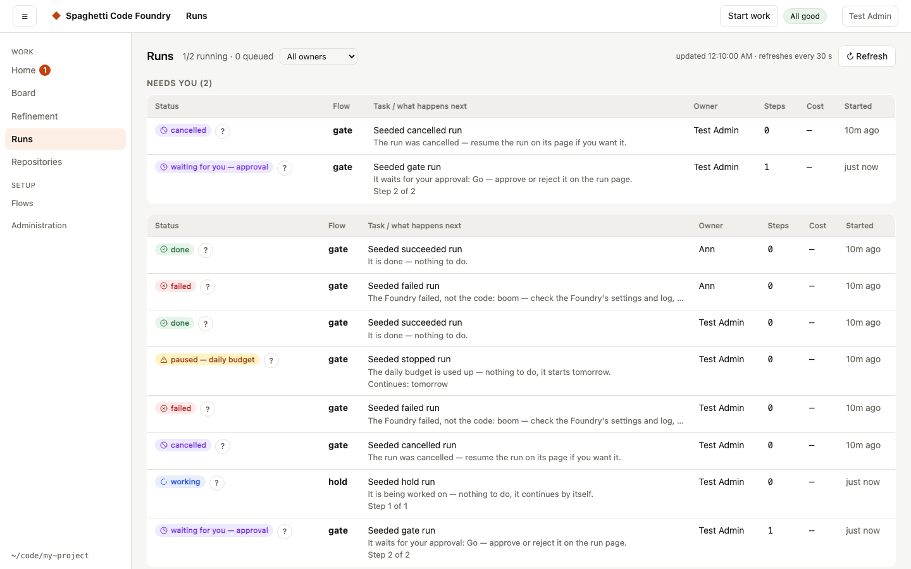

Runs whose next move is yours (the record says **You**) are listed under **Needs you**. Runs
that wait for a limit, the budget or another run are not. Under each task the table shows the
"what happens next" sentence, also for finished runs. At most *N* runs execute at the same time
(Settings → Runs at the same time); the rest queue. Each queue line shows the same sentence
and a link to what it waits for. A bug story in the queue has a "goes first" mark.

An admin sees every run, with an **Owner** column, and can pick one account in the **Owner**
filter next to the title (the list shows "All owners" and each account with its number of runs).
The Owner column shows the account's name, `deleted user` when the account is gone, and nothing for
a run without an owner.
The rows of the **Queue** card show the owner's name the same way.
A user sees only their own runs and their own queued runs; runs of others in front of them show
as "n runs ahead of you".

The Status column shows the plain status name (see "Words the Foundry uses"). Press the **?**
next to it to read what it means and what happens next, and press it again to close it. It
works with a mouse, the keyboard (Tab, then Enter or Space) and touch. Pressing it does not
open the run.

Every status pill also shows a small icon before its words (for example a check for done, a clock for waiting, a cross for failed), so you can tell what it means without the colour. The words are unchanged.

**How long will it take?** A run that is not finished shows "Step N of M": the number of its
step in the flow. It can jump, because steps that only run when another step jumps to them are
counted too. A running run also shows an estimate ("Estimate: about 20 min left (usually 25–40
min in total)"). It comes from succeeded runs of the same flow (same steps) in the same
repository, among the newest 500 runs, and counts working time only. It appears after 3 such
runs and starts again when steps are added, removed or renamed. It is an estimate, not a
promise. "Taking longer than usual" means a step runs much longer than it usually does. Nothing
is wrong yet: look at the live log.

### Search (API)

`GET /api/search` finds runs, issues, refinement sessions, repositories and flows by text or by id.
There is no page for it yet; the new navigation will use it.

- `?q=text` — words separated by spaces. Every word must match. Equal matches rank above
  prefixes, prefixes above word starts, word starts above "contains". A word like `#254` matches
  issue and run numbers only; `254` matches numbers and text. `q` can have 100 characters at most,
  else the answer is 400. An empty `q` gives `{ "q": "", "groups": [] }`.
- `?id=type:id` — up to 8 times, to check that things still exist and may be seen. `type` is
  `run`, `issue`, `refinement`, `repo` or `flow`. A wrong shape gives 400. `q` is ignored.
- The answer is `{ q, groups, incomplete? }`. A group has `type`, `label`, `hits` (8 at most) and
  `more` (true when there are more). A hit has `type`, `id`, `title`, `href` and, when known,
  `status`, `repo`, `detail`, `owner` and `at`. `status` is the same word that Runs and the queue
  show. If one source fails, the other groups still come back and `incomplete` names the failed
  type.
- **A user** gets their own runs (also queued ones), repositories and refinement sessions, and the
  flows they can start. No issues, no owner names, no server paths, no costs.
- **An admin** gets the runs, repositories and sessions of all accounts with owner names, the
  issues on the board, and all flows. With `as=<user>` while viewing as that user, the answer is
  the one the user would get.

### A run

Open a run to follow it live. At the top, the **What happens next** block says who has the next
move, what to do, why, a link to the place to do it, and when it continues by itself (if
known). It updates live. While the run is not finished it also shows its progress, the estimate
and the "Taking longer than usual" hint (see "How long will it take?" above). The raw reason of a
waiting run (the approval message) is the **Details** row below. An admin also sees an **Owner**
row: the name of the account that started the run, or `deleted user` (no row for a run without an
owner).

A failed run shows a **failure card** instead: who has the next move, the kind of problem, what
happened, why, what the Foundry already tried, what to do first and your four options (Retry,
Retry with a hint, Change the plan, Close). The page opens on **Steps**, and **Show the failed
step** opens the step that explains the failure. The raw reason is one click away under **Raw
details** in the card; it is never the first thing shown. A user sees the card without raw
details.

The status next to the flow name has the same **?**. The **Current step** (while the run
works) or **Resumes at step** (when it is stopped) row names the step and says what it does:
its description, or the kind of step when the flow gives none.

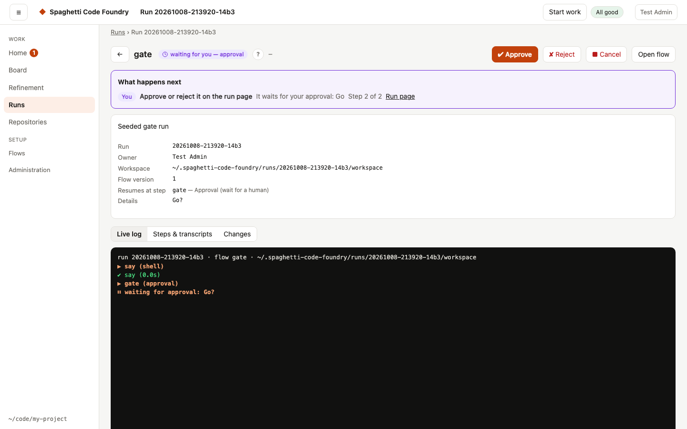

- **Live log** — each step as it starts and ends, with the agent's tool calls, duration, cost or
  tokens. A user sees the steps and the tool names only.
- **Steps & transcripts** — every step with its outcome. Open an agent step to read the whole
  conversation: what it said, each command it ran and the output, and the final result. The
  label next to the step name shows which agent and model ran it (here Claude on Haiku wrote the
  code, and Codex reviewed it).

  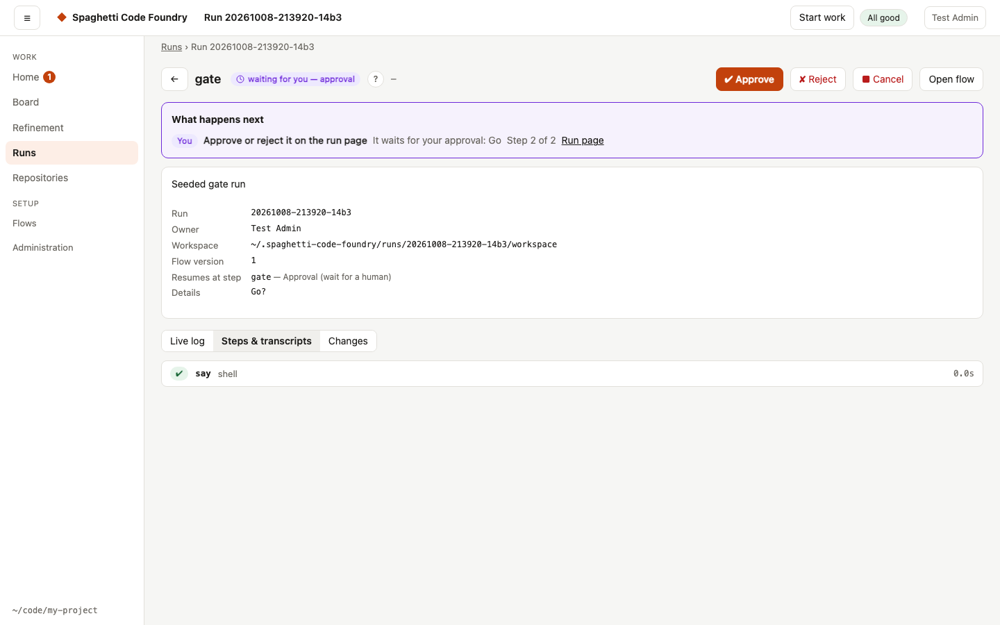

  A user sees **Steps** only: each step with its result and a plain sentence for a failure, but
  no output, no transcripts and no cost.

- **Changes** — the complete diff the run made, including uncommitted work.

  A very long log, diff or transcript does not slow the page. The live log keeps the last 2,000
  lines and says "N earlier lines are not shown" above them; it follows the end only while you
  are at the end. **Changes** lists each file closed (a diff of one file is open) and builds the
  lines when you open it; a file over 1,500 lines shows the first 1,500 and a **Show all**
  button. A transcript shows the first 200 events with **Show 200 more**, and a tool result over
  20,000 characters is cut with **Show all**.

  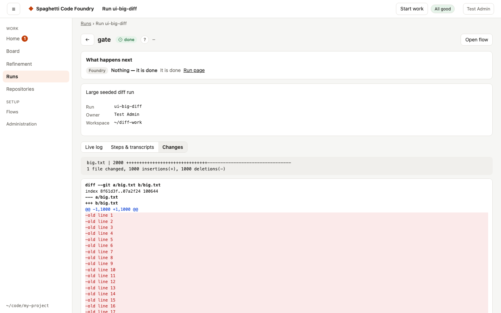

### Approvals

An **approval** step pauses the run until a person decides. Approve or reject in the UI, with
`scf approve <run-id>` / `scf reject <run-id>`, or — for GitHub flows — by commenting
`/approve` or `/reject` on the issue (only people with write access count). A waiting run shows
a **What happens next** block with **You** as who and the approval message as the reason.


### When something goes wrong

- **Retry from the failing step** continues a stopped, failed, cancelled or interrupted run from
  the step where it stopped (the step is in the button's tooltip), with everything it already did
  kept. Fix the cause first (e.g. answer the question, fix the environment), then press it. It is
  the filled main button of the run header, like **Approve** for a run that waits. A Codex step
  with `resume:` continues the earlier session only when it runs with the same Codex folder;
  otherwise it starts a new session and the log says why.
- **Retry from step…** re-runs from any earlier step.
- **Cancel** stops a running run, or a run that waits for approval; you can resume it later.
  Removing a queued approval from the queue cancels that run too (Resume brings the approval back).
- **Archive** takes a finished run (succeeded, failed, cancelled or stopped) out of the list of runs,
  so the list shows current work. Nothing is deleted: `GET /api/runs?archived=1` lists the archived
  runs, and the run, its log and its changes open as before. **Unarchive** puts it back. A run that
  is queued, running or waiting cannot be archived (409). You can archive your own runs; an admin
  can archive any run. The mark is shared: it hides the run from everyone's default list. Resuming,
  retrying, approving or answering an archived run removes the mark. Board, Your turn, statistics
  and the monitor still count it.

Runs survive restarts: if the Foundry stops mid-run, the run is marked *interrupted* and can be
resumed (watchers do this automatically).

**Answer a run's questions.** When a run stopped with questions (it stopped at `send_back` or
`ask_for_info` and that step printed something), its owner or an admin can answer with
`POST /api/runs/:id/answer` and the body `{ "text": "…" }`. The call answers 202 with `{ "runId" }`.
The answer is saved with the run (`answers` in `run.json`: `at`, `text`, `by` = account id) when the
call is accepted, and a resume is queued at the step the run would resume at. From then on every
step reads the task followed by all answers so far, oldest first, under the heading
`## Answers to the questions of this run (oldest first)`; this holds for `{{task}}`, `$FACTORY_TASK`
and `$SCF_TASK`. The `task` of the run itself stays as it was typed. The answer stays when the
queued resume is cancelled or dropped, when the account is blocked, and over a restart; a later
resume continues with it. The text is saved as sent, except that stored secrets become `[redacted]`.
It is never in `queue.json`, the audit log or a server log line.

- **Limits.** At most 4000 characters per answer, and at most 100000 bytes for the task with all
  answers. A call over a limit is refused; nothing is cut.
- **Refused, and nothing is written** (no change in `run.json`, no job, no audit line):
  404 for an unknown run, and for a user a run of another account (same body); 400 when `text` is
  missing, not a string, empty, only spaces, or has a NUL character; 400 over 4000 characters or
  over 100000 bytes; 400 `run <id> is already queued or running`; 409 when the run did not stop
  with questions, when a watcher follows it (answer on the issue; a run started by hand is
  answered here), when its saved flow has no step that reads the task (an older run), and for an
  architect run of a refinement session; 500 when the stored secrets cannot be read.
- **When a file cannot be written.** If the queue file cannot be written, the call fails and the
  answer is taken out of `run.json` again. If that fails too, the answer stays saved without a job;
  resume the run and it continues with the answer. Once the job is in the queue file the call is
  accepted.
- **Not together with `scf resume`.** The server does not see a run that `scf resume` continues in
  a terminal. Do not do both for the same run at the same moment: the answer can be lost and the
  run can run twice.
- **In the run view** (`GET /api/runs/:id`, the list and the `update` events) a user sees `answers`
  as `{ at, text }` (no `by`, folders hidden) and `canAnswer: true` exactly when the call would be
  accepted now. `canAnswer` is absent while a resume is queued. An admin sees the raw `answers`.
- The audit log gets `run-answer` for an accepted answer only.
- **On the run page of the user display.** Under the questions of a run with `canAnswer`, the page
  shows **Your answer**, a text box and **Send answer**. Ctrl/⌘+Enter sends too. An empty box shows
  "Write your answer first." and sends nothing. The text is sent trimmed; the button is off while
  the call is out. On success the box is emptied, the form goes away, a toast says "Answer sent —
  continuing" and the page shows the run as queued or running. A refusal shows the server's
  sentence in the form; your text stays. The form is not shown without `canAnswer` or while the
  run has a queued job. Updates of the page keep your text and the focus. When the run stops with
  questions again, the form comes back by itself. The answers given are listed under **Answers
  given**, oldest first, as plain text — also after a cancelled resume, when **Retry** continues
  with them.
- **What happens next.** For a user's run that can be answered on the run page, the sentence reads
  "The planner has questions — answer the questions on the run page and it continues." and links
  to the run page. A run a watcher follows, a run that cannot read an answer, and every record an
  admin reads still say "… on the issue" (the admin pages have no box). The comment on GitHub does
  not change.

**The failure summary.** A failed run (the run page and the comment on the issue) says what
failed, why, what was tried and the kind of problem:

- **A problem in the code** — the tests keep failing, a review is rejected by the checks. Example:
  "The step run_tests kept failing. Already tried: 3 fix attempts."
- **A problem with the environment or the Foundry** — a blocked command, a login, the network, wrong
  model settings. Example: "git could not log in to the remote."
- **A limit** — the budget of a step or of the run was used up. Example: "It used the amount the
  flow allows for one run."
- **A person's decision** — someone rejected an approval. The note of the approver is shown.

The four options, for a watched issue and for a run by hand:

| Option | Watched issue | Run by hand |
|---|---|---|
| Retry | Remove the failed label, or resume the run on its page | Resume the run on its page (a new run when the fix is a change to the flow, such as a larger budget) |
| Retry with a hint | Write the hint as a comment on the issue, then remove the failed label | Start a new run and put the hint in its task |
| Change the plan | Change the text of the issue, then remove the failed label | Change the task, then start a new run |
| Close | Close the issue if the work is no longer wanted | Leave the run as it is |

For a code failure the *why* is one sentence written by a small model that read the end of the
failing output (see "The failure summary call" in Costs). The comment and the card then say so.
If the model says the cause is the environment, the failure counts as a Foundry failure.

A usage limit, the daily budget, a sign-out and an unreachable AI service do not fail a run: they
pause it, and it continues by itself (a sign-out needs you to sign in again first).

**When the Foundry itself failed.** Some failures are not a bug in the code. The run page, the
Runs list, the watcher card, the Dashboard and the notification then say "The Foundry failed, not
the code", what went wrong and the fix. The causes and fixes:

- A command the agent was not allowed to run: allow it in the flow (the step's allowed tools or
  permission mode), then resume. The sentence shows only the tool and program, e.g. `Bash: curl`;
  the run page's log has the whole command.
- A push to a protected branch was blocked: change **Protected branches** in Settings or the
  flow's branch, then resume.
- A hotfix: GitHub refuses the push to `main` ("only accepts pull requests"): allow direct pushes
  for the Foundry's account on GitHub, or remove the `bug` label so the issue is built as a
  feature. Nothing was pushed.
- A hotfix: `main` changed in the same places while the run worked ("changed in the same
  places"): nothing was pushed and the branch is kept. Delete the `hotfix/…` branch and start the
  issue again.
- A hotfix: the tests fail on `main` with the fix merged in (`red_main`): nothing was pushed to
  `main`. Fix the cause on the hotfix branch and resume, or remove the label and build it as a
  feature.
- A hotfix: `develop` could not take the fix: the fix is on `main` and the issue is closed; see
  "Hotfix" under Branches for what to do.
- A marker the Foundry could not read (no `PLAN_STATUS` line, no questions to ask, no `SUBTASK`
  lines): resume the run to try the step again.
- A skill request in the plan that is not valid ("planning failed: the skill request of the plan is
  not valid"): resuming does not help, because the stored plan is the same. Start the run again so
  the issue is planned again. The step output says what was wrong.
- An internal error, an unknown step, or a run that failed before any step ran (workspace, bot
  identity, GitHub App token): fix the setting, or restart or update the Foundry, then resume.
- A git or gh login error, or a network error, in a command of the flow: log in again (`gh auth
  login`) or check the network, then resume.
- Wrong model or provider settings, or a missing `claude` or `codex` program: fix the setting or
  install the program, then resume.
- An interrupted run: resume it (a watcher does this by itself).

A failed test, guard or review, too many visits of a step and a push blocked by the secret scan
are code failures and keep the usual text. A step budget that is used up is a limit, and a
rejection is a person's decision. If a command was blocked earlier in such a run, the
sentence adds a hint to allow it in the flow if it was needed.

### Words the Foundry uses

One glossary decides the words. The app, the comments on GitHub and the labels all use them.
Every status in the app has a **?** that shows the two sentences from this table.

| Status | What it means and what happens next |
|---|---|
| waiting for you — questions | The Foundry has questions about this issue before it starts. Answer them on the issue, or reply /defaults to go with the recommendations. When the planner asks: The planner has questions that the issue and the code do not answer. Answer them and the work goes on. |
| waiting for you — risky plan | The plan is risky, or you asked to check it, so coding waits for your decision. Approve it to start coding, or reject it and say what to change. |
| waiting for you — split | The issue is too big for one change, so the Foundry proposes smaller issues. Approve and it creates them and closes this one, or reject it and say what to change. |
| waiting for you — approval | A step of the run asks for your approval before it goes on. Approve or reject it, and the run goes on with your decision. |
| waiting for you — stopped | The run stopped at a step that needs a person. Look at the run, fix what it asks for and resume it. |
| waiting for you — release pull request | A release pull request brings finished work to main, and this one is not merged yet. Merge it and the Foundry goes on. |
| in develop (ships with the 17:00 release) | The work is finished and waits for the 17:00 release. Nothing to do now — the release pull request then brings it to main. |
| waiting for #88 | It needs #88 to be done first. Nothing to do — it starts by itself after that. |
| waiting for another run | Only one run at a time works here, and another run is active. Nothing to do — it starts when that run is finished. |
| waiting — your limit for today is reached | You started as many new runs today as the administrator allows. Nothing to do — it starts by itself tomorrow. |
| waiting — your limit of runs at the same time is reached | As many of your runs are working at the same time as the administrator allows. Nothing to do — it starts by itself when one of your runs ends. |
| waiting — the owner's limit of runs per day | The owner started as many new runs today as their limit allows. Nothing to do — it starts tomorrow, or sooner when you raise the limit on the Users page. |
| waiting — the owner's daily budget | The owner's daily budget is used up. Nothing to do — it goes on tomorrow, or sooner when you raise the budget on the Users page. |
| waiting — the owner's limit of runs at the same time | As many runs of the owner are working at the same time as their limit allows. Nothing to do — it starts when one of them ends, or sooner when you raise the limit on the Users page. |
| waiting for another run in the same code | Another run is changing the same part of the code. Nothing to do — it goes on when that run is finished. |
| waiting — a bug story goes first | A story with a bug label is repaired before other work. Nothing to do — it goes on by itself after that. |
| paused — usage limit | The usage limit of the AI account is reached. Nothing to do — the Foundry tries again after the limit resets. |
| paused — signed out | The Foundry is signed out of its AI account. Sign in again — the run then goes on by itself. |
| paused — AI service not reachable | The AI service could not be reached. Nothing to do — the Foundry tries again later. |
| paused — daily budget | Today's budget is used up. Nothing to do — it goes on tomorrow. |
| checking for questions | The Foundry reads the new issues and looks for questions only you can answer. Nothing to do — an issue without questions starts after the check. |
| starting soon | Nothing is in the way, it only waits for the watcher's next check. Nothing to do — it starts by itself. |
| queued | It waits in the queue until a run finishes. Nothing to do — it starts by itself. |
| working | The Foundry is working on it right now. Nothing to do — you can follow it on the run page. |
| interrupted | The run was cut off, for example by a restart of the server. A watched issue resumes by itself at the next check, any other run you resume on its page. |
| cancelled | Someone cancelled the run. A watched issue resumes by itself at the next check, any other run you resume on its page if you still want it. |
| failed | A step failed and the run could not go on. Fix the cause if needed, then start over or resume the run at the failed step. When the Foundry itself failed: The Foundry itself failed, not the code: a blocked command, a marker it could not read or a broken setting. Follow the suggested fix, then start over or resume the run. |
| watcher error | The watcher could not do its check, so its issues do not move. Look at the error on the Watchers page and fix the cause, it then tries again at the next check. |
| bug stories stopped | The monitor stopped making bug stories, because many new problems appeared at once or its fixes kept failing. Look at what went wrong, then switch bug stories on again on the Watchers page. |
| waiting for you — two fixes did not work | The monitor made two bug stories for this problem and it is still there, so it makes no third. Press Try again to let it try once more, or mute the finding, on the Watchers page. |
| watcher silent | The watcher has not finished a check for a long time, so its issues do not move. Press Check now on the Watchers page. |
| closed on GitHub, run still busy | The issue was closed on GitHub, but its run is still working and nothing was changed. Cancel the run on its page if the work is no longer wanted. |
| issue closed | The issue is closed on GitHub, so nothing is left to do for this run. Reopen the issue if you still want the work. |
| restarting soon | The server waits to restart and starts nothing new until then. Nothing to do — it restarts when the active runs are done. |
| replaced by a newer run | A newer run took over the same work. Nothing to do with this run. |
| done | The work is finished. Nothing to do. |

Other words:

- **release pull request** — the pull request that brings finished work to `main`.
- **split risk** — how risky it is to create the smaller issues without you looking, 0–100.

A watcher's own state on the Watchers page has a **?** too:

- **active** — The watcher checks GitHub on its schedule and starts runs. Nothing to do — it works by itself.
- **disabled** — The watcher is switched off, so it checks nothing and starts nothing. Enable it on the Watchers page when you want it to work again.
- **paused: the owner is blocked** — The owner of this repository is blocked, so the watcher checks nothing and starts nothing. It starts again when the account is unblocked; until then another problem of the watcher is not shown.
- An error shows as **watcher error** (see the table).

Every record from `GET /api/next` has these as `status` and `help`. Text the Foundry quotes
(an error message, a step's approval message, a label or code-area name) is shown as it is.

---

## 4. Write your own flows

### The editor

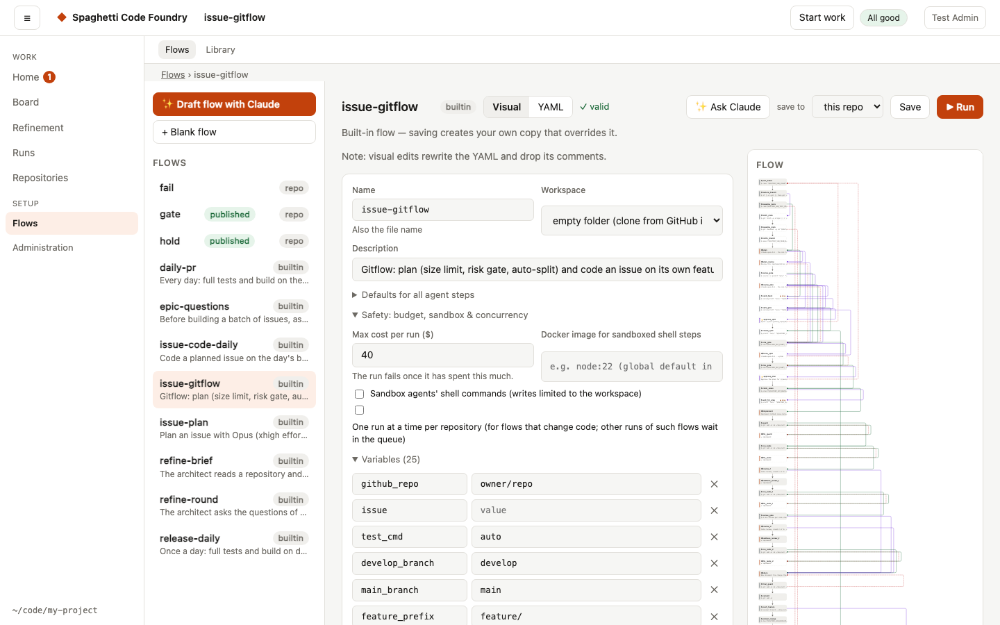

The header always shows which flow you edit and its scope (*builtin*, *repo*, *global* or
*not saved yet*), a text state (**Saved** or **Unsaved changes**), whether the flow is valid
(**Valid**, **n problems** or **Checking…**; click it to go to the problem list) and where Save
writes ("Saves to this repo"; for a built-in flow "Saves your own copy to this repo").

Edit a flow **visually** or as **YAML** (switch at the top). There is one main button: **Save**
when the flow is new or has changes, otherwise **Test run**. **Ask Claude**, **Save to** and
**Delete flow** are in the **More** menu. Ctrl/Cmd+S saves, and leaving with unsaved changes asks.

The **Overview** button opens the graph of how steps connect: grey = next, green = on success,
red dashed = on failure, purple = route. Click a node to select the step. The choice is
remembered; at 1100 px wide and below the overview starts closed and opens above the form.
The list on the left has a search box that filters by name and description.

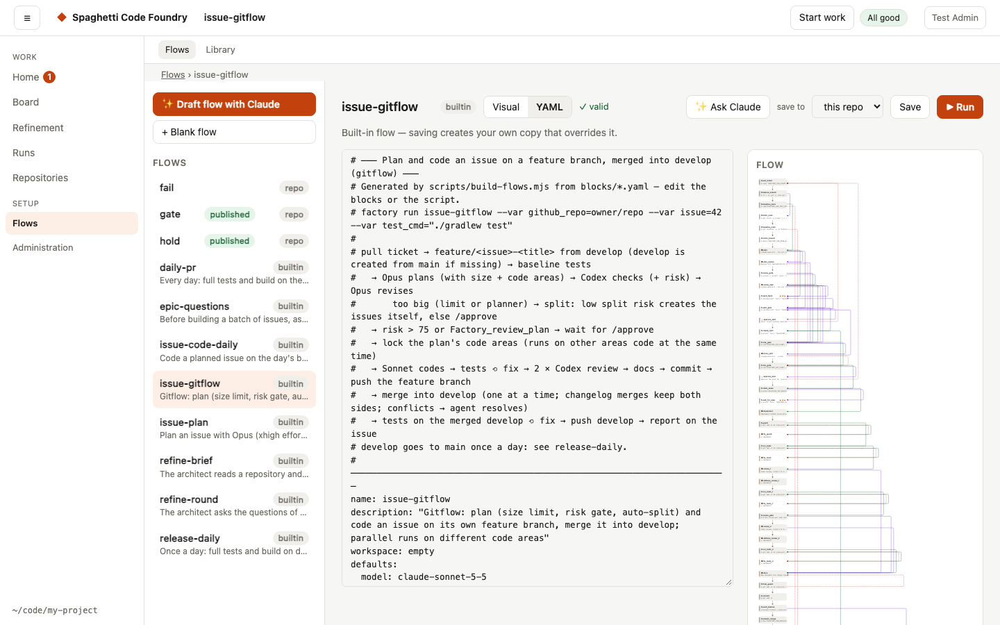

- **Save to** — *this repo* (`<repo>/.claude-factory/flows/`, shared with your team through git)
  or *global* (`~/.spaghetti-code-foundry/flows/`, just for you). Saving a built-in flow creates your own
  copy that overrides it.
- **✨ Draft flow with Claude** — describe what you want and Claude writes the YAML.
  **Ask Claude** changes the open flow the same way.
- **+ From library** inserts a block from the [Library](#the-block-library).
- **Errors and failed saves.** Errors that stop a save or a run are shown above the editor. If a save, delete or run fails, the reason is shown and your changes stay; use **Retry** to save again. Discarding, overwriting and deleting ask for confirmation in a dialog.
- **Publish to users** — choose whether users may start this flow ("Available to users"), the
  name and description they see, and for each variable whether it is *hidden* (your value is
  used), *fixed* (shown, cannot be changed) or *user fills in* (with a label, help text,
  "Required" and a default). Tick **Own default** to give the input its own default, even an
  empty one; unticked, it uses the flow's value. The version goes up by itself when you save a
  change. A published flow cannot have sub-flow steps, and a shell step must read an input as
  `$FACTORY_VAR_NAME`, not `{{vars.name}}`. An approval message is shown to users, so it may only
  use `{{task}}`, `{{vars.<name>}}` of a variable users see (fixed or input, or `github_repo` or
  `issue`) and `{{steps.<id>.output}}`; the flow is refused on save otherwise.
- **Problems** — when the flow is not valid, the editor lists each problem on its own row. Click a
  row to go to it. In the visual editor, a problem in a step selects that step and focuses the
  field; a problem in *defaults*, *vars*, *limits*, *sandbox* or *publish* opens that section. In
  the YAML tab, the cursor goes to the line. A YAML syntax error links to its line and column. A
  problem without a place is plain text. If you have edited the text since the check, rows do
  nothing until you check again.

### Let any AI write a flow

[`docs/FLOW_AUTHORING.md`](FLOW_AUTHORING.md) is a complete, self-contained description of the
flow format written for AI assistants: every field, step type, template and environment
variable, the common patterns (test/fix loops, review gates, asking a human, pull requests), a
checklist and a full example. Give it to any assistant — ChatGPT, Claude, Gemini, Codex or a
local model — and describe the flow you want:

```bash
scf flow-guide > flow-guide.md        # or copy docs/FLOW_AUTHORING.md
```

1. Paste (or attach) the guide in a new chat, then write what the flow should do, e.g. *"Opus
   plans a database migration, I approve the plan, Sonnet implements it with pytest tests, up to
   3 fix rounds, Codex reviews once, then push the branch and open a PR."*
2. Save the YAML it answers with as `<repo>/.claude-factory/flows/<name>.yaml` (or in
   `~/.spaghetti-code-foundry/flows/`).
3. Check it: `scf validate <name>` — it names the field and step for anything that is wrong;
   paste that back to the assistant to fix it. Then open it in the editor to see the graph.

**✨ Draft flow with Claude** in the editor uses the same guide, so both ways produce the same
kind of flow. The examples in the guide are checked by the test suite, so they always match the
current format.

### Step types

| Type | What it does |
|---|---|
| **Agent** (`type: claude`) | Runs Claude Code or Codex with a prompt |
| **Shell** | Runs a command; exit code 0 = success |
| **Approval** | Pauses until a person approves (→ on success) or rejects (→ on failure) |
| **Parallel** | Runs several agent/shell steps at once; succeeds when all succeed |
| **Sub-flow** | Runs another flow inline, in the same workspace |

**Repository access (shell steps).** Tick **Needs repository access** (`repo_access: true`) on a
shell step that calls `gh`, or uses `git clone`, `fetch`, `pull`, `push` or `ls-remote`, or calls a
helper script that does. Never tick it on a step that runs tests or the build, and not together
with **Run in Docker** or in a parallel step. A marked step signs in with the token you stored for
the repository under **My repositories**: its token, its deploy key or the GitHub App (see "What runs sign in with" there); the built-in flows
and the blocks of the library are already marked. **Flows you wrote yourself that call `gh` or push need the flag. In a step
without it the Foundry's own access is used, not your repository's token.** If the sign-in fails
in a marked step, the run ends there and `on_failure` is not followed. A call you tolerate on
purpose must send its error output to `/dev/null`, because a refusal on stderr fails the step.

### Controlling the path

Steps run top to bottom. Each step can change that:

- **On success / On failure** — `next` (default on success), `fail` (default on failure), `end`
  (finish as succeeded), `stop` (pause for a human), or a step id to jump to.
- **Routes** — on success, jump to a step when the output matches a pattern, e.g.
  `^ROUTE: small` → `quick_fix`. The first match wins.
- **Pass if / Fail if** — patterns that decide success from the output, e.g. an agent that must
  end with `VERDICT: APPROVE`.
- **Only reachable via jumps** — the step is skipped in the normal order (for fix-up handlers).
- **Max visits** — how often a step may run in one run (default 5); guards loops like
  test → fix → test.
- **When resumed, restart at** — for a step that stops the run, where a resume should continue.

A typical fix loop:

```yaml
steps:
  - id: implement
    type: claude
    prompt: "{{task}}"

  - id: run_tests
    type: shell
    run: npm test
    on_failure: fix_tests

  - id: fix_tests
    type: claude
    jump_only: true
    max_visits: 3
    prompt: |
      The tests fail. Fix the code.
      {{steps.run_tests.output}}
    on_success: run_tests
```

### Passing information between steps

In **agent prompts** you can use:

| Template | Value |
|---|---|
| `{{task}}` | The run's task, followed by the answers given on the run page (also `$FACTORY_TASK` / `$SCF_TASK`) |
| `{{vars.name}}` | A flow variable |
| `{{steps.<id>.output}}` | Output of an earlier step (also `.ok`, `.exit_code`) |
| `{{learnings}}` | Lessons saved by earlier runs in this repo |
| `{{run.history}}` | Which steps ran so far and how they ended |
| `{{workdir}}`, `{{run.id}}`, `{{run.branch}}` | Where and what this run is |

**Shell commands** may only template trusted values (`{{vars.*}}`, `{{workdir}}`, `{{run.*}}`).
Task text and step outputs could contain anything, so shell steps read them from environment
variables instead: `$FACTORY_TASK`, `$FACTORY_OUT_<STEP_ID>`, `$FACTORY_VAR_<NAME>`,
`$FACTORY_RUN_ID`, `$FACTORY_BRANCH`, `$FACTORY_NEXT_<REASON>`, `$FACTORY_FIRST_<REASON>`, `$FACTORY_FIRST_NOTHING`, `$FACTORY_FIRST_INFO` and the other report lines (also as `$SCF_…`).

An agent step can **continue the session** of an earlier agent step ("Continue session of"), so
it remembers the conversation.

### Variables

Flow variables (`vars:`) have defaults in the flow and can be overridden per run, per watcher,
or per repository in `<repo>/.claude-factory/config.yaml`:

```yaml
vars:
  test_cmd: ./gradlew test
```

The editor keeps empty values (`issue: ""`), so a variable you have just added stays.

### The block library

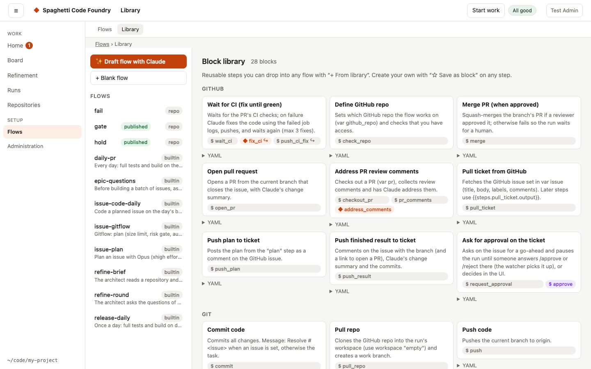

Blocks are ready-made groups of steps: pull a GitHub issue, plan, code, run tests with a fix
loop, code review, cross-review by Codex, commit, push, open a PR, wait for CI, secret scan,
Jira and Linear, and more. The block **Architect (charter)** holds the architect's role as one
text; the architect steps of Refinement take it from there. Insert one with **+ From library** in the editor. Turn any step into
your own block with **☆ Save as block**. Blocks that call `gh` or the remote come with **Needs
repository access** ticked. A flow built from blocks before this version has copies without it, so
tick it there or insert the block again.

The Library shows a loading state, an empty state and a failure with **Retry**. A failed delete or save keeps the form with what you typed. The Models page still shows Routing when the providers cannot be checked, and a model test result stays after **Reload**.

---

## 5. Models, agents and routing

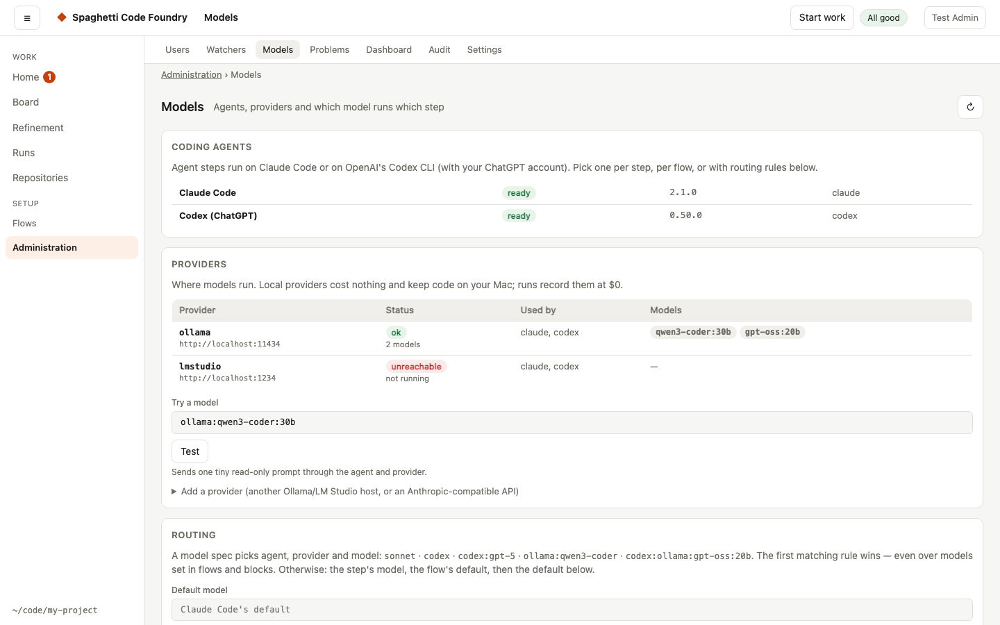

*The Models page on the demo machine, where the agents are stand-ins: on your machine the two
coding agents show as installed.*

### Agents

Agent steps run on one of two command-line agents:

- **Claude Code** — uses your Claude login (or an API key).
- **Codex** — OpenAI's Codex CLI with your ChatGPT login. Install it with
  `npm i -g @openai/codex` (or use the one inside the ChatGPT desktop app) and run `codex login`.

The **Coding agents** panel shows whether each is installed and logged in.

### Model specs

Wherever you can pick a model — a step, a flow's defaults, a routing rule, an eval — you write a
*model spec*:

| Spec | Runs on |
|---|---|
| `sonnet`, `opus`, `haiku` | Claude Code, Anthropic |
| `codex` | Codex, its default OpenAI model |
| `codex:gpt-5` | Codex with a specific model |
| `ollama:qwen3-coder:30b` | Claude Code on a local Ollama model |
| `codex:ollama:gpt-oss:20b` | Codex on a local Ollama model |
| `lmstudio:<model>` | Claude Code on LM Studio |

You can also set **Agent** and **Provider** separately on a step.

### Providers and local models

Anthropic, OpenAI, Ollama (`localhost:11434`) and LM Studio (`localhost:1234`) are built in.
Add your own (another Ollama host, or any Anthropic-compatible API) under **Add a provider**.
Local models cost nothing and keep your code on your machine; runs record them at $0. Choose
models trained for coding and tool use (e.g. `qwen3-coder`, `gpt-oss`) — general chat models
often fail to call tools. Use **Try a model** to check one works before you rely on it.

### Routing

**Rules** decide which model runs which step. The first matching rule wins — even over models
written in flows and blocks. A rule matches on a step id pattern, a flow name pattern and/or a
visit number (`From visit 2` = only retries). The presets add common rules:

- **Retries on Opus** — fix steps use Opus from their second attempt.
- **Codex reviews Claude's code** — review steps run on Codex.
- **Small jobs on a local model** — triage and learning steps run locally.

Without a matching rule, a step uses its own model, then the flow's default, then the
**Default model**.

**Fallback models** are tried in order when a model hits a rate or usage limit. With *continue
on the first free one when a budget runs out*, runs switch to the first free fallback (local or
ChatGPT) instead of pausing when the daily or run budget is used up.

---

## 6. Automate with watchers

A watcher checks GitHub on a schedule and starts runs by itself — as long as the Foundry is
running (see [Keep it running](#keep-it-running)). GitHub access uses the `gh` CLI's login.

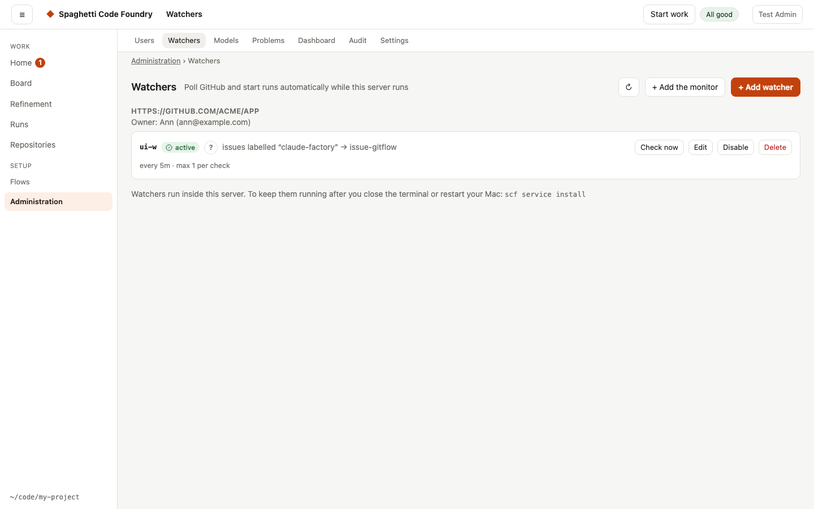

### Sources

| Source | Starts a run when… | Default flow |
|---|---|---|
| **Issues** | an open issue has the trigger label | `issue-gitflow` (or `issue-plan` / `issue-code-daily` for the human-in-the-loop pipeline) |
| **Schedule** | it is time (every N, or once a day at a set time) | `release-daily` |
| **Monitor** | never — it checks the Foundry itself and records problems (see [The monitor](#the-monitor-the-foundry-checks-itself)) | none |
| *Review comments* | someone comments on a Foundry PR (branch `factory/*`) | none shipped — name your own flow |
| *CI failures* | the latest CI run of a workflow on the default branch failed | none shipped — name your own flow |

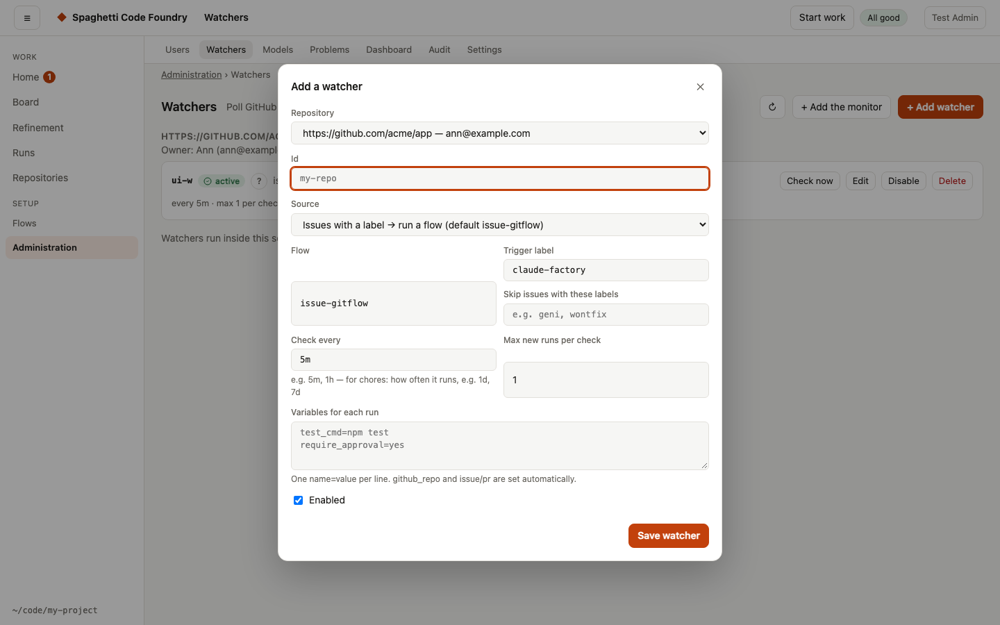

For a **schedule**, the text becomes the run's task. Intervals: `30s`, `5m`, `1h`, `7d`; or set
**Once a day at** `17:00` with a time zone.

### The Watchers page (admins)

Only admins see the Watchers page. No watcher name or status shows anywhere else. A user sees the runs a watcher started on their repository in **My runs**, without the watcher's name.

- **By repository.** Watchers are grouped by connected repository. Each group shows the repository's owner (with a "blocked" mark when the owner is blocked). Runs of a watcher belong to that owner.
- **Add watcher.** Choose the repository from a list, then the flow, the labels and the other options. There is no `owner` field: the repository's owner is used. Repositories that cannot have a watcher (a deploy key, or not on GitHub) are listed as not available, with the reason.
- **Edit, enable, disable, delete.** These change the watcher at once. Options the form does not show are kept when you edit. If the server refuses a change, its sentence is shown as it is.
- **The monitor** stays on the page, under "The Foundry itself", and is still saved in `config.yaml`. If only the monitor cannot be loaded, the watchers are still shown and the monitor card says so, with **Retry**.
- **While it works.** The page shows a grey skeleton while it loads. **Check now** shows "Checking…" next to its own button. **Delete** asks first in a dialog. If a reload fails, the list stays and a line says when it was last updated, with **Retry**. The same holds for Users and Problems.
- **From config.yaml.** A watcher that is still in `config.yaml` (for example while there is no admin account, or at the connection limit) shows read-only with a note, and **Check now**. A watcher whose repository is gone can only be deleted.

### Watchers of a repository (API)

The page uses these routes. A watcher stored for a connected repository has the same options as one in `config.yaml`, except `github_repo` and `owner`: they come from the
repository. The source `monitor` is not allowed.

- **Routes:** `GET` and `POST /api/admin/repos/:id/watchers`, and `PUT` and `DELETE /api/admin/repos/:id/watchers/:wid`. A user gets 403. Changes go to the log. A change starts, stops or restarts the watcher at once. `GET /api/admin/repos` adds a `watcherProblem` sentence to a repository that cannot have a watcher.
- **Which repositories:** GitHub only, with the sign-in `none` (the owner is an admin), `github-token` or `github-app`. `ssh-deploy-key`, `https-token` and other addresses are refused.
- **The id** is unique on the whole install, in the store and in `config.yaml` together. A duplicate is refused.
- **Runs** belong to the repository's owner, so they show in that user's "My runs".
- **Lists:** `GET /api/watchers` also shows stored watchers, with their `repoId`. A stored watcher that cannot run shows a `problem` sentence.
- **Blocked owner:** while the owner is blocked, the watchers of their repositories are paused. They check nothing and start nothing, and the list shows "paused: the owner is blocked". Unblocking starts them again, without a restart. This also works for `scf user block` and `scf user unblock`: the server sees it within its usual sweep. Runs that are already going are not touched.
- **Removed with their repository:** when a repository is removed (by id or by name), or its owner is deleted, its stored watchers are stopped and removed in the same step. The audit log says so. A watcher found at start whose repository is gone is removed and logged.
- **Transfer:** a transferred repository keeps its watchers. They run for the new owner, and new runs belong to the new owner.
- **Sign-in:** a stored watcher talks to GitHub with its repository's own credential: the stored token, a GitHub App token limited to that repository, or the server's own `gh` login for the method `none`. With a token or the app, the server's login is never used, so one repository's watcher cannot see another. The same credential is used for the actions on its items under "Your turn". Watchers in `config.yaml` keep using the server's login.
- **When the sign-in does not work** (missing, unreadable or refused, or the owner of a `none` repository is no admin), the watcher makes no GitHub call and its status says so in a plain sentence. It works again by itself at the next check once you fix the credential.
- **Status comments:** a status comment is only edited by the account that wrote it. When a watcher's account changes (for example a new token of another account), it posts a new status comment and the old one stays as it is on open issues.
- **Request limit:** a repository token or app has its own GitHub request limit. The limit the Foundry shows is that of the server's own login and the bot.

### Watchers move from config.yaml to their repositories

When the server starts after the update, every watcher in `config.yaml` except the monitor moves to the repository store. Nothing to do — it happens by itself.

- **Same watcher.** Its id, options and enabled state stay the same, so run history, status comments and labels on GitHub keep matching. A repository name with capital letters (`Acme/App`) keeps its spelling.
- **Repository not connected yet:** it is connected for the first admin with the method `none`. The admin pages show it as **none (legacy)**: the watcher uses the server's own `gh` login, as before.
- **Repository already connected** (for example by a user): it keeps its owner and method, and the watcher is attached to it. If that method cannot run a watcher (a deploy key, or `none` owned by someone who is no admin), the watcher moves but is **disabled**. The log and the Watchers page say why.
- **The `owner` option goes away.** The repository's owner owns the runs. If the option named another account, the log says so.
- **The backup.** Before it changes `config.yaml`, the Foundry copies it to `config.yaml.before-watcher-move-<date>-<time>` next to it. The moved watchers are then removed from `config.yaml`; the rest stays the same. Comments in the file are lost, so use the backup to see them. The log names every moved watcher.
- **No admin account yet:** nothing moves. The watchers keep running from `config.yaml` and move at a later start, once an admin exists.
- **At the connection limit** (50 per account): the remaining watchers stay in `config.yaml` and the log says so.
- **Safe to repeat.** If the server stops halfway, the next start finishes the move without duplicates. A watcher you add to `config.yaml` by hand later moves at the next start. A watcher whose stored copy differs, or whose id is used twice in the file, stays in the file and is logged.
- **After the move,** saving `config.yaml` through `PUT /api/config` with a new or changed watcher other than the monitor is refused, with a sentence that points to the Watchers page. Add and edit watchers there.
- **`scf watch`** works as before, with the server's own login.

**Going back.** Stop the server, copy the backup over `config.yaml`, and delete the moved watchers on the Watchers page first (or remove them from `repo-watchers.json` in the data folder). Otherwise the next start moves them again.

The watchers are kept in `repo-watchers.json` in the data folder.

### The monitor: the Foundry checks itself

The monitor is a watcher that looks at the Foundry itself and writes down what is wrong, so you
do not have to find it. It is **off until you add it**: on the Watchers page choose **Add watcher**
and the source **The Foundry itself**. It needs only an id and an interval. It has no repository, no
flow and no label, only one is allowed, and only an admin can add it. It starts nothing and changes
no run, label or file of a run; it writes its findings and, if you set `report_to`, bug stories
(see [Bug stories](#bug-stories-from-the-monitor)). The whole loop, in one place, is in
[chapter 13](#13-self-repair-for-admins).

Each check runs these detectors. Each one reads the runs, the queue, the watchers and the server
log; none calls an AI or GitHub.

| Detector | Finds | Severity | Default |
|---|---|---|---|
| Restart loop | the same run resumed again and again | critical | more than 5 times in 10 minutes |
| Watcher error | a watcher's checks fail one after the other (grouped by kind of error) | major | more than 3 checks in a row |
| GitHub request limit | the limit was hit, or most of it is used | critical when hit, major when used | more than 80% |
| Watcher silent | an enabled watcher finished no check | critical | 5 times its interval |
| Unexplained failure | a run failed with an error no rule of the Foundry explains | minor | 1 run in 24 hours |
| Stuck run | a running run wrote nothing to its log for longer than its step's timeout plus a margin (no timeout: 120 minutes) | major | timeout + 10 minutes |
| Same step keeps failing | the same step of the same flow ended runs as failed for different issues | major | 3 issues in 24 hours |
| Label and run disagree | an issue's status label does not match its newest run | major | more than 3 checks |
| Lock without owner | a code-area lock or a run lock is held by a run that is not running | major | more than 10 minutes |
| Queue not moving | jobs are queued, slots are free, and nothing started | critical | 15 minutes |
| Restart overdue | a new version is installed and the server has not restarted | major | more than 2 hours |
| Develop is red | the tests after a merge into develop failed one after the other | critical | 2 in a row, looking back 24 hours |
| Slow step | a step took much longer than its usual time (the times kept for estimates; needs 3 earlier runs and more than 2 minutes) | minor | more than 3 times, 3 times in 24 hours |
| Self-update failed | an update failed and the old version keeps running (major); the new version did not start healthy, the Foundry could not go back, or `self-update.json` cannot be read (critical) | major / critical | always (only when a self-update was tried) |

*Critical* means work has stopped, *major* means work is slowed or wrong, *minor* means wrong but
harmless. A detector that crashes shows up as a finding "Detector X failed"; the others still run.

Change the thresholds in `config.yaml`:

```yaml
watchers:
  - { id: monitor, source: monitor, every: 5m }
monitor:
  restart_loop: { resumes: 5, within_minutes: 10 }   # resumes: at most 49
  watcher_error: { checks: 3 }
  github_limit: { percent: 80 }
  watcher_silent: { intervals: 5 }
  unexplained_failure: { runs: 1, within_hours: 24 }
  stuck_run: { extra_minutes: 10, no_timeout_minutes: 120 }
  same_step_failing: { issues: 3, within_hours: 24 }
  label_mismatch: { checks: 3 }
  orphan_lock: { minutes: 10 }
  queue_stalled: { minutes: 15 }
  restart_overdue: { hours: 2 }
  develop_red: { failures: 2, within_hours: 24 }
  slow_step: { factor: 3, times: 3, within_hours: 24 }
```

**What is never a finding:** a run that waits for a person (approval or questions), a usage limit
that resets by itself, a sign-out (that is your turn, already shown), a story that waits for a
dependency or a release, and a `factory:done` label. While the server waits to restart, the label
and watcher-silent detectors are quiet.

Notes:

- Label data comes from the watchers' last checks. A `done` label is never a mismatch.
- A run inside a sub-flow step is not checked for being stuck.
- Same step keeps failing counts runs that ended failed, not steps that failed and were fixed in
  the same run. A step that only handles another step's failure is not named.
- Develop is red counts every test run after a merge, also several of one story, and looks back
  `within_hours`.
- A lock without owner is counted from the check that first saw it. A lock whose owner's `run.json`
  cannot be read is counted the same way.
- Slow step compares with the newest 500 succeeded runs that finished before the last
  `within_hours`, rebuilt about once an hour.
- The monitor keeps running while a new version waits for the server to restart.

Findings are kept in `monitor-findings.json` in the data folder and survive a restart. Each has a
detector, a fingerprint (the same problem gives the same one), a severity, one sentence, the
evidence, when it was first and last seen and how often. A finding not seen for 24 hours becomes
*gone* (kept 30 days; at most 500 findings are kept, not counting those with a bug story or an
owed one). A file that cannot be read is kept as `monitor-findings.json.broken`. If the monitor's
own check fails, the Health line says so. The monitor's card on the Watchers page shows what waits
or is wrong with its bug stories, and lists the findings and the mutes (see
[Mute a detector or a finding](#mute-a-detector-or-a-finding)). The
[Problems page](#the-problems-page) shows the same with the state of each finding.

#### Bug stories from the monitor

Set `report_to` and the monitor writes a lasting problem up as one GitHub issue, so the normal flow
can fix it. **Try it on a private repository first**, and read one real story before you point it
at a public one.

```yaml
monitor:
  report_to: your-name/your-foundry-repo
  report_limits: { per_day: 3, per_check: 1 }   # per_check: at most 3
  cooldown_minutes: 10                          # quiet time after a server start; 0: none
  fix_wait_days: 7                              # watch a closed story anyway after this many days
  breaker: { new_findings: 5, within_minutes: 60, failed_fixes: 3 }   # the circuit breaker
```

- **When.** Critical and major findings: after 2 checks in a row. Minor: after 3 different days. A
  story that is owed is made later even if the problem has gone away.
- **What.** Labels `bug` and the build label of the repository's issue watcher (with several
  watchers: the `issue-gitflow` one). With no watcher the story only gets `bug`, and the card says
  so. The text comes from a fixed template (no AI): what happened, since when, effect, evidence,
  what should happen, how to see it again, where to look, acceptance criteria.
- **Cleaning.** Other repositories, people, e-mail addresses, folders, links and keys are removed.
  In log lines only words of a fixed list stay. If a line cannot be cleaned with certainty, the
  story says the evidence is left out.
- **Only once.** A hidden marker in the story tells the monitor it exists. While it is open, a
  comment "Seen again: N times since …" is added at most every 6 hours.
- **Came back.** If the story was closed as completed and the problem returns after the fix runs
  (new proof from after the 24-hour clock started, see "Did the fix work?"), and the usual rule is
  met (2 checks in a row; minor: 3 different days after the clock started), a new story links the
  old one. Closed as *not planned* means muted: reopen the story to unmute it. (That is not an
  admin's mute; see below.) A story that is reopened is open again: its clock and verdict are
  forgotten.
- **Did the fix work?** A story closed as completed is *waiting for the update* until the fix is
  running. Sightings then are not "came back" and make no story. The 24-hour clock starts: when the
  running Foundry contains the fix commit (the full commit is read from the run that built the
  story); else at the first server start after the close (no git checkout, fix commit not known,
  or `report_to` is not the Foundry's own repository); and in any case `fix_wait_days` (default 7)
  after the close (the log says "waited"). If the problem is not seen for 24 hours of normal work
  (time with no check, such as a sleep, does not count), the finding is *fixed* and the story gets
  one comment "Not seen since the fix." It is written once, also after a lost answer or when GitHub
  could not be reached; while bug stories are off, quiet or stopped by the breaker, or the finding is
  muted, it waits. A story closed long before the clock (`fix_wait_days` or more) gets no comment.
  If the problem is seen again after the clock started, with new proof, "fixed" is not said. The
  findings list shows: waiting for the update, being watched, fixed. A story whose problem is not
  seen is still checked on GitHub every 6 hours, so a close or a reopen is noticed.
- **Two tries, then a person.** The monitor counts the bug stories it made for a finding. After
  two that did not fix it, it makes no third: the finding *needs you*, the log says so once
  (`story-skipped`, reason `two_tries`), and **Needs you** on Home shows one item for it. A story that
  existed before the upgrade counts as one. Nothing becomes "needs you" while bug stories are off,
  quiet after a restart or stopped by the breaker, or while the finding is muted.
  - **Try again or mute.** On the Watchers page the findings list shows "needs you" and a **Try
    again** button (admin only). It starts the count anew; the next check may make a story, which
    links the newest earlier story. A mute (see above) also makes the item go away; when the mute
    ends and the finding still needs a person, the item is back.
  - **When the item is hidden.** While the finding is *gone* (not seen for 24 hours), while its
    story is open again, and once it is *fixed*. The count is kept, so no third story is made when
    it returns. A story closed as not planned does not hide the item: **Try again** then starts the
    count anew, but no story is made until that story is reopened.
  - **A new count.** A finding that became *fixed* no longer needs you, and starts a new count when
    it is seen again. A finding that needs you is kept (never pruned) until someone acts.
- **Limits.** 3 new stories a day, 1 per check (most severe first). The rest waits and the card
  says how many. At most 6 GitHub calls per check. If GitHub cannot be reached or its request limit
  is used up, nothing is lost; the stories are made at a later check.

- **Never a story about a story.** A run that builds a bug story of the monitor is never a finding,
  whether it fails, hangs, is slow, loops, holds a lock or its label is wrong. This also holds for a
  story that a newer one replaced. A failed run of a bug story is written on the finding as "the
  fix failed" (how often and when) and in the log.

*Unexplained* is strict: no rule in the Foundry's failure rules matched (an AI's summary does not
count). An ordinary failing command (`exit code 1`) is explained. The request-limit numbers come
from `gh api rate_limit`, read at most once a minute for the server's own login and the bot token.

#### Stop bug stories: the off switch and the quiet time

One switch stops the monitor from making bug stories. It needs no GitHub.

- **Switch.** On the monitor's card on the Watchers page, the line says "Bug stories: on",
  "Bug stories: off since 14:05" or "Bug stories: quiet until 14:15 after the restart", and a button
  switches them off or on. Only an admin can do this. On the command line: `scf monitor off`,
  `scf monitor on` and `scf monitor status`. The commands only read and write the state file, so
  they work when the server is not running. The server reads the state at every check and again
  right before each GitHub call that makes or touches a story. The state (since when, by whom: the
  account id or `cli`) is kept in `monitor-guard.json` in the data folder and survives a restart.
- **While it is off.** The monitor still records findings. It makes no story, writes no comment
  and makes no GitHub call for stories. Nothing new becomes owed; stories owed before stay owed and
  are made after you switch on, at the next check.
- **Off does not stop building.** Stories that already exist still carry the build label, so the
  issue watcher keeps building them (with `hotfix_to_main` on, it still pushes fixes to main). To
  stop that, disable the issue watcher or remove the label from the issue.
- **Quiet time.** For the first `cooldown_minutes` (default 10, 0 = none) after the server started,
  findings are recorded but no story is made and none becomes owed. A server that restarts more
  often than that never makes a story.
- **A state file that cannot be read.** Stories stop and the card says so. `scf monitor on` or the
  button keeps the old file as `monitor-guard.json.broken` (older ones as `.broken.1`, `.broken.2`,
  …), starts a fresh file and switches on. Later parts add other state to this file; it is reset
  too (the mutes as well), and the card and the log say so. "Off" does nothing on an unreadable file.
- **The log.** `monitor-log.jsonl` in the data folder has one JSON line per event: `off`, `on`,
  `story-made`, `story-skipped`, `breaker-open`, `breaker-closed`, `fix-failed`, `clock-started` (reason `update`, `restart` or `waited`), `fixed`,
  `came-back`, `try-again` (with `by`, the account id), `mute-made` and `mute-ended`, with the reason for a skipped story (`off`, `cooldown`, `unreadable`, `breaker`,
  `muted`, `two_tries`, `day_limit`, `check_limit`, `request_limit`, `github`). A story skipped because of a
  mute also has the mute's id and its reason text. A skipped story is written once per finding and reason, not at every
  check (and again each time the circuit breaker opens). The file moves to `monitor-log.1.jsonl` at 512 KiB, so it keeps
  between 512 KiB and 1 MiB of history. Lines from the server also show in the card's recent
  activity; a switch made on the command line does not.
- **Lock.** Changes take `monitor.lock` in the data folder for a moment. If `scf monitor on` says
  the lock is held, try again; if no process uses it, remove the folder `monitor.lock`. "Off" never
  waits for it: it takes the lock over.

#### The circuit breaker

The monitor stops making stories by itself when many things go wrong at once. It only works when
`report_to` is set and bug stories are not switched off.

- **When it opens.** More than `new_findings` (default 5) different findings first appear within
  `within_minutes` (60), or the newest `failed_fixes` (3) finished runs of bug stories all failed.
  A succeeded run between failed ones resets the count; cancelled, stopped and interrupted runs
  neither count nor reset. Findings first seen in the quiet time after a restart do not count.
- **What stops.** No story, as with the off switch. Findings are still recorded. The log has a
  `breaker-open` line and one `story-skipped` line (reason `breaker`) for each story that is owed.
  The reason and the time are kept in `monitor-guard.json`, so a restart does not close it.
- **Your turn.** An admin sees one item, "The monitor stopped making bug stories", with the reason
  and the way back: switch bug stories on again on the Watchers page. It cannot be dismissed and
  goes away when the breaker is closed. The card says "Bug stories: stopped by the circuit
  breaker since …"; `scf monitor status` says so too.
- **Switch on again.** Only an admin: the button on the monitor's card or `scf monitor on`. The log
  gets `on` and `breaker-closed`. Every switch-on starts the counts anew: findings and failed runs
  from before do not open the breaker again. Look at what went wrong first.

#### Mute a detector or a finding

Some problems are known noise. An admin can mute one detector (by name) or one finding, so that it
does not become a bug story.

- **Make a mute.** On the monitor's card (Watchers page) open **Findings (N) · Mutes (M)**. Press
  **Mute** on a finding, or **Mute a detector**. Give a reason (required, at most 200 characters)
  and choose how long: for good, 1 hour, 1 day, 1 week or 30 days. The API takes any number of
  hours up to 8760 (one year).
- **See and end mutes.** The list shows each mute with its reason, since when and until when.
  **End mute** ends it at once. An admin can end any mute. A mute for a time ends by itself; the
  log gets `mute-ended` with the reason `expired`. `scf monitor status` lists the mutes too.
- **What a mute stops.** No story is owed or made, and no "seen again" comment is written, for a
  muted finding. A story that was owed before the mute is not made while the mute lasts; it is
  made at the next check after the mute ends (if the problem still lasts).
- **What it does not stop.** Findings are still recorded (count, last seen) and shown. A story that
  already exists keeps its build label, so it is still built. Muted findings do not count for the
  circuit breaker, and neither do the failed runs of their stories.
- **The log.** `mute-made` and `mute-ended` (with who, and the reason text), and one
  `story-skipped` line with reason `muted` for a story that a mute held back.
- **Limits.** One mute per detector and one per finding at a time (a finding can be muted next to
  its detector; the mute of the finding wins). At most 200 mutes. Mutes are kept in
  `monitor-guard.json` as account ids, never names or e-mail addresses.

#### The Problems page

**Problems** (`#/problems`, admins only; users do not see it) shows what the monitor found and what
happens to each problem.

- **The sentence at the top.** One sentence says whether the monitor is running, whether bug
  stories are on, off, quiet or stopped, when it last checked, how many bug stories it made today
  and the daily limit, and whether the circuit breaker is open, with its reason. The count comes
  from the monitor's log, so it can be above the limit: "Make a story now" does not count against
  the limit. "Last checked" is kept in memory: after a server restart it says "has not checked
  since the server started" until the monitor runs again.
- **The findings.** Newest and most severe first (gone ones last), at most 100 at first and then
  **Show N more**. Each row has the summary, the severity, since when, how often ("seen in N
  checks"), the state and the bug story. **Details** opens the evidence, the bug stories (links;
  "(earlier)" for older ones) and the runs that build them. If the findings file cannot be read,
  the page says so instead of "No findings."

| State | What it says |
|---|---|
| seen | seen, no story yet |
| waiting | bug story #N is waiting (open, no run builds it) |
| building | bug story #N is being built (a run builds it now) |
| fixed-watching | fixed, watching: the story is closed and the fix is being watched |
| came-back | came back: the problem was seen again after the fix |
| needs-you | needs you: two stories did not fix it |
| muted | muted by an admin (with the reason), or the story was closed as not planned |
| gone | gone: not seen for 24 hours |

- **Actions.** **Switch the monitor off / on** (the same as on the Watchers page; while it is off
  the monitor still records problems, but makes no bug story and writes no comment). **Mute** and
  **End mute**. **Try again** for *needs you*. **This is not a problem** mutes the finding for
  good with a reason you give; you can end it here later.
- **Make a story now.** For a finding that is *seen, no story yet*. It skips the waiting rules:
  the severity, "longer than one check", 3 days for minor, the daily and per-check limits, the
  quiet time and an open circuit breaker. It never skips the off switch, the mutes, "only once"
  (a story already on GitHub is taken up, not made again) or the two tries; the cleaning of
  private text applies too. It makes only that one story. The button says why it cannot be used:
  the monitor is off, is not running, or no repository is set. The API answers 409 when the
  monitor is off or not running, or the finding has a story, is muted, used its two tries, is
  gone or has no repository; 502 when GitHub fails.
- **Detectors.** Each detector is listed with what it looks for, its threshold numbers, when it
  last found something and whether it is muted. Change a number and press **Save**; this changes
  the setting `monitor.<detector>` like the Settings page.

### How issue watchers use labels

For each issue with the trigger label the watcher sets status labels, so you can follow along
in GitHub:

| Label (default name) | Meaning |
|---|---|
| `factory:working` | Working — nothing to do, it continues by itself |
| `factory:needs-info` | Waiting for you — questions: reply on the issue, or reply `/defaults` |
| `factory:waiting-approval` | Waiting for you — approval: reply `/approve` or `/reject` on the issue |
| `factory:done` | Done — nothing to do |
| `factory:failed` | Failed; the comment on the issue starts with what you need to do, then says what happened, why, the kind of problem, what was already tried and your options, with the failing output. Remove the label to start over, or resume the run on its page to continue at the failed step. If the Foundry itself failed, the comment says so and names the fix |

The descriptions on GitHub say the same in short. They are set when the labels are created and
refreshed at every server start. The trigger label and the review label (`vars.review_plan_label`)
get one too. If the review label is the same as the trigger label, the one description says both.

Each watcher's card on the **Watchers** page lists the labelled issues it is *not* working on
right now under **What happens next**, with the same lines as the Dashboard. A watcher error is
a line too; the raw error is under **Error details**.

Every check also compares the label with the newest run and fixes what is safe to fix: a run that
is working (for example approved or resumed on its page) gets `factory:working`, and a label that
does not match the run (say `factory:failed` while the run waits for approval) is corrected. A
`factory:done` label is left alone, and an issue without a status label starts over. If you close
an issue on GitHub while its run is still working or waits for approval, nothing is changed; the
watcher says so (see [Why is nothing happening?](#why-is-nothing-happening)) and you decide
whether to cancel the run. Every label change is in the card's **Recent activity**. Next to the
repository the card shows **last successful check …**, also when the newest check failed.

The needs-info and waiting labels stay only while the Foundry really waits for you. Once you have
answered the questions and the issue waits for something else (another story, the release pull
request, the budget, the limit of new stories per check or a story that is running), the label is
removed at the next check, so the issue looks like every other story that waits. When the release
pull request holds it, the thing to do (merge it) is on that pull request. A run that asked, was
answered and cannot continue yet shows `factory:working`. The label comes back only for new,
unanswered questions. A waiting label on an issue that has no run is left alone: remove the label
to start the issue.

More options are set in `~/.spaghetti-code-foundry/config.yaml` (the form keeps them when you edit the
watcher). This is the watcher for the [one-label pipeline](#the-label-pipeline-one-label--plan--code--one-pull-request):

```yaml
watchers:
  - id: webshop
    source: issues
    flow: issue-gitflow            # feature branch per issue → merged into develop
    precheck_flow: epic-questions  # ask all open questions for new issues first
    github_repo: acme/webshop
    label: Factory_go
    exclude_labels: [wontfix]
    status_labels: {working: Factory_working, done: Factory_done, needs_info: Factory_needs_info, waiting: Factory_waiting, failed: Factory_ERROR}
    remove_on_done: [Factory_go]
    max_per_tick: 2                # issues on different code areas are coded in parallel (bug stories are not counted)
    priority_labels: [bug]         # stories with these labels go first (the default)
    dependency_done_labels: [Factory_done]
    vars:
      test_cmd: ./gradlew test
      docs_required: docs/CHANGELOG.md
      union_merge_files: docs/CHANGELOG.md   # merges keep both sides' entries
      agent_env: JAVA_HOME=/path/to/jdk      # extra environment for the coding agents
      develop_branch: develop
      risk_threshold: "75"         # plans scoring above this wait for /approve
  - id: webshop-release
    source: schedule
    flow: release-daily            # daily tests + build on develop, PR develop → main
    github_repo: acme/webshop
    at: "17:00"
    timezone: Europe/Berlin
    task: Daily release pull request develop → main
```

| Option | What it does |
|---|---|
| `exclude_labels` | Never touch issues with any of these labels |
| `status_labels` | Your own names for the status labels above |
| `remove_on_done` | Labels to remove when a run succeeds (e.g. the trigger label) |
| `one_at_a_time` | Never run two of this watcher's runs at once |
| `wait_for_dependencies` | On by default: an issue with a **Depends on** / **Blocked by** section waits until those issues are closed (or have a `dependency_done_labels` label) |
| `dependency_done_labels` | Labels that also count as "done" for dependencies, e.g. `Factory_done` |
| `precheck_flow` | Run this flow once over all new labelled issues before any is started (`epic-questions` asks every owner decision up front) |
| `auto_defaults` | `true`: the watcher answers the Foundry's questions itself with the recommendations (it posts `/defaults` on the issue), so nothing waits for a person. At most twice per issue; if the planner still asks after that, a person answers. Default `false` |
| `pause_while_pr_open` | Start nothing while a PR from a branch with this prefix is open (for the older two-label pipeline) |
| `comment_on_failure` | On by default: post the failure reason and output on the issue |
| `status_comment` | On by default: keep one status comment on every issue the watcher follows (see "The status comment") |
| `owner` | Only for watchers in `config.yaml`: the e-mail of the account that owns the watcher's runs and may read and approve them. Empty: the first admin. It must be an account. A watcher of a repository uses the repository's owner |

**Coding agents run the build themselves.** In the issue flows the coding agent may run the
project's build and test commands (`./gradlew`, `mvn`, `npm`, `pytest`, `go test`, `cargo`,
`make`) and read-only git commands — so it can check its own work and, for example, regenerate
test fixtures. Pushing is never allowed. If the build needs environment settings (such as
`JAVA_HOME`), put them in the `agent_env` variable: `KEY=value` pairs separated by `;` or new
lines. `PATH`, tokens and the Foundry's own variables can't be set this way. In a run that never
uses the machine's login (see "What runs sign in with"), names that start with `GH_`, `GITHUB_`,
`GIT_`, `SSH_` or `XDG_`, and `LC_ALL`, are ignored too.

### Bug stories go first

A story with a bug label is repaired before the Foundry builds anything new. The watcher option `priority_labels` lists the labels (default `[bug]`, not case sensitive). Set `priority_labels: []` to turn it off for a watcher.

- **What goes first:** in every check the watcher handles bug stories before all others: questions up front, starting, resuming and answering. When a slot is free, a waiting bug story gets it before any other story, also before stories that were queued earlier and stories of other repositories. Among bug stories the oldest issue goes first.
- **No per-check limit:** bug stories are not counted against `max_per_tick`. Concurrency, the daily budget and `one_at_a_time` still limit what runs.
- **Code areas:** when several stories wait for the same code area, a bug story gets it first when it becomes free. The other stories wait up to one check longer.
- **What a bug story still waits for:** its own "Depends on" stories, the answers to its own questions, a daily budget or usage limit, and an open release pull request (`pause_while_pr_open`). It goes first after that.
- **Nothing running is stopped.** A bug story only takes the next free slot.
- **Taking the label off** ends it: the story goes back to its place in the queue.
- **Where you see it:** a bug story has a "goes first" mark on the board and in the queue. Another story that waits for it says "waits: a bug story goes first".
- **Runs started by hand** from the Runs page get no priority. Resume, approve and reject on the run page of a bug story do.

### The status comment

Every issue an issue watcher follows gets **one status comment** that says what happens next. It looks like this:

```
**Nothing needed from you** — it is being worked on.

Nothing to do, it continues by itself.

- **Where:** this issue

_This comment is kept up to date by the Spaghetti Code Foundry. It is edited, never posted again. Other comments are history._
```

- **Edited, never a second one.** The Foundry changes the text of the same comment when the state changes. An edit sends no notification. Other comments (questions, plans, approvals, failures) are history and stay as they are.
- **When it is your move**, the first line starts with **What you need to do**. Otherwise it says **Nothing needed from you** and why.
- **Done.** Once the work is finished it says it is done. If the work waits for a scheduled release (a schedule watcher with `at`), it says it waits for that release, and says it is done after the release ran.
- **Closed while the run works.** It asks you to cancel the run if the work is no longer wanted. When the run ends it says it is done.
- **No longer followed.** If the issue is closed or loses the watcher's label, the last text says the Foundry no longer follows it (or that it is done, if its run succeeded). A closed-issue check that fails or is cut short changes nothing.
- **Two watchers on one issue** (for example a plan and a code watcher) share one comment. It shows the record of the one that is working, else the one that waits for you.
- **Plain words.** The comment uses the wording for a reader of the issue: no raw error text, folder, setting or amount of money. Pages of the Foundry app are named, not linked; the details are in the app.
- **Switch it off** with `status_comment: false` on the watcher. A switched-off, removed or disabled watcher leaves its comments as they are.
- **Extra copies.** If the Foundry finds more than one status comment of its own account on an issue, it keeps the oldest and removes the others (at most 5 per check; the rest follows at the next check).
- **A failure is only in the log.** If a comment cannot be written, the check goes on; the log has a line `status comment #<n>: …` and the next check tries again.
- **After an upgrade**, the first check adds one new comment (one notification) to every open issue the watcher follows, at most 30 per check. The Foundry remembers which issues have one in `status-comments.json` in its data folder (issue numbers only), so it can write a last text when an issue leaves the list, also after a restart.

### The label pipeline: one label → plan + code → one pull request

The built-in flows `epic-questions`, `issue-gitflow` and `release-daily` form a pipeline that you
drive with **one label**. You only step in for three things: answering questions (asked all at
once, up front), approving **risky** plans, and merging the pull request. (Label names below are
the ones from the example configuration; yours are whatever you set in the watcher.)

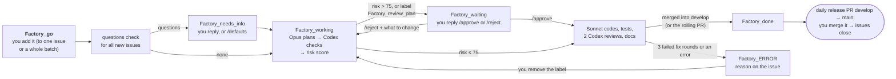
```mermaid
flowchart LR
    G["<b>Factory_go</b><br/>you add it (to one issue<br/>or a whole batch)"] --> Q["questions check<br/>for all new issues"]
    Q -->|questions| NI["Factory_needs_info<br/>you reply, or /defaults"]
    NI --> W
    Q -->|none| W["Factory_working<br/>Opus plans → Codex checks<br/>→ risk score"]
    W -->|"risk > 75, or label<br/>Factory_review_plan"| A["Factory_waiting<br/>you reply /approve or /reject"]
    A -->|/approve| C
    A -->|/reject + what to change| W
    W -->|risk ≤ 75| C["Sonnet codes, tests,<br/>2 Codex reviews, docs"]
    C -->|"merged into develop<br/>(or the rolling PR)"| D["Factory_done"]
    C -->|3 failed fix rounds or an error| E["Factory_ERROR<br/>reason on the issue"]
    E -->|you remove the label| W
    D --> M(["daily release PR develop → main:<br/>you merge it → issues close"])
```

#### The only label you set

| Label | Add it when… | What happens |
|---|---|---|
| **`Factory_go`** | the issue (or a batch of issues) should be built | New issues are first checked together for questions only you can answer. Then each issue is planned **right before it is coded**, in one run: Opus plans, Codex checks the plan against the code, both give a **risk score**, the plan is posted on the issue — and coding starts straight away unless the plan is risky. |
| `Factory_review_plan` *(optional)* | you always want to approve this issue's plan yourself | The plan waits for your `/approve`, whatever its risk score |

#### The risk score

Every plan gets a score from 0 to 100 from Opus, and Codex gives its own; the higher one counts.

| Score | Typical change |
|---|---|
| 0–25 | local, well covered by tests, easy to undo |
| 26–50 | several modules, or behaviour users see |
| 51–75 | persistence or migrations, concurrency, public APIs or file formats, hard to test |
| **76–100** | security or trust (signing, secrets, auth), installing/updating/deleting software or user data, irreversible steps, privacy — or assumptions the planner couldn't verify |

**Above 75 a human decides:** the plan is posted with the score and the reason, and the run waits
(label `Factory_waiting`). The comment starts with `**What you need to do:** Reply /approve or /reject.` and ends with: "The plan is risky and waits for your decision —
reply /approve to start coding (optionally with notes), or /reject followed by what to change — it
then plans again." Your feedback goes into the new plan. Only people with write access to the
repository can approve. (The threshold is the `risk_threshold`
variable, default 75.)

#### Issues that are too big

When the planner finds an issue too big for one change, it proposes a **split** into smaller
issues that can each be built and tested on their own, and scores how risky it is to split
without you looking (0–100: a mechanical split along existing boundaries is low; deferring or
reinterpreting scope, or anything that needs your decision, is high).

- **Split risk 50 or lower:** the Foundry creates the new issues by itself — with the original's
  labels, `Factory_go`, and a **Depends on** section with the real issue numbers so they are built
  in order — comments the list on the original and closes it. The new issues then go through the
  questions check and are built like any other.
- **Above 50**, or the issue has `Factory_review_plan`: the split is posted on the issue and waits
  (`Factory_waiting`). The comment starts with `**What you need to do:** Reply /approve or /reject.` and ends with: "The issue is split into smaller ones and waits for
  your decision — reply /approve and the Foundry creates these issues and closes this one, or
  /reject followed by what to change."
- **You already agreed** to a split in a comment ("split it"): it creates the issues without asking.

The threshold is the `auto_split_max_risk` variable (default 50).

#### Labels the Foundry sets

| Label | Means | What you do |
|---|---|---|
| `Factory_needs_info` | Waiting for you — questions: asked up front for the whole batch, or by the planner | Reply on the issue — or just **`/defaults`** to accept the recommendations. It continues by itself. |
| `Factory_working` | Working, or paused — usage limit: planning and coding are running or paused | Wait; follow it on the Runs page |
| `Factory_waiting` | Waiting for you — risky plan / split: it waits for your decision | `/approve` or `/reject` + feedback on the issue |
| `Factory_done` | Done: implemented, tested, reviewed and merged into `develop` (gitflow) or in the rolling pull request | Nothing — merge the release pull request (or the rolling one) when you like |
| `Factory_ERROR` | It failed; the comment on the issue starts with what you need to do, then says what happened, why, the kind of problem, what was already tried and your options, with the failing output | Fix the cause if needed, then remove the label to start over, or resume the run on its page to continue at the failed step. If the Foundry itself failed, the comment says so and names the fix |

Issues with an excluded label (e.g. `geni`) are never picked up, whatever other labels they have.

#### How do I…?

| I want to… | Do this |
|---|---|
| Build an issue, or a whole epic | Add `Factory_go` to each issue (select them all in GitHub's issue list → Labels). Give stories a **Depends on** section so they are built in order. |
| Answer the questions | Reply on the issue, or `/defaults` — or in the app, on Home |
| Check a plan before it is coded | Add `Factory_review_plan` before (or together with) `Factory_go` |
| Approve / reject a risky plan | `/approve` (+ notes), or `/reject` + what to change — or in the app, on Home |
| Retry after an error | Remove `Factory_ERROR` to start over, or resume the run on its page to continue at the failed step |
| Stop the Foundry from touching an issue | Remove `Factory_go`, or add an excluded label |
| Get the work into `main` | Merge the release pull request `develop` → `main` (gitflow), or the rolling Foundry pull request |

#### Why is nothing happening?

A line can say "waiting — a bug story goes first": a story with a `bug` label is repaired before
anything new is built. There is nothing to do; the story goes on by itself after that.

Look at the **Dashboard**: the **Waiting** card lists every labelled issue that isn't being
worked on right now (the same list is on each watcher's card on the **Watchers** page). Every
line starts with a badge for who has the next move (**You**, **Foundry**, **Another story**, **A
time limit**, **Something is wrong**), then the status name with its **?** (press it for what
it means and what happens next), then the issue, what to do, why, "Continues: …" when it
continues by itself (it can say how long the run it waits for still needs, for example "after #88
(about 20 min left)", and the Runs list shows it too), and a link to the place to do it (GitHub links open in a new tab). Lines
where you have the next move come first, above the rest. The state of the watcher itself
(**active**, **disabled** or **watcher error**) has a **?** too. Problems of the Foundry itself
(a restart wait, a usage limit, a watcher error) are in the [health line](#the-health-line) on
every page. Runs that started and then paused are listed too: a usage
limit, the daily budget, a code area that another run uses, or an interruption. The same
sentences are in the failure comment on the issue and in notifications, and they also end the
Foundry's comments that ask you something (questions, a risky plan, a split, the push approval).
The comment has the fixed sentence; the Dashboard may add the number of questions or what is being
approved. Every comment that needs you starts with one bold line, `**What you need to do:** …`, so you
see at once what to do. For a risky plan it looks like this:

```
**What you need to do:** Reply /approve or /reject.

🤖 **Spaghetti Code Foundry plan**
…
_The plan is risky and waits for your decision — …_
```

A comment that only reports something says so too. In flows built from the `push-plan`,
`push-result` and `triage` blocks the plan comment starts with `**Nothing needed from you**`. The result comment starts
with `**What you need to do:** Review and merge the pull request.` when there is a pull request, else
with `**What you need to do:** Open a pull request from the branch.` The comment that lists the new
issues after a split starts with `**Nothing needed from you**`. In `github-auto` it starts with
`**What you need to do:** Start the new issues when you want them built.` when the new issues are not
picked up by themselves (`auto_subtasks` is `no`).

The label-driven flows do the same:

- The plan from `issue-plan` starts with
`**What you need to do:** Add the code label to start coding.`
- The result of `issue-code-daily`, `issue-deliver` and `issue-gitflow` starts with
`**Nothing needed from you** — it goes to main with the release pull request.`
- The result of a hotfix in `issue-gitflow` starts with
`**Nothing needed from you** — the fix is on main and in develop.` or, when `develop` could not
take the fix yet, with `**What you need to do:** Merge main into develop, because the fix is not there yet.`
- The reply of `pr-feedback` after review comments starts with
`**What you need to do:** Look at the changes.`
- The daily report (`daily-pr`) and the release check (`release-daily`) start with
`**What you need to do:** Merge the release pull request when you like.` when the checks pass, and with
`**Nothing needed from you** — it stays a draft until the checks pass.` when they fail.

The empty line and the heading follow, as before.

In `issue-gitflow`, a plan that starts coding by itself starts with
`**Nothing needed from you** — it is being worked on.` The server gives
them for every run and issue at `GET /api/next` (and as `next` on each run). The usual reasons:

- **It needs you:** a question (`Factory_needs_info`), a risky plan (`Factory_waiting`) or an
  error (`Factory_ERROR`).
- **It waits for another issue.** If the issue has a **Depends on** (or **Blocked by**) line or
  section, it starts only when those issues are done — closed, or `Factory_done` (in the Foundry
  pull request). You can name them as `#72` or by title (`Story 4 — Download the update safely`).
  So you can put `Factory_go` on a whole chain at once; each story is planned and coded on top of
  the code of the one before it.
- **Another issue is being built.** One issue at a time per repository; the rest start after it.
- **New issues are being checked for questions** (a few minutes, once per batch).
- **The usage limit or the daily budget is reached.** Runs pause and continue by themselves
  later; the label stays `Factory_working`.
- **The Foundry isn't running.** Watchers only run while `scf ui` / `scf serve` runs.
- **It has an excluded label** such as `geni`.
- **The issue was closed on GitHub, but its run is still working.** The
  line says so and links to the run page. Cancel the run there if the work is no longer wanted;
  if the issue was closed by the run itself (report, split, merge) you see nothing.
  A run that waits for you or is stopped is not cancelled when its issue is closed: it only
  leaves your lists. If you reopen the issue, the watcher puts the status label back and the
  same run is listed again; no second run starts. Runs that an older version already cancelled
  stay cancelled.
- **The watcher has not checked for a long time** (more than three times its interval). The line
  says since when ("has not checked since 11:20"). Press **Check now** on the Watchers page; the
  line is gone after the next check.

#### Branches: gitflow (recommended) or one rolling pull request

The pipeline can deliver in two ways; the watcher's flow decides which.

**Gitflow — flow `issue-gitflow`, with `release-daily` once a day**

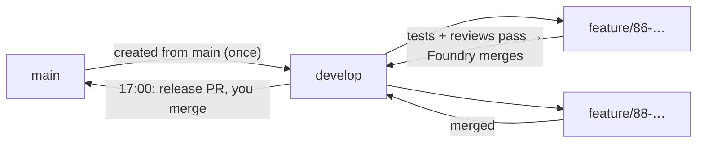
```mermaid
flowchart LR
    M[main] -->|"created from main (once)"| D[develop]
    D --> F1["feature/86-…"] -->|"tests + reviews pass →<br/>Foundry merges"| D
    D --> F2["feature/88-…"] -->|merged| D
    D -->|"17:00: release PR, you merge"| M
```

- Every issue gets its own branch, `feature/<issue>-<title>`, from `develop`. When its tests and
  both Codex reviews pass, the **Foundry merges it into `develop` itself**, runs the tests on the
  merged `develop`, pushes, deletes the merged feature branch (`delete_merged_branches: no`
  keeps it) and **closes the issue** — done means merged into `develop` (`close_when_merged: no`
  leaves it open until the release reaches `main`). If `develop` moved meanwhile, it merges again; conflicts are
  resolved by an agent (keeping both changes), then tested again. The changelog never conflicts:
  both sides' entries are kept (`union_merge_files`).
- **Several issues are coded at the same time** when they change different parts of the code:
  each plan names its code areas (`AREAS:`), and a run waits only while another run holds an
  overlapping area — without holding a slot: it steps aside and continues as soon as that run is
  done. Docs, the changelog and whole test folders are never locked (they merge safely). Issues
  in a **Depends on** chain are still built one after the other.
- **No waiting when nobody needs to act:** when a run ends, the Foundry checks that repository
  at once, so the next story, a resume or a retry starts right away instead of at the next interval.
- **No more rounds than the work needs.** Opus plans at high effort. Only a plan with a risk score
  above 75 — one a person approves anyway — is rewritten by Opus (at its highest effort) after
  Codex's review (`revise_above_risk`); for every other plan Codex's notes go straight to the coder.
  Each code change gets **one** Codex review. Set `review_twice_above_risk` to a number (for
  example `50`) to get a second review after a `[high]` finding or for stories riskier than that;
  the default is `off`.
- **No test run twice on the same code.** The tests before a change and the tests after a merge are
  skipped when exactly that code already passed them in another run — which is the normal case for
  the tests before a change: the story starts from the `develop` the previous story just tested.
  The log says "not run again". Set `reuse_test_results: no` to always run them.
- **One full test run per story.** Inside a story (after coding, after the review fixes) the
  watcher's `quick_test_cmd` runs when it is set — for example only the tests the change touches
  (`npx vitest run --changed --passWithNoTests`). The full `test_cmd` runs before the change and on
  the merge with `develop`, so nothing reaches `develop` without the full tests.
- **The merge is tested ahead of its turn.** A finished story tests its merge with `develop` before
  it takes its turn at `develop` (steps `pretest_merge` and `pretest_tests`), so several stories test side by side. If
  `develop` did not move meanwhile, the turn needs no test run and the story is pushed at once.
- **A few test runs at a time.** At most `test_slots` test commands (default `2`) work on the
  machine at once, over all runs and repositories; the others wait their turn. Many test runs at
  once make each of them slow and let timing-sensitive tests fail. `0` switches the limit off.
- **Small sessions for easy steps.** Writing the docs and resolving a merge conflict each start a
  fresh session with only what they need, instead of continuing the whole coding conversation. If
  the tests fail after a resolved conflict, the coding session takes over.
- Every day at **17:00** (`release-daily`) the Foundry runs the full tests and build on `develop`
  and opens (or updates) **one pull request `develop` → `main`** that lists and closes the day's
  issues — a draft while the checks fail. **You merge it once a day.**
- `develop` is created from `main` the first time, and kept up to date with `main` (for example
  after a hotfix) before new work starts. `develop` must not be in *Protected branches*
  (Settings), since the Foundry pushes to it; `main` stays protected (the one exception is the
  hotfix path below, and only when you switch it on).
- **Hotfix — bug stories go to `main` at once.** An issue with a label in `hotfix_labels` (default
  `bug`, any case) is built as a hotfix when an admin has switched on **Hotfixes** in Settings →
  Safety (off by default). Without the setting, or in a changed copy of the flow, it is built as a
  feature and the report says why in one line. The plan, plan review, size and risk checks, code
  areas, build, tests, reviews and docs are the same. What differs:
  - The branch is `hotfix/<issue>-<title>` (`hotfix_prefix`), made from the `main` commit the
    tests passed on before the change.
  - After the reviews the Foundry merges it into `main` (no fast-forward), **runs the tests on the
    merge result and pushes `main` only when they pass.** If `main` moved meanwhile, it merges and
    tests again. The issue is closed as soon as the fix is on `main`; it does not wait for the
    release. No pull request, no tag.
  - Then `main` goes into `develop` (conflicts are resolved by an agent and tested, like for a
    feature), so the release has no conflicts from hotfixes. The merged `hotfix/…` branch is
    deleted (`delete_merged_branches: no` keeps it; a branch that got new commits after the
    merge is kept).
  - A hotfix is never split by itself, and a plan above the risk threshold still waits for you.
  - The comment on the issue says: fixed on `main` (with the commit), merged into `develop`, and
    whether the running Foundry already has the fix (only when the issue belongs to the Foundry's
    own repository).

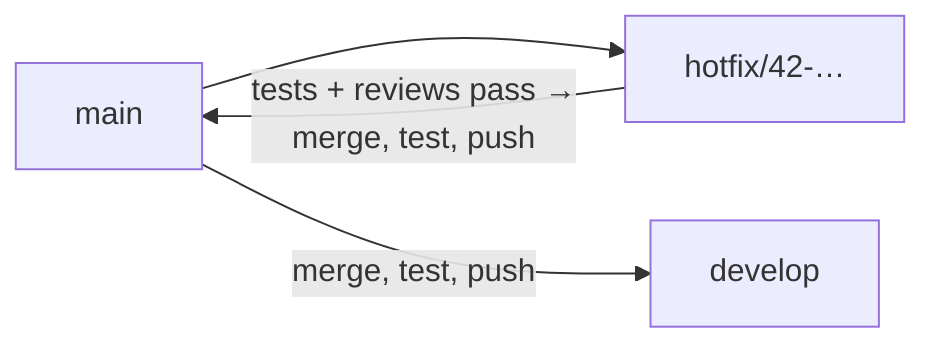
```mermaid
flowchart LR
    M[main] --> H["hotfix/42-…"]
    H -->|"tests + reviews pass →<br/>merge, test, push"| M
    M -->|"merge, test, push"| D[develop]
```

  If `develop` cannot take the fix (conflicts the agent cannot resolve, or red tests), the fix is
  still on `main`; the comment starts with **Merge main into develop** and says why. The Foundry
  tries again when it starts the next story (without conflicts only). To be sure, merge `main`
  into `develop` yourself — until then the daily release pull request can show conflicts.
- **Size limit:** a plan over 15 files or about 800 lines of production code (tests and docs
  don't count) is split into smaller issues instead — automatically when the split risk is low
  (`max_files`, `max_code_lines`).

#### The human-in-the-loop pipeline

For work where you want to see and approve **every** plan before any code is written:
`issue-plan` (label `Factory_ready`) plans the issue and posts the plan; you read it and add
`Factory_code`; `issue-code-daily` codes it on the day's branch; `daily-pr` opens the day's pull
request to `main` at 17:00, and no new coding starts while it is open.

#### Which flows ship

Two delivery pipelines, what supports them, and the standalone refinement flow: `epic-questions`,
`issue-gitflow` and `release-daily` (gitflow), `issue-plan`, `issue-code-daily` and `daily-pr`
(human in the loop), and `refine-brief` (the architect's context brief, see
[Refinement](#12-refinement); it can't be deleted, because Refinement uses it) and `refine-round`
(the architect's question round, same section). Build anything else yourself in the editor, with **✨ Draft flow with Claude**, or with any
AI assistant ([Let any AI write a flow](#let-any-ai-write-a-flow)). **A flow that a watcher uses —
enabled or disabled, or as its questions check — or that another flow runs as a step can't be
deleted**; the Foundry says which watchers or flows use it.

### Keep it running

Watchers only run while `scf ui` (or `scf serve`) runs. When a new version of
Spaghetti Code Foundry is built (`npm run build`), the running server restarts itself as soon as no run
is active — no need to stop and start it. To keep the Foundry running in the background on macOS,
also after a restart of your Mac:

```bash
scf service install     # uninstall | status
```

If you installed the service before, run `scf service install` once. It replaces the old
`com.claude-factory.server` agent with `com.spaghetti-code-foundry.server`, and puts the old one
back if the new one can't start.

#### Self-update

Off by default, because it lets merged code run on this machine without a person looking. For a Foundry that runs from a git checkout of its own repository. Switch it on in Settings → Safety and name the repository (`self_update: { enabled: true, repo: owner/name }` in `config.yaml`). After upgrading, stop and start the Foundry once, so that it can go back after a bad update.

Every 5 minutes it checks, in this order, and stops at the first reason that applies (the Health line shows it):

1. The record `self-update.json` can be read, and no earlier go-back failed.
2. The Foundry runs from a git checkout, under the supervisor (`scf ui` / `scf serve`, or the service).
3. The `origin` of the checkout is the repository in the setting.
4. `main` can be read from GitHub. Nothing new: nothing to do.
5. The checkout is on `main` and has no local changes (untracked files count). Only then does it fetch.
6. The same commit did not fail before. It waits for a newer commit.
7. The checkout can fast-forward to `main`.

Then it builds and tests the new commit in a separate folder (`npm ci`, `npm run build`, `npm test`). If a step fails, the old version keeps running and the monitor gets a finding. When all pass, no new runs start (queued runs wait and start after the restart) and the server restarts when the active runs are done. Right before the install it checks everything again, including the tip of `main`. It never updates from a branch other than `main` or from another repository.

If the new server stops or does not answer within 3 minutes, the supervisor puts the previous version back once and reports it (the monitor finding is critical). An install that was cut off is finished or undone at the next start. If you switch the setting off while an update waits, the server restarts on the unchanged version when the runs are done.

When the Health line says "Self-update is stopped", the checkout needs a person: run `git status`, `npm ci`, `npm run build`, then delete `self-update.json` in the data folder. Going back does not undo changes the bad version made in the data folder.

---

## 7. Settings and safety

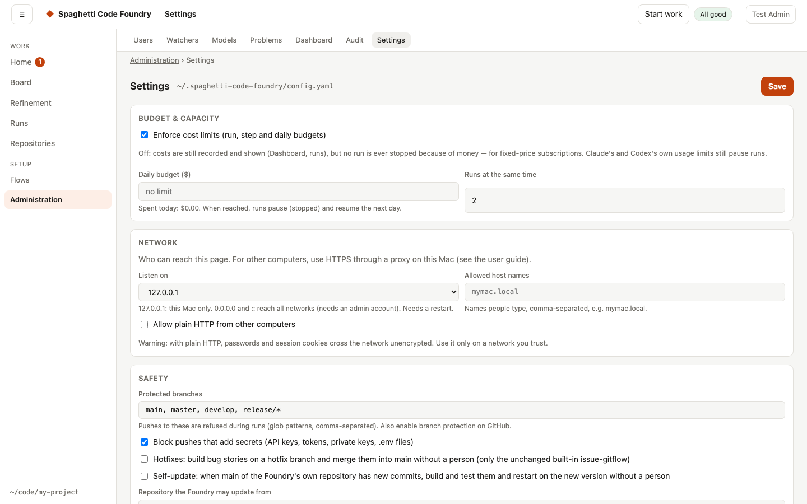

**Saving.** Next to **Save** the page says "Saving…", then "Saved at …" or "Not saved.". A message also appears. **Clean up** in the Disk section asks first in a dialog.

**Budget & capacity** — the daily budget stops new work when today's (estimated) spend reaches
it; paused runs continue the next day. An admin can also set a daily budget per user (Users page). Flows can also cap one run (`limits.max_cost_usd`).

**Safety**

- **Protected branches** — pushes to these branches (default `main`, `master`, `develop`,
  `release/*`) are refused during runs, whoever tries. Claude Code is not allowed to run
  `git push` at all, and Codex's sandbox has no network access by default — pushing is a flow
  step. This stops ordinary pushes from steps and agents; for a hard block use branch protection
  on GitHub (and allow the Foundry's account when hotfixes are on).
- **Hotfixes** — off by default. When on, bug stories (label from `hotfix_labels`) of the
  built-in `issue-gitflow` are merged into `main` and `develop` without a person, after tests and
  reviews. This is the one exception to **Protected branches**: only the merge-to-`main` step of
  the unchanged built-in flow may push `main`; flows you write never can. Stored as
  `hotfix_to_main` in `config.yaml` (an older build rejects that key).
- **Repository access** — shell steps that call `gh` or the remote carry `repo_access: true`, so
  only they will get the repository's credential (see [Step types](#step-types)).
- **Self-update** — off by default. When on, the Foundry builds and tests new commits of `main` of
  the repository you name and restarts on them without a person (see [Self-update](#self-update)).
  Stored as `self_update` in `config.yaml` (an older build rejects that key).
- **Audit log** — "Keep the audit log for … days": a whole number from 1 to 3650, default 180.
  Older lines are removed when the server starts and once a day (see "How long the audit log is
  kept" below). Stored as `audit.retention_days` in `config.yaml` (an older build rejects that key).
- **Secret scan** — every push is checked for API keys, tokens, private keys, connection
  strings and `.env`/key files in the new commits. Findings are shown masked and the push is
  refused. A private-key header only counts when key data follows it, so code (or a test) that
  writes a PEM around a key it generates is fine. For a false positive, add
  `factory:allow-secret` to the line or a pattern to `.claude-factory/secret-allow` in the
  repository.
- **Risk gate** — in `issue-gitflow`, every plan gets a risk score (0–100) from Opus and from
  Codex; above 75 (`risk_threshold`) a human must `/approve` it before any code is written. See
  [The risk score](#the-risk-score).
- **Sandboxing** — *Sandbox agents' shell commands* limits what agents' shell commands can
  write to the run's workspace. Shell steps marked **Run in Docker** (like the test steps) run
  in the Docker image you set, with only the workspace mounted.
- **Approval steps** in flows let you decide before anything irreversible happens (the risk gate
  and the split approval are approval steps).

**Notifications** — macOS notifications and a Slack webhook tell you only when something new
lands under **Needs you** on Home (a question, a risky plan or split, a release pull request, a failure, a
watcher error). Nothing is sent for progress. A run that succeeds is told only if you switch on
"Also notify when a run succeeds" (off by default; runs that finished before you switched it on are
not told).

No notification and no `notify.command` is sent for a run whose issue is known to be closed on GitHub. When the state is unknown or open, they are sent as before.

- **Message:** it says who has to do what, for example "acme/app#7 — The step
  run_tests failed: its command ended with an error — look at the output of the step and fix the
  cause, then remove the `factory:failed` label to start over, or resume the run on its page to
  continue at the failed step." It is at most 300 characters; a long title or reason is
  shortened, the action never.
- **Grouped and throttled:** at most one notification every N minutes (default 5, at least 1).
  Items that appear in that time come as one message, for example "3 things need you". Each item
  is told once; it is told again only when its situation changes.
- **Quiet hours:** set "from" and "to" (this machine's clock, may cross midnight). Nothing is
  sent in that time; what is still waiting afterwards is sent then.
- **Daily summary** (optional): set a time. Once a day you get a short message, for example
  "Done since yesterday: 3 stories, 2 other runs. Waiting for you: 1. Expected today: 2 stories
  being built, release pull request around 17:00." It follows the throttle and quiet hours, and
  is skipped when there is nothing to say.
- **Click:** on macOS a click opens the item, if `terminal-notifier` is installed
  (`brew install terminal-notifier`, allow it in the macOS notification settings). It must be on
  the `PATH` the server runs with; run `scf service install` again after installing it. Without
  it the notification shows but a click does nothing. Settings says which case applies. Slack
  messages always carry an "Open" link.
- **Command:** your own command still runs for every finished run, as before, for the outcomes
  you tick ("Run the command when a run is:"), with `FACTORY_STATUS`, `FACTORY_RUN_ID`,
  `FACTORY_FLOW` and `FACTORY_MESSAGE` set.
- **Who sends:** the server (`scf ui` / `scf serve`) sends the macOS and Slack messages, also for
  runs started with `scf run`. Without a running server only the command runs.

**Bot identity** — by default commits and comments are made as you. Set a bot name/email and a
token (or a GitHub App) to make them as a bot instead. In a run that never uses the machine's login
(every user's run, and an admin's run on a repository with a stored sign-in) the bot's token is never
used; the bot name and e-mail are, else the name and e-mail of the run's owner.

**GitHub App** — one app for the whole Foundry. It lets users connect a repository without a personal
token (the method "GitHub App" on My repositories). Set it up once:

1. Create a GitHub App. Give it the repository permissions Contents, Issues and Pull requests, each
   "Read and write". Download its private key (a `.pem` file) and keep it readable only by the server's account.
2. Fill in Settings → GitHub App: **App ID**; **App name (slug)**, the last part of
   `https://github.com/apps/<name>`; **Private key file**, the path of the `.pem`; and, only if you want the
   bot identity, **Installation ID (optional)**. With an installation ID, runs commit and comment as the app
   (this works as before). Without one, the app is used only for the repository method.
3. Without an app ID, a key file and a name, the method is not offered, and the API answers 400.

The server finds the installation with the app's own key, so a user needs no rights on GitHub. That is why
each account has a list of the repositories it may connect through the app. Set it on the Users page with the
"App repositories" button: one entry per line, `owner/name`, or `owner/*` for every repository of an owner.
An admin's own connections are not limited. A user cannot read or change any list, or these settings.

- Adding a repository, changing its method to the app and testing an app connection answer 403 when the
  repository is not on the account's list. GitHub is not asked.
- An account without a list can connect nothing through the app. After an upgrade, set the list of every
  account that needs the app.
- The list is checked only when a connection is added, changed or tested. Existing connections keep working
  in runs and watchers, also when you later remove an entry. To cut one off, remove the connection. The
  admin's Repositories page marks an app connection that is not on its account's list with "not on the app list".
- Still install the app only on repositories that Foundry users may work in, and choose "Only select repositories".

After the first save with a name, an older build of the Foundry rejects the new `slug` field in `config.yaml`.

**Disk** — every run keeps its workspace so you can inspect or resume it. Remove old ones on the
**Maintenance** page (Administration › Maintenance, `#/maintenance`; it is no longer on Settings) or with `scf clean` (branches in your repositories are kept).

**Accounts.** `scf user` keeps accounts in `users.json` in the data folder. Each account has an id,
name, e-mail, role (`admin` or `user`), status (`active` or `blocked`), password hash, created time
and last sign-in. An account can have no password yet: it has no hash, it cannot sign in, and it may
have a `passwordLink` (`id`, the SHA-256 of the link token, and `expires`) instead. Only you can read the file (mode `0600`). A data folder that does not exist yet is
created with mode `0700`. Passwords are never stored: each one is hashed with scrypt, a 16-byte
random salt per account, N=32768, r=8, p=3 and a 64-byte key. The parameters are stored with each
hash (`scrypt$N=32768,r=8,p=3$<salt>$<key>`). A hash in any other form makes the file invalid.
Anyone who can run commands on the machine as you has admin rights: they can read the file or run
`scf user create --admin`. This includes the agent and shell steps of flows, which run as your
user. A file that cannot be read or is not valid is an error, never "no accounts".

The last admin that is not blocked cannot be demoted, blocked or deleted: the command says "make
another admin first", changes nothing and exits 1. An admin that has no password yet does not count
as another admin. Change a role with
`scf user role <e-mail> admin|user`. `scf user list` shows the last sign-in of each account
("never" when there is none).

**The Users page.** Admins only: **Users** in the top bar (`#/users`). It lists name, e-mail, role,
status, last sign-in and the number of runs. The status is **blocked**, **no password yet**,
**locked** (too many wrong tries) or **active**; when more than one is true, the first in this list
wins, so a blocked account reads "blocked" even if it is also locked. Your own account is
marked "(you)".

- **Add user** asks for name, e-mail and role. Then the dialog shows the set-password link once. The
  link works once, for 24 hours, and you must send it to the user yourself. **Copy** needs HTTPS or
  localhost; otherwise select the link in the field and copy it. Close the dialog too early and
  the link is gone: use **New link**.
- **New link** (only for an account without a password) shows a fresh link; the earlier one stops
  working. For a blocked account the link works only after you unblock it.
- **Reset password** (only for an account with a password) removes the password, signs the account
  out everywhere and shows a one-time link, like **Add user**. Until the link is used the person
  cannot sign in. The last admin that can sign in cannot be reset; resetting your own account signs
  you out (the link is in the dialog). If the dialog shows an error and the account now reads "no
  password yet", the reset happened but its link was not shown: use **New link**.
- **Unlock** (only for a locked account) removes the lock and the wrong tries of the account. A wait
  of up to a minute for the address the wrong tries came from can remain, so the person may need to
  wait a moment. It leaves no line in the audit log.
- **Edit** changes name, e-mail and role. After an e-mail change, set a watcher's `owner` again
  (see above).
- **Block** signs the user out, cancels their queued runs and lets running runs finish. **Also stop
  all their work now** also cancels running runs and runs that wait for approval. The page then says
  how many runs were cancelled.
- **Unblock** lets the user sign in again. Cancelled runs are not restarted.
- **Delete** asks first, names the account, wipes its stored credentials and keeps its runs
  (they show `deleted user`). It cannot be undone.
- **Limits** (per account) and **Default limits** (toolbar) set three limits: runs at the same
  time, runs per day and the daily budget in USD. An empty field means "no limit". The defaults
  apply to every account, admins too; an account's own value wins over the default. The Limits
  column shows each account's effective limits and marks its own values with "(own)". Clear a field
  in the account's dialog and the default applies again. Deleting an account removes its own
  limits. **All three limits are enforced.** A job over a limit waits in the queue and starts by itself when the limit allows; the queue and the run page say which limit it is. Free slots are shared between users: the next slot goes to the user with the fewest working runs, then to the user whose last start is oldest. Only new runs count for "runs per day" (local day); resuming, answering or approving a run does not. Architect runs of a refinement session count for "at the same time" but not for "runs per day". Runs of a watcher count for the watcher's owner. Runs without an owner (the command line) are not limited in the queue, but a run that falls to the first admin counts for that admin, so an admin who uses the command line may need to raise their own limits. The daily budget counts the cost of the user's runs that started today (local day). When it is reached, no new job of that user starts and a working run stops before its next agent step (shell and approval steps still run); it continues the next day, or when you raise the budget. A watcher starts no new work for that owner and holds the issue. The user sees "waiting — your limit for today is reached", with no amount; you see the amount. `cost_limits: false` turns the budget off, and the global `daily_budget_usd` still applies on top. Runs without an owner are only under the global budget. Lowering a limit does not stop working runs; nothing new starts until usage is below it. Only admins can
  see or change them, and no answer to a user contains them. Each change writes a `limits-change`
  line to the audit log with the account (or "defaults") and the field names, not the amounts.
  Without a `limits.json` in the data folder, everything is "no limit".

A refusal (the last admin, an e-mail that is taken, bad input) shows in the dialog and the list does
not change. An error from Block or Delete can come after the change was made; close the dialog to
see the list again. Blocking or deleting your own account signs you out, and the page reloads.

**Managing accounts over the API.** Admins only (a user gets `403`). `GET /api/users` lists the
accounts (`id`, `name`, `email`, `role`, `status`, `created`, `lastSignIn`, `runs`, `hasPassword`, `lockedUntil`: an ISO time while the account is locked, else `null`; a blocked account can have both).
`POST /api/users {"name": …, "email": …, "role": "admin"|"user"}` adds an account without a password
and answers 201 with the account and its one-time token (400 for bad input, 409 for a taken e-mail).
The token is shown once; the link is `<address>/#/set-password/<token>`.
`PUT /api/users/<id>` changes `name`, `email` or `role`: leave a field out to keep it; `null` is not
accepted (400). `POST /api/users/<id>/block {"stopWork": true}` blocks, signs the account out and
answers with `cancelled: {queued, running, waiting}`. `POST /api/users/<id>/unblock` unblocks.
`POST /api/users/<id>/link` gives a new token for an account without a password (409 if it has one).
`POST /api/users/<id>/reset` removes the password, ends the account's sessions and answers like
`/link` (`user`, `token`, `expires`); 409 for an account without a password or for the last admin
that can sign in. `POST /api/users/<id>/unlock` removes the lock and wrong tries of the account and
answers with the account. Everyone signed in may call `POST /api/password {"current": …, "password": …}`
to change their own password (400 for bad input, 403 for a wrong current password, 429 when waiting).
`DELETE /api/users/<id>` deletes as `scf user delete` does. An unknown id is 404, the last admin that
is not blocked is 409. An admin may act on their own account within the last-admin rule; blocking
yourself signs you out. If an old key stays in the Keychain, delete answers 500 and the account is
gone; run `scf credential rotate-key`. A watcher's `owner` is an e-mail: after changing an account's
e-mail, set the owner again, or its new runs go to the first admin.

**What a block or delete stops.** Through the API the server acts at once and answers with the
numbers; running runs are told to stop and show as cancelled a moment later. A blocked or deleted account cannot start anything new. The jobs it
queued are cancelled (the server checks every 2 seconds; a block made while the server was down is
handled at the next start, before any job starts). A job it queued never starts, also after a
restart. Its running runs finish, and runs that wait for approval stay as they are. An admin can
still resume, approve or reject such a run, and that job runs. `scf user block <e-mail> --stop-work`
also cancels the account's running runs and its runs that wait for approval; workspaces are kept.
The server acts on `--stop-work` once, when it sees it (about 2 seconds, or at the next start), and
it covers every run the account owns at that moment. An admin's resume made in that gap is
cancelled too. `scf user unblock` restarts nothing and removes a stop-work request the server has
not handled yet. Watchers of the account keep working: disable the watcher or change its owner. The
server log says how many runs it cancelled, with the account id only.

**Audit log.** Every `scf user` action and every users API call that changes something (`create`, `password`, `role`, `edit`,
`block`, `unblock`, `delete`, `reset`; also `link`, when a new set-password link replaces the old one) adds one line to `audit.jsonl` in the data folder (mode `0600`), for
example `{"time":"2026-10-02T09:46:46.000Z","by":"cli","action":"role","userId":"<id>","oldRole":"user","newRole":"admin"}`.
`by` is `cli` or the id of the admin. An `edit` line is a name or e-mail change. A password set through a link is a `password` line made by the account itself (`by` is its id), and so is a password changed with **Change password**. A `reset` line has the admin's id (or `cli`) in `by`.
Only a role change has `oldRole` and `newRole`. A `block` line has `stopWork` (`true` when
`--stop-work` was given). No line holds a name, e-mail, password, hash, key or
token, and a failed account change is not logged. A block or delete that stops with an error may already have
signed the account out or removed its repositories and stored credentials; the server log names the
problem, and the same action made again finishes the job and writes the line. If the file cannot be written, the command stops before
it changes anything. In the rare case that the line cannot be added after the change (for example a
full disk), the command says so and exits 1. The file is a record, not a protection: anyone who runs
commands as you can edit it.

Every sign-in is also a line, for example `{"time":"2026-10-02T09:50:00.000Z","by":"<id>","action":"sign-in","result":"ok","userId":"<id>"}`.
A sign-in that works has `result` `ok`, and `by` and `userId` are the account id. A sign-in that fails (wrong password,
unknown e-mail, blocked account) has `result` `failed` and `by` `anonymous`; it has `userId` only when the e-mail belongs to an
account, so a wrong password and an unknown e-mail each write one line. The typed e-mail and password are never written. A try that is
refused with 429, a bad request and an over-long e-mail write no line. The first admin made on the setup page writes a
`create` line with `by` set to its own id (no `sign-in` line); if `audit.jsonl` cannot be opened, setup stops with an error and
makes no account. Event lines can also hold a short `target` (instead of `userId`) and a `detail` (only with a `target`); sign-ins
use neither. A sign-in line that cannot be written (for example while another `scf` command holds the lock) does not stop the
sign-in; the server log says `auth: audit.jsonl cannot-write`.

What people do in the web interface is also logged, with `result` `ok`, `by` set to the account that made the call, and a `target`
(and sometimes a `detail`):

| `action` | When | `target` | `detail` |
|---|---|---|---|
| `run-start` | A run is started | run id | |
| `run-cancel`, `run-approve`, `run-reject`, `run-resume` | A run is cancelled, approved, rejected or resumed (a cancel that cancelled nothing writes no line) | run id | |
| `run-archive`, `run-unarchive` | A finished run was archived or taken out of the archive (a repeat call writes a line too) | run id | |
| `run-answer` | An answer to the questions of a run was accepted (a refused call writes no line; the text is never logged) | run id | |
| `refinement-publish` | Ready drafts of a refinement session were published | session id | repository and issue numbers |
| `repo-add`, `repo-change`, `repo-remove` | A repository is added, its sign-in is changed, or it is removed | repository id | stored address |
| `repo-change` (admin) | An admin changes the settings of a repository | repository id | `settings:` and the names of the changed fields |
| `repo-transfer` (admin) | An admin moves a repository | repository id | id of the new owner |
| `credential-add`, `credential-remove` | A credential is added or removed | credential id | its type |
| `flow-publish` | A published flow is saved with a new version | flow name | version |
| `settings-change` | Settings are saved | `config.yaml` | names of the top-level settings that changed |
| `turn-answer`, `turn-approve`, `turn-reject`, `turn-retry` | An action under **Needs you** on Home (`defaults` and `answer` are `turn-answer`; `retry` and a retry with a hint are `turn-retry`) | `owner/repo#issue` | |

A line is written when the change is made. A call that is refused or fails before any change writes no line, and neither does a
call that changes nothing (the same repository settings again, a flow saved without a change, an unpublished flow). If an old key
is left in the Keychain, the change was made, so its line is written even though the answer is an error. Tokens, passwords, keys,
notes, task text, credential names and setting values are never written. A line that cannot be written does not stop or undo the
action, and a line is not written while another `scf` command holds the lock; the server log then says
`audit: <file> <kind> (<action>)`. Runs that a watcher starts, `scf run`, `scf approve`, `scf reject`, evals, deleting or
unpublishing a flow, blocks, clean-up and running a watcher now are not logged. A `target` can be up to 255 characters.

**The Audit page.** Admins only: **Audit** in the top bar (`#/audit`). It shows who did what, newest first: time, who, action,
target and result. "Who" is the account's name, "command line" for `scf`, or "not signed in" for a failed sign-in. An account
that is gone shows as "deleted user". A detail, such as `user -> admin` for a role change, is under the target.

- **Filters.** User (a list of the accounts; it finds what the account did and what was done to it), action, and a from and a
  to date. The dates are days in your browser's time zone; both days are included. Changing a filter reloads the list.
- **Export CSV** downloads every line that matches the filters shown, oldest first.
- The page shows the newest 500 lines. When there are more, it says so: narrow the filters or use **Export CSV**.
- An empty result says "No entries." An error, such as a log that cannot be read, shows on the page.

An account with the role `user` never sees the link or the page; a user who opens `/#/audit` lands on My runs.

**View as user.** An admin can open the display of one user and see what that user sees, read-only.

- **Start.** On the Users page, press **View as user** on an account with the role user (admins do not have the button). The user display opens at `/user/?as=<id>` with that user's My runs, run page, My repositories, Refinement and Start work.
- **The bar.** A bar at the top says "You are viewing as <name>. Nothing can be changed here." Press **Back to the admin display** to end the view and return to the Users page. The top bar still shows your own name and Sign out.
- **Read-only.** Buttons that only change things are not shown: Start, Add repository, Remove, Approve, Reject, Retry, Cancel, Send answer and the buttons of a refinement session. A button that is still there, such as Change password, shows "This is a preview. Nothing can be changed here." and sends nothing. The page sends no changing call in this mode.
- **When the view ends.** A view ends after 30 minutes, or when the server restarts. The page then says so and offers **View again** (a new start, a new audit line) and **Back to the admin display**. It never shows your own data instead. A view opened in another tab, or when the browser cannot keep the user's name, also shows this card.
- **Other cases.** `/user/` without `as` still sends an admin to the admin display. If a user opens `/user/?as=…`, the parameter is ignored.

**View as user (server).** The part below is what the server does for the page above.

- **Start.** `POST /api/admin/view-as` with `{"userId": "…"}` starts a view for your session and answers `{id, name}` of the user. It writes one audit line with the action `view-as` (you as the actor, the user as the target). If that line cannot be written, the view does not start (503 when the log is busy, 500 otherwise). An unknown account answers 404; an account with the role admin, or your own account, answers 400. A blocked user can still be viewed.
- **Use.** While the view runs, a `GET` call with `?as=<userId>` is answered as it would be for that user: the same rules (a call marked `no` for users is 403), and the same cut-down answers (no costs, no folders, no runs of other accounts; a foreign run is 404). This holds for `flows`, `queue`, `runs`, `runs/:id`, `runs/:id/events`, `runs/:id/diff`, `repos`, `repos/methods`, `credentials`, `refinement` and `refinement/:id`. Unexpected errors show the user's fixed sentence. `GET /api/session` still shows you as the admin. Calls without `as=` are not changed. Reads leave no audit line.
- **Refused.** `as=` without a running view for that user is 403, and so is `as=` from a user. Any call that is not a `GET` and has `as=` is 403 "the preview is read-only", and nothing changes.
- **End.** A view lasts 30 minutes and ends with the session. `DELETE /api/admin/view-as` ends it now. It also ends when the user is deleted or made an admin, or when you are no longer an admin. Views are kept in memory only: after a restart a new one must be started, which writes a new audit line. An open log stream started with `as=` is closed when the view ends.

**Reading the audit log over the API.** Admins only; a user gets 403. `GET /api/audit` answers `{entries, more}`. An `actor` is `{type: "cli"}`, `{type: "anonymous"}` or `{type: "account", id, name}`; a `target` is an account in the same form, `{type: "text", text}`, or `null`. Account lines show `result: "ok"` and the account as target; a role change has `detail` like `user -> admin`, and a block that stops work has `stop work`. `name` is the current name, or `deleted user`; the file keeps ids only. Filters: `user` (the account id exactly as stored; it matches the actor or the target account), `action`, `from` and `to` (ISO times with seconds, such as `2026-10-02T09:00:00Z`; both are included). A `+` in an offset must be written `%2B`. An unknown, empty or repeated filter, a `user` that is not an id, an `action` that is not an audit action, a bad time, or `from` after `to` answers 400. At most 500 entries come back, newest first by the order of the lines; when `more` is true, narrow the filters or use the export. `GET /api/audit/export` takes the same filters and downloads every matching line as `audit.csv`, in the order of the file (oldest first), with the header row `time,actor,actor_name,action,target,target_name,result,detail`. A cell that starts with `=`, `+`, `-` or `@` gets a `'` in front. Stored secrets are hidden as in every other answer; a CSV row that would show one is hidden whole. Lines that do not parse are left out. An unreadable file answers a plain 500, and the log says `audit: audit.jsonl unreadable`. A download that breaks half-way is cut off, not ended early.

**How long the audit log is kept.** Lines older than `audit.retention_days` (Settings → Safety, "Keep the audit log for … days"; 1 to 3650, default 180) are removed when the server starts and once a day after that. A changed setting counts at the next round, without a restart. There is no "keep for ever": download the log with `GET /api/audit/export`, or copy `audit.jsonl`, before lines age out. Only a line that can be read and is too old is removed. Lines that cannot be read stay, also a line with bytes that are not valid UTF-8; the order and the mode `0600` stay. The file is replaced in one step and is not touched when no line is old enough. If the clean-up fails or `auth.lock` is busy, the server keeps running, the log says `audit: <file> <kind> (clean-up)`, and the next round tries again. `scf` commands never remove lines. The first start after an upgrade removes lines older than 180 days; to keep more, set `audit.retention_days` in `config.yaml` before that start.

**Sign-in and sessions.** The UI and its API need a signed-in account; only the sign-in, sign-out,
first-admin and set-password calls and the static files are open. A session is kept on the server in
`sessions.json` (mode `0600`): it holds only a SHA-256 of the session token, never the token. It
lasts 7 days from sign-in and is not renewed. Sessions survive a restart and move with the data
folder. The browser holds the token in the cookie `scf_session_<port>` (`HttpOnly`,
`SameSite=Strict`); the port is in the name because `localhost` cookies are shared between ports.
The cookie gets the `Secure` flag when you reach the UI over HTTPS (through a proxy, see
[Access from other computers](#access-from-other-computers)); over plain HTTP on this machine it has none.
- **CSRF.** Every call that changes something must send the header `X-CSRF-Token` with the token
  the server gave at sign-in; otherwise it gets 403. The UI does this for you. Requests from a
  foreign origin or host are refused as before.
- **Wrong passwords.** Every try is counted before the password is checked, per e-mail and per
  client address. From the 5th wrong try, sign-in answers 429 (with `Retry-After`) until a wait is
  over: 1, 2, 4, 8, 16 and 32 seconds, then 60 seconds. The 20th wrong try for an e-mail locks it
  for 30 minutes, also against the right password. A try with the right password is given back
  for the address and clears the count of the e-mail. Counts are forgotten 30 minutes after the
  last try. **Change password** counts as a sign-in try for the e-mail, and a wrong current
  password can delay or lock sign-in for that account. **Unlock** removes only the lock and the
  count of the account; a wait of up to a minute for the address can remain. A server restart
  clears all waits and locks (the CLI cannot unlock). Anyone can lock an e-mail with 20 wrong
  tries, so the only admin can be locked out: wait 30 minutes, ask another admin to unlock, or
  restart the server. The answer for a wrong password and for an unknown e-mail is the same.
- **Set-password links.** Only a SHA-256 of the link token is stored. The token sits after `#` in
  the address, so it is in no request line or log. A link lasts 24 hours (a link made before the
  upgrade keeps its stored end time). `POST /api/set-password` shares the per-client wait with
  sign-in (16 password checks at once); a refused password with a live link does not count, and
  using a link clears the wrong-tries count of that e-mail.
- **Ending sessions.** Signing out, expiry, `scf user password` and `scf user block` end sessions, and so do block, delete and **Reset password** through the API. **Change password** ends the other sessions of the account and keeps the one that made the change.
  A run log that is open in the browser stops within 5 seconds. A role change does not end
  sessions; the new role counts from the next call.
- **Problems with the files.** If `users.json` or `sessions.json` cannot be read or written, or
  another `scf` process holds the lock, sign-in shows "sign-in is not working; see the server
  log". The log names the file and the kind of problem, never a password or a hash. The users API
answers a plain 500 for such a problem and logs the same way (for example `users: audit.jsonl cannot-write`).

#### Roles and permissions

Every account has a role, `admin` or `user`. The server checks it on every call. A call that is
not in the table below answers 404, also for an admin.

- **An admin** may make every call and sees every page.
- **A user** sees only the **Start work**, **Refinement**, **Runs** and **My repositories** pages and may use the calls marked `yes` or `own runs` in the
  table. Every other call answers `403 {"error":"not allowed for your role"}`. Pages other than
  Start work, Refinement, Runs and My repositories are not part of the user display at `/user/`. A user who
  opens `/` is sent to `/user/`, and any other address there goes to `#/runs`.

**What a user does not see.** The server cuts these from every answer a user gets, so the page
cannot show them: costs, tokens, budgets and prices; the model, provider and agent; step output
and transcripts (`GET runs/:id/transcript/:n` is for admins only); tool arguments in the log;
settings, folders and the raw reason of a failure; hidden variables of the flow. A user sees the
status, the log (steps and tool names), the questions and approvals, the steps with their result,
and the changes. A limit reads "the administrator's limit was reached". An unexpected error
answers "something went wrong on the server; ask the administrator" and the details go to the
server log. Notifications are not changed: they go to your channels with your wording, also for
runs users started, so the Slack webhook should not point at a channel users read.

**Your own runs.** A run has an owner: the account that started it. A user sees and may follow,
cancel, resume, approve, reject and read only their own runs. Another account's run, an unknown
run and a run without an owner all answer `404 {"error":"run not found"}`, so a guessed id tells
nothing. A run started by a watcher belongs to the watcher's `owner` (an account's e-mail, set by
an admin; empty: the first admin). Runs from the command line and from evals belong to the first
admin. A queued run that has not started yet already counts as its owner's. An admin may use
every run.

**After an upgrade.** Runs from older versions have no owner. The first admin gets them at the
next server start, when the first admin is created on the setup page, and within a minute of
`scf user create --admin` while the server runs. A run that is still live is handed over after
it ends.

**The queue.** A user sees only their own queued runs. Runs of other accounts in front of them
show as "n runs ahead of you", without ids.

**Answering a run.** On a run that waits, a user can approve or reject it with a note
(`POST /api/runs/<id>/approve` or `/reject` with `{"note": "…"}`). The note reaches the run. A user whose run stopped with questions answers them on the run page
(see "Answer a run's questions"); the card in My runs says so and sorts on top.

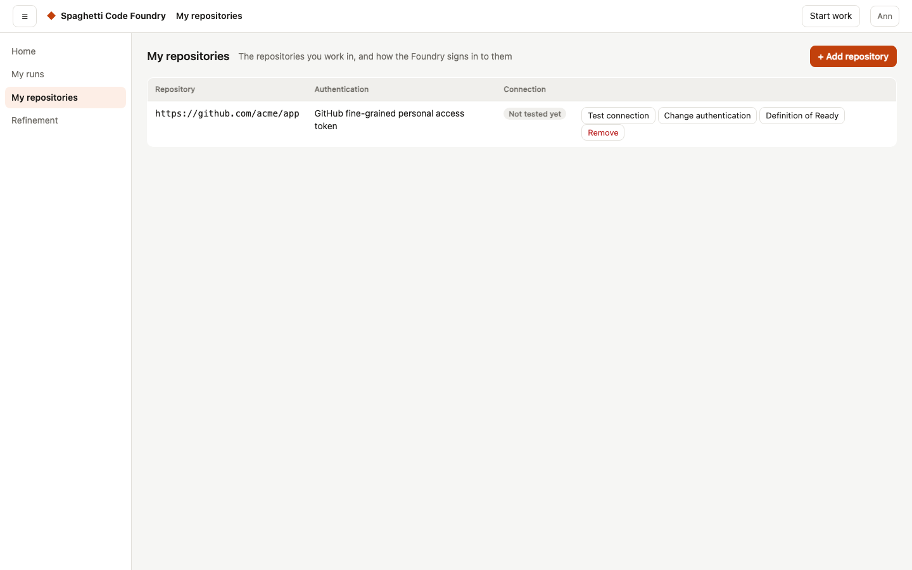

**What runs sign in with.** In a run you own, every step marked `repo_access` signs in to the repository named by `github_repo` with the sign-in you chose for it, and nothing else: not the bot's token, not the server's `gh` login or git settings. Other steps and the agents never get it.

**Runs that never use the machine's login.** Every run owned by a user is isolated, and so is an admin's run on a repository with a stored sign-in (a token, a deploy key or the GitHub App). In such a run **no step** acts with the server's login, the bot's token or the Mac's git identity. Every step, agents and shell steps without `repo_access` too, has no `GH_TOKEN`, `GITHUB_TOKEN`, `GH_ENTERPRISE_TOKEN` or bot token, an empty `gh` folder of its own, no git settings or credential helpers of the machine, no ssh agent and no ssh keys of the account, and no prompts. Only a step marked `repo_access` gets the repository's own credential. An admin's run on a repository with the method "none", one that is not in the list, or a local folder is **not** isolated: the machine's login and the bot's token work as before.
- **Commit name.** Commits in these runs use the bot name and e-mail from Settings when they are set (each on its own), else the name and e-mail of the account that owns the run. If the account was deleted and the bot name and e-mail are not both set, the step ends with "the account that owns this run could not be found, so its commits have no name": set the bot name and e-mail in Settings, then resume the run.
- **After the upgrade.** An unflagged step or an agent in these runs can no longer call `gh` or the remote. The machine's git settings (signing, aliases, proxy) are not used; if you need a proxy or a certificate file, list `HTTPS_PROXY` or `SSL_CERT_FILE` in `step_env.pass` (see "Environment of the steps").
- **Environment of the steps.** A step of a run owned by a user does not get the server's environment. A shell step gets `PATH`, `HOME`, `USER`, `LOGNAME`, `SHELL`, `TMPDIR`, `TMP`, `TEMP`, `LANG`, `LANGUAGE`, `LC_ALL`, `TZ` and `TERM`, the Foundry's own `FACTORY_…` variables, and the names an admin lists. An agent step gets the same plus what its own agent and provider need (for example `ANTHROPIC_API_KEY` for Claude on an Anthropic provider, `OPENAI_API_KEY` for Codex on OpenAI); keys of other providers are not passed. Admin runs are unchanged.
  - **Admins add a variable** in `config.yaml`: `step_env.pass` lists names for all steps, `step_env.agent_pass` names for agent steps only. A name may end in `_*` (for example `AWS_*`). Names starting with `FACTORY_`, `SCF_`, `GH_`, `GITHUB_`, `GIT_` or `SSH_` are refused, and provider keys are never passed by a list. `SCF_STEP_ENV_PASS` in the server's environment (comma separated) adds names too. A name on `pass` can be read by every user's shell steps, so use `agent_pass` for a secret that only agents need (such as `CLAUDE_CODE_USE_BEDROCK` with the `AWS_…` keys).
  - **After the upgrade,** a flow that relied on an inherited variable such as `JAVA_HOME` or `NVM_DIR` in a user's run needs that name added.
  - **Hidden in output.** The values of the provider key variables named in the config (`api_key_env`) are hidden in logs, live output and API answers. A value shorter than 8 characters is not hidden; the server logs a line when it finds one.
  - **The limit.** The agent's own key is still visible to the agent's shell tool unless the agent program hides it.
- **OS sandbox for steps of a user's run.** On macOS, every shell step of a user's run starts inside a `sandbox-exec` profile. The step cannot read the Mac account's home, the data folder or other runs, cannot write outside its run folder (and not `run.json`, `live.log` or `logs/`), and cannot use the Keychain, unix sockets or open apps. The network stays open. Its `HOME` is `<run folder>/home` and `TMPDIR`, `TMP` and `TEMP` are `<run folder>/tmp`, so caches in `~` start empty. A shell step marked **Run in Docker** is held by the container instead. Claude and Codex steps are held by the same profile. Their own sandbox is off, each run has its own empty agent folders, and they sign in by a token variable set for the server only (see "Trust"); without one the step is refused. Admin runs are unchanged.
  - **Settings.** Tick **Allow user runs without the OS sandbox** (`sandbox.user_runs: off`) to run user runs without it. If no sandbox works (not macOS, or `sandbox-exec` fails) and the box is not ticked, a user's run does not start: "This computer cannot hold a user's run in a sandbox, so the run was not started. An admin can allow user runs without it in Settings." The server variable `SCF_USER_SANDBOX=off` (or `FACTORY_USER_SANDBOX=off`) does the same.
  - **Extra read paths.** `sandbox.user_read` in `config.yaml` lists up to 50 paths a user's shell step may also read (for example a tool installed in the home). Saving Settings keeps it.
- **The limit.** Agent steps are **not in an operating-system sandbox** yet, and neither are runs with the sandbox switched off. For them, this is done through the environment of the steps. It is **not an operating-system sandbox**. A step runs as the server's macOS account, so it can still read that account's files and Keychain (`~/.ssh`, `~/.netrc`, a `gh` login kept in the Keychain), call `ssh` itself, or set the variables again. A Codex agent still loads the account's Codex settings (`~/.codex/config.toml`); on a server with users, keep GitHub tokens and GitHub MCP servers out of that file. Claude Code agents skip the personal setup in these runs. A step marked **Run in Docker** gets nothing of the machine but the commit name; as before, the push hook does not run inside the container. A separate account or container per run is not included.
- **A token** ("GitHub token" or "HTTPS token"): `gh` and git use it. Give it Contents, Issues and Pull requests, read and write, then press **Test connection**; a token made for reading only fails at the first push or comment.
- **A deploy key:** git uses it over ssh, and nothing else (no ssh agent, no key or ssh settings of the server's account; host keys are kept in `known_hosts` in the data folder). The key is a file in the folder `sign-in` of the run folder, outside the workspace. It exists only while the marked step runs and is deleted when the step ends. **A deploy key gives git access only:** a step that calls `gh` fails with "a deploy key gives git access only; choose a token or the GitHub App under My repositories". Call `gh` by name; the check does not see `gh` called by its full path.
- **The GitHub App:** each marked step gets a new token from the app, limited to this repository, for `gh` and git. It is never stored and is hidden in the output. **A token lives one hour,** so a marked step with the app must finish within one hour. A step that runs longer and is then refused fails with "the app's token ran out during the step"; resume the run to get a new token. If the app is not set up, not installed on the repository or GitHub cannot be reached, the run fails with a sentence that says so.

With the method "none" an admin's run uses the server's own access; a user's run fails with "set a token for this repository under My repositories". If the sign-in is missing, cannot be read or is refused by GitHub (expired, revoked, no access), the run fails and tells you to reconnect the repository here. A push to a protected branch is still refused and the secret scan still applies.

**The sign-in folder.** The `sign-in` folder is removed when the step ends and when the run ends, however it ends. A folder left by a crash is removed when the run is resumed and when the server starts. If a folder cannot be removed, the step or the resume fails with "the sign-in folder of this run could not be removed"; ask an admin to delete the folder `sign-in` in the run folder, then resume the run. A background process that a step starts is stopped when the step ends.

**After the upgrade.** An admin's repository with a deploy key or the app no longer uses the server's own access in marked steps. A deploy-key repository cannot run steps that call `gh`, such as the first steps of the built-in issue flows; choose a token or the app for it.

**Test connection.** The button on My repositories calls `POST /api/repos/<id>/test` (the owner, or an admin for any
repository). It runs up to three checks and shows each with a short message: **Read** (a shallow clone), **Write**
(`git push --dry-run` to a scratch branch name; nothing is pushed and no branch is created) and, for GitHub
repositories, **GitHub API** (the repository, its issues and its pull requests can be read). The last result is saved
as the connection status and returned by `GET /api/repos` as `connection`. It is cleared when the token, key, method
or address changes, when the repository is transferred, and when its stored token or key is deleted. A test stops
after 60 seconds. A second test of the same repository while one runs, and a repository changed during its test,
answer 409. The messages tell wrong or expired tokens, a repository not found, read-only access (for a deploy key:
"added without write access"), an unreachable host, host key problems, timeouts and a token without the Issues or
Pull requests permission, and say what to do. A deploy key gives git access only, so for a GitHub repository with a
deploy key the API check is skipped; issue and pull request work needs a token or the GitHub App. The API check only
reads: the Foundry still needs "Read and write" for Issues and Pull requests, and the test does not prove that. A dry
run does not check branch rules, so a protected branch can still refuse a real push. In an empty repository the push
check uses a local commit that is never sent. Only an admin can test a repository with the method "none", whoever
owns it; for a user the test answers 409. For that method the test uses the server account's git configuration, credential helpers, SSH configuration, keys and `gh`
sign-in; `GIT_*` variables of the server are not used. SSH host keys: the first key seen is trusted and kept in
`known_hosts` in the data folder; remove the host's line there after a real key change (for "none", the file is
`~/.ssh/known_hosts` of the server's account). The server's SSH configuration is not used for a deploy key.
For the method "GitHub App" the test looks up the installation again and asks GitHub for a new short-lived token
limited to that repository; clone, push check and API check use it (it is passed to git and `gh` through the
environment only, and is never stored, logged or shown). If the app is no longer installed, the result says so
(`app-not-installed`); if the app was removed from the settings, `app-not-set-up`; if its key or ID is wrong,
`app-broken`. A changed installation ID is kept.

**The My repositories page.** `#/repos` is in the top bar for every account. It lists your repositories
with the URL, how the Foundry signs in (the authentication method) and the connection status, which is
"Not tested yet" until you press **Test connection** (see below). **Add repository** asks for the URL and the method:
a GitHub fine-grained personal access token (give it these repository permissions, each "Read and write":
Contents, Issues and Pull requests), an HTTPS user name + token for other git hosts, an SSH deploy key, or
the **GitHub App**. The token is typed in a password field and is never shown again. **Change authentication** keeps the stored
token if you leave the token empty; a new method needs a new token. **Remove** asks first and deletes the
stored token or key too.

With **GitHub App** you need no token. It is offered only for a GitHub repository with an https address, and
only when the administrator has set up the app; otherwise the dialog says "GitHub App is not available: the
administrator has not set up the app (Settings → GitHub App)". The dialog shows **Install the app on GitHub**
(`https://github.com/apps/<name>/installations/new`). Install the app on this repository (choose "Only select
repositories" and pick it), then save, then press **Test connection**. When you save, the server looks up the
installation of the app on the repository and keeps its ID with the repository; if the app is not installed
there, it says so (409) and nothing is saved. The row keeps the link, to install the app on more repositories or
change which ones it may use. If the administrator removes the app, the row says so; choose another
authentication. **Remove** does not uninstall the app on GitHub.

With **SSH deploy key** you type the SSH address of the repository (`git@host:path` or `ssh://…`) and no
secret. The Foundry makes a key pair, keeps the private key and shows the **public key** in the
Authentication column, with **Copy** (it needs HTTPS or localhost; otherwise select the key and copy it
yourself). Add the public key in the settings of the repository as a deploy key **with write access** (on
GitHub: Settings → Deploy keys → Add deploy key, with "Allow write access"). **Generate a new key** makes
another pair after a confirmation; the old key stops working, so add the new public key and remove the old
one. When you change a repository with an https address to this method, the dialog also asks for its **SSH
address**; changing a deploy-key repository to a token method asks for an **HTTPS address**.
Errors from the server show in the dialog in plain words. A failed removal shows above the list, with
**Try again** when the server asks for it (an old key is still in the Keychain). A repository without a
method shows "Needs authentication" for a user. An admin can also choose "The server's own access". The page
has no per-repository settings. An admin sets them on the **Repositories** page.

**The Repositories page (admin).** `#/all-repos` is the admin page **Repositories**; a user never gets it.
It lists the repositories of all accounts with the owner (name and e-mail, and "blocked" for a blocked
owner), the URL, the authentication method and the connection status ("Not tested yet" until the owner tests it). Three calls, all admin only: `GET /api/admin/repos`, `PUT /api/admin/repos/<id>/settings` and
`POST /api/admin/repos/<id>/transfer {"email": …}`.

- **Settings** per repository: the test command (one line, up to 500 characters), the docs to update (up to
  50 paths, no leading `/`, `~` or `-`, no `..`), the protected branches (up to 50 patterns), and the names of
  the main and the develop branch. Input is checked on the server: lengths, no control characters. Branch names
  follow git's rules, are at most 200 characters, and may not be `@`. In a pattern `*` matches any text and
  `?` matches one character; `[…]` is not allowed. `{}` clears the settings.
- **The settings are only stored and shown.** Runs do not use them yet: the test command still comes from the
  flow var `test_cmd` and the protected branches from `protected_branches` in `config.yaml`. They are never in
  `GET /api/repos` and never shown on **My repositories**.
- **Definition of Ready** per repository: a short ordered list of checks a story must meet before it may go to
  the backlog. Each item has an `id` and a `text`. With nothing stored, a repository has the default list of
  seven items: the value is clear (who and why); it stands on its own or its dependencies are named; every
  acceptance criterion can be checked; it is small enough to build in one go; there are no open questions; it
  says what is out of scope; it contains no implementation plan. The default items also have a fixed `rule`
  key that later parts use to pick the check; an item an admin adds has none.
  - **Admin:** the **Definition of Ready** button on a repository row opens a dialog: reword, add, remove,
    move up or down, add a removed default item back, **Back to the default**, Save. The API is
    `PUT /api/admin/repos/<id>/ready {"items": [{"id"?, "text"}]}`; `{"items": null}` or the unchanged default
    list stores nothing. Limits: 1 to 20 items, each 1 to 200 characters on one line, no control characters, no
    two items with the same text, no unknown or repeated `id`. A refusal is a 400 with one plain sentence.
  - **Owner:** **My repositories** shows the list read-only. `GET /api/repos/<id>/ready` answers
    `{ items, isDefault }` to the owner and to an admin; anyone else gets 404.
  - A transfer keeps the list; removing the repository removes it. It is only stored and shown for now: no
    story is checked against it yet.
- **Transfer** moves a repository to another account, chosen by e-mail (any case). It is refused, with a plain
  message, when the e-mail is missing or not valid (400), no account has it (404), the account is blocked (409),
  or it already has 50 repositories (400). Afterwards the repository is in the new owner's list and no longer in
  the old one's, and its settings stay.
- **Sign-in on transfer.** A personal token (`github-token`, `https-token`) is deleted and the method becomes
  `none`. For a user that reads "Needs authentication"; for an admin it reads "The server's own access", like
  every `none` repository of an admin. The new owner sets the sign-in again. An SSH deploy key belongs to the
  repository, not to a person: it moves to the new owner with its public key, so the key that was added in the
  repository's settings keeps working (a missing key refuses the transfer with 409). A GitHub App installation
  is kept the same way: the method and the installation ID move with the repository (the connection status is
  cleared). The wipe of a token cannot be undone; transfer back and
  type the token again.
- Queued and running runs of the old owner are not stopped.

**The Credentials page (admin).** `#/credentials` is the admin page **Credentials**, after **Repositories**; a
user never gets it. It is a table of the stored credentials of all accounts, sorted by owner name and then by
name, with Owner, Name, Type, Fingerprint, Created and Last used ("never" when it was not used yet). The
owner shows "deleted account" when the account is gone. It is for looking only: there is no add, change or
remove button, and no secret is ever sent. One call, admin only (a user gets 403): `GET /api/admin/credentials`.
If the store cannot be read, the call answers 500 with the same sentence as `GET /api/credentials`.

**Repositories.** Every account has its own list of GitHub repositories, kept in `repos.json` in
the data folder (mode `0600`). A repository is a record: `id`, `owner` (account id), `url`, `method`
and `added`, and it may hold `settings`, which only an admin can read (`GET /api/repos` never has them).
A deploy-key record also has `credentialId` and `publicKey`. It never holds a secret (a public key is not
one). These calls manage it:

- `GET /api/repos` lists your records, with the `publicKey` of a deploy key and the `installationId` of a
  GitHub App record (a record with the method `github-app` has no credential). A GitHub record also has
  `github`, its `owner/name` in lower case without `.git`; so do the answers of adding and changing a record.
- `GET /api/repos/methods` answers `{methods, githubApp}`: the methods you may choose (`none` only for an admin,
  `github-app` only when the app is set up) and `githubApp: {available: true, installUrl}` or
  `{available: false}`. It never shows the app ID or the key path.
- With `"method": "github-app"`, `POST /api/repos` and `PUT /api/repos/<id>/auth` take no token and no user name,
  and the installation ID is never read from the request. The server checks the request first (a request it
  refuses itself makes no call to GitHub), then asks GitHub for the installation. Answers: 400 when the app is
  not set up on this server, 409 when it is not installed on the repository, 500 when the app does not work
  (ask the administrator), 502 when GitHub cannot be asked.
- `POST /api/repos {"url": …, "method": …, "username": …, "token": …}` adds one (201; 409 if you or
  another account has it; 400 for a bad URL or method; at most 50). `{"name": "owner/name"}` still works.
- `PUT /api/repos/<id>/auth` changes the method, user name, token or address. What you do not give
  keeps its value. The old stored token is wiped. 404 for an id that is not yours.
  `{"newKey": true}` makes a new deploy key (only for the method `ssh-deploy-key`; 400 otherwise); the
  answer holds the new `publicKey`.
- `DELETE /api/repos/<id>` removes the repository and its stored token or key (404 if it is not yours).
- `DELETE /api/repos/<owner>/<name>` removes a GitHub repository by name (the old form).

The URL is `https://host/path`, `ssh://[user@]host[:port]/path` or `git@host:path`; `owner/name`
means `https://github.com/owner/name`. Local paths, `file:`, `ext::` and other transports, a user
name or password in the URL, and control characters give 400. The record keeps the address as you
wrote it (for example `git@host:team/app.git` stays that way). The same repository in another case,
with or without `.git`, or in https or ssh form counts as one repository. `PUT …/auth` may change the
address only to another form of the same repository.

Methods: `github-token` (a GitHub fine-grained token, only for `https://github.com/…`) and
`https-token` (a user name and a token, any https host). The token is stored in the credential store
as `repo:<repository id>`. `none` is the default without a method: the server's own access for an
admin, "needs authentication" for a user, who cannot choose it. If a repository's token is removed
with `DELETE /api/credentials/<id>`, set it again with `PUT …/auth`.

`ssh-deploy-key` works only with an SSH address (400 with "SSH address" in the message for https); it takes
no user name and no token. The Foundry makes an ed25519 pair with `/usr/bin/ssh-keygen` (no passphrase, no
comment) in a private temporary folder that is removed again. The private key is stored as the credential
`repo:<repository id>` of type `ssh-key` and never leaves the server; the record and `GET /api/repos` show
the `publicKey`. If ssh-keygen fails, the call answers 500 "the SSH key could not be made; see the server
log". If the key was removed with `DELETE /api/credentials/<id>`, generate a new key (`PUT …/auth` with
`{"newKey": true}`, or the method `ssh-deploy-key` again, which also repairs a missing or wrong credential).

If `repos.json` cannot be read, the calls answer "the repository list is not working; see the server log".

**Which flows a user may start.** A user starts a *published* flow by name (`POST /api/runs
{"flow": "<name>", "task": "…", "vars": {…}}`), never by `yaml` (403 "only an admin can run a
flow that is not saved") and never in a folder of their choice (403 "only an admin can choose
the folder"). A flow is published when its `publish:` section has `enabled: true` (see "The
editor"). Built-in flows are not published; save a copy and publish it. After an upgrade users
see no flows until you publish some. An unpublished flow answers 404.

`GET /api/flows` shows a user the published, valid flows as `{name, title, description,
version, usesTask, fields}`. `usesTask` is true when a step reads the task (`{{task}}`,
`FACTORY_TASK` or `SCF_TASK`); the Start work page shows a Task box only when it is not false. The built-in `issue-plan` and `issue-gitflow` read the task in their planning steps: what you type reaches the planner on top of the issue, and it may be left empty. `fields` lists the variables that are *fixed* (shown with their value) or
*user fills in* (with label, help text, default and whether it is required); hidden variables
are not listed. In `vars` a user may set only the inputs (403 `you cannot set the var "<name>"`
for any other). A required input that is empty gives 400 `fill in "<label>"`. Hidden and fixed
variables keep the value of the flow or of the folder's own settings.

If the flow uses `github_repo`, it must be one of the user's repositories: when it is an input,
give it in `vars` (403 `"<name>" is not one of your repositories`). When none is given and the
flow or the folder's own settings name a repository that is not the user's, the answer is 403
`set the var "github_repo" to one of your repositories` (or, when `github_repo` is not an input,
`this flow works on a repository that is not one of yours`). A flow without `github_repo` runs
in the server's default folder. A user's run keeps the variables it had when it was queued.

**Versions.** Each save of a published flow sets `publish.version`: 1 the first time, then one
more for each change (compared with every same-named copy, in all places). Saving it unchanged
keeps the number; turning the flow off and on again raises it. A run keeps the flow it started
with, even if you save a new version while it waits, and the run page shows "Flow version". If
you edit a flow file by hand, raise the number yourself.

**Trust.** Roles limit the API and the pages. They do not fully limit what a run can do. The
server's GitHub login is not put into a user's run. On macOS, every step of a user's run, shell and
agent, is held by a sandbox profile: it cannot read your Mac account's files, the Keychain or the
agent login, and it writes only in its own run folder. Agent steps sign in by a token variable you
set for the server: `CLAUDE_CODE_OAUTH_TOKEN`, `ANTHROPIC_API_KEY` or `ANTHROPIC_AUTH_TOKEN` for
Claude; `OPENAI_API_KEY` or `CODEX_API_KEY` for Codex; the provider's `api_key_env` for a compatible
provider. A local model needs none. Without one the step is refused. Each run has its own empty
agent folders, so your agent settings, MCP servers and skills do not reach it. The agent's shell tool
can see the token. The limits are in `docs/THREAT_MODEL.md` (SR-O1): macOS only, and with
`sandbox.user_runs: off` nothing is held. To switch user runs off, change the rule `POST runs` to
`no` in `src/server/permissions.ts`.

**Security rules for published flows.** A published flow is code that users steer with text. Keep
to these rules:

- Never paste user text into a shell command: no `{{vars.<input>}}` and no bare `{{vars}}`. Read
  `"$FACTORY_VAR_NAME"` and `"$FACTORY_TASK"`, always in quotes.
- Never `eval` or `sh -c` a value users fill in. Do not publish `test_cmd` or `agent_env` as an
  input.
- For users' repositories use `workspace: empty` and clone in a `repo_access` step. `worktree` is a
  branch of the server's own folder, so it is refused for users, like `inplace`. Only admins can
  run those flows.
- Give agent steps only the tools they need. The task and the issue text are untrusted
  instructions.
- Keep secrets out of `vars`. Hidden variables are not secret from the run itself.

The flow editor refuses `{{vars}}` in a shell `run` and `agent_env` as an input when you save a
flow that has a user input. `from` on resume is for admins only; a user gets 403. A user's run of an
`inplace` or `worktree` flow fails before any step ("This flow works in a branch of the server's
folder, so only an admin can run it." for `worktree`), the flow is not listed for users, and starting
it gives 403. A user also gets 403 for the diff of an `inplace` run. The server's own git calls for
a workspace ignore hooks, `fsmonitor` and the global git settings. A user's run without `github_repo` keeps its learnings in a file of its own account. What is
protected and what is still open is in `docs/THREAT_MODEL.md`.

**After an upgrade.** Existing accounts with the role `user` lose access to everything but Refinement, Runs and My repositories.
Change a role with `scf user role <e-mail> admin|user`, or create an admin with
`scf user create --admin` under another e-mail.

**The table.** An admin may make every call.

| Call | Admin | User | What it does |
|---|---|---|---|
| `GET /api/info` | yes | no | server settings and today's cost |
| `GET /api/config` | yes | no | read the settings |
| `PUT /api/config` | yes | no | change the settings |
| `GET /api/watchers` | yes | no | list the watchers |
| `POST /api/watchers/:id/tick` | yes | no | run a watcher now |
| `GET /api/monitor` | yes | no | whether the monitor makes bug stories (on, off, quiet after a restart, or stopped by the circuit breaker), when it last checked, how many stories it made today, its findings with their states, its detectors and its mutes |
| `GET /api/monitor/findings/:id` | yes | no | the evidence, bug stories and runs of one finding of the monitor |
| `POST /api/monitor/story` | yes | no | make the bug story of one finding of the monitor now (the waiting rules do not apply; the off switch, mutes and the two tries do) |
| `POST /api/monitor/off` | yes | no | stop the monitor from making bug stories |
| `POST /api/monitor/on` | yes | no | let the monitor make bug stories again |
| `POST /api/monitor/mutes` | yes | no | mute one detector or one finding of the monitor, with a reason, for a time or for good |
| `DELETE /api/monitor/mutes/:id` | yes | no | end a mute |
| `POST /api/monitor/retry` | yes | no | let the monitor try again for a finding that waits for a person (two bug stories did not fix it) |
| `POST /api/clean` | yes | no | clean up old runs |
| `GET /api/providers` | yes | no | agent providers |
| `POST /api/providers/test` | yes | no | test a provider |
| `GET /api/evals` | yes | no | eval reports |
| `GET /api/stats` | yes | no | statistics |
| `GET /api/flows` | yes | yes | list flows (a user sees the published flows only; an admin gets that list with `?published=1`) |
| `GET /api/flows/:name` | yes | no | read a flow |
| `PUT /api/flows/:name` | yes | no | save a flow |
| `DELETE /api/flows/:name` | yes | no | delete a flow |
| `GET /api/blocks` | yes | no | list blocks |
| `PUT /api/blocks/:id` | yes | no | save a block |
| `DELETE /api/blocks/:id` | yes | no | delete a block |
| `POST /api/validate` | yes | no | check a flow; answers `{ ok, flow }` or `{ ok: false, error, issues }` (`issues` is `[{ path, message }]`, empty for a YAML syntax error) |
| `POST /api/generate` | yes | no | write a flow with AI |
| `GET /api/queue` | yes | yes | the queue (a user sees their own queued runs and how many are ahead) |
| `GET /api/runs` | yes | yes | list runs that are not archived (a user sees their own); `?archived=1` lists the archived ones; `q`, `repo`, `flow`, `status` and `since` narrow the list before the 200-run cap |
| `GET /api/run-owners` | yes | no | the accounts that have runs, for the owner filter |
| `GET /api/run-filters` | yes | yes | the repositories and flows of the runs you can see, for the filter menus |
| `POST /api/runs` | yes | yes | start a run (a user: a published flow and own repositories; an admin with `likeUser: true` follows the same rules) |
| `GET /api/runs/:id` | yes | own runs | read a run (a user: without costs and setup) |
| `POST /api/runs/:id/cancel` | yes | own runs | cancel a run |
| `POST /api/runs/:id/archive` | yes | own runs | archive a finished run: it leaves the list of runs (`GET /api/runs?archived=1` lists the archived ones); nothing is deleted |
| `POST /api/runs/:id/unarchive` | yes | own runs | take a run out of the archive again |
| `POST /api/runs/:id/resume` | yes | own runs | resume a run (an architect run: ask again from its refinement session); 409 when its issue is closed on GitHub (see "A run of a closed issue" in chapter 3) |
| `POST /api/runs/:id/answer` | yes | own runs | answer the questions a run stopped with; the run continues with the answer |
| `POST /api/runs/:id/approve` | yes | own runs | approve a run, with a note; 409 for a closed issue, as for resume |
| `POST /api/runs/:id/reject` | yes | own runs | reject a run, with a note; 409 for a closed issue, as for resume |
| `GET /api/runs/:id/events` | yes | own runs | follow a run live (a user: without costs and setup) |
| `GET /api/runs/:id/diff` | yes | own runs | the changes of a run |
| `GET /api/runs/:id/transcript/:n` | yes | no | the transcript of a step |
| `GET /api/next` | yes | no | what happens next, for all runs |
| `GET /api/health` | yes | no | server health |
| `GET /api/board` | yes | no | the board of all work |
| `GET /api/search` | yes | yes | find runs, repositories, refinement sessions and flows by text or id (a user: their own and the flows they can start; an admin: all accounts and the board's issues) |
| `GET /api/since` | yes | no | what changed since a time |
| `GET /api/your-turn` | yes | no | what waits for you |
| `POST /api/your-turn/dismiss` | yes | no | dismiss an item |
| `POST /api/your-turn/restore` | yes | no | restore dismissed items; with `{ "key": "…" }` only that item |
| `GET /api/your-turn/detail` | yes | no | the questions, plan or split of an item |
| `POST /api/your-turn/act` | yes | no | answer, approve, reject or retry an item, as a comment on the issue; retry of a closed issue is 409, as for resume |
| `GET /api/clarity` | yes | no | how long items waited for you, and what Your turn missed |
| `POST /api/password` | yes | yes | change your own password (the other sessions of the account end) |
| `GET /api/credentials` | yes | yes | your stored credentials |
| `POST /api/credentials` | yes | yes | store a credential |
| `DELETE /api/credentials/:id` | yes | yes | remove a credential |
| `GET /api/users` | yes | no | list the accounts |
| `GET /api/users/limits` | yes | no | the default limits for all accounts and the overrides per account (all three are enforced) |
| `PUT /api/users/limits` | yes | no | set or clear the default limits: runs at the same time, runs per day, daily budget in USD (null clears one) |
| `POST /api/users` | yes | no | add an account without a password; the answer has its one-time set-password token |
| `PUT /api/users/:id` | yes | no | change the name, e-mail or role of an account |
| `PUT /api/users/:id/limits` | yes | no | set or clear the limits of one account; a cleared one follows the default again |
| `POST /api/users/:id/block` | yes | no | block an account, end its sessions and cancel its queued jobs |
| `POST /api/users/:id/unblock` | yes | no | unblock an account |
| `POST /api/users/:id/link` | yes | no | a new set-password token for an account without a password |
| `POST /api/users/:id/reset` | yes | no | take the password of an account away, end its sessions and give a one-time set-password token |
| `POST /api/users/:id/unlock` | yes | no | remove the lock after too many wrong tries (a short wait for the address can remain) |
| `GET /api/users/:id/app-repos` | yes | no | the repositories an account may connect through the GitHub App |
| `PUT /api/users/:id/app-repos` | yes | no | set the repositories an account may connect through the GitHub App (`owner/name` or `owner/*`); an empty list allows none |
| `DELETE /api/users/:id` | yes | no | delete an account with its sessions, repositories, refinement sessions and stored credentials |
| `GET /api/audit` | yes | no | read the audit log, newest first, with filters |
| `GET /api/audit/export` | yes | no | download the audit log as CSV, with the same filters |
| `GET /api/repos` | yes | yes | your repositories |
| `GET /api/repos/methods` | yes | yes | the sign-in methods you may choose, and the link to install the GitHub App |
| `POST /api/repos` | yes | yes | add a repository (a URL, and a token or a deploy key for it) |
| `PUT /api/repos/:id/auth` | yes | yes | change the method, user name, token or address of your repository, or make a new deploy key |
| `POST /api/repos/:id/test` | yes | yes | test the connection of your repository (an admin: any repository); the result is saved as its connection status |
| `GET /api/repos/:id/ready` | yes | yes | the Definition of Ready of your repository (an admin: any repository) |
| `DELETE /api/repos/:id` | yes | yes | remove your repository and its stored token or key |
| `DELETE /api/repos/:owner/:name` | yes | yes | remove a GitHub repository by name (old form) |
| `GET /api/admin/repos` | yes | no | the repositories of all accounts, with their settings |
| `PUT /api/admin/repos/:id/settings` | yes | no | set the test command, docs, protected branches and branch names of a repository |
| `PUT /api/admin/repos/:id/ready` | yes | no | set the Definition of Ready of a repository, or put the default list back |
| `POST /api/admin/repos/:id/transfer` | yes | no | move a repository to another account, by e-mail |
| `GET /api/admin/repos/:id/watchers` | yes | no | the watchers of a repository, with status and holds |
| `POST /api/admin/repos/:id/watchers` | yes | no | add a watcher to a repository (GitHub, with a sign-in that can call the GitHub API) |
| `PUT /api/admin/repos/:id/watchers/:wid` | yes | no | change a watcher of a repository, or enable or disable it |
| `DELETE /api/admin/repos/:id/watchers/:wid` | yes | no | delete a watcher of a repository |
| `POST /api/admin/view-as` | yes | no | start a read-only view of one user's display for 30 minutes (GET calls with ?as=<id> are then answered as for that user); writes an audit line |
| `DELETE /api/admin/view-as` | yes | no | end the view of a user's display |
| `GET /api/admin/credentials` | yes | no | the stored credentials of all accounts, without any secret |
| `GET /api/refinement` | yes | yes | your refinement sessions and the repositories a new one can use (an admin: the sessions of all accounts, with the owner) |
| `POST /api/refinement` | yes | yes | start a refinement session on one of your GitHub repositories, from an idea or from an open issue of it (read with the repository's sign-in; 409 when the Foundry is building or has built the issue, or you have an open session for it) |
| `GET /api/refinement/backlog` | yes | yes | the open issues of one of your GitHub repositories (`?repo=owner/name`) that the Foundry is not building and has not built, newest first, each with four checks done by code: acceptance criteria, value sentence, "Depends on" issues exist, no open questions; read with the repository's sign-in; GitHub's newest 100 issues and pull requests are read, and `cut` says when that page was full so older open issues may be missing; no architect run starts and nothing is written (an admin who is not the owner: 403) |
| `GET /api/refinement/:id` | yes | yes | read your refinement session, with the architect's brief and state and the talk (an admin: any session) |
| `PUT /api/refinement/:id` | yes | yes | rename your refinement session |
| `POST /api/refinement/:id/drop` | yes | yes | drop your refinement session (an admin: any session); it is removed after 30 days, and its architect run is cancelled |
| `POST /api/refinement/:id/restore` | yes | yes | restore your dropped refinement session |
| `POST /api/refinement/:id/source/remove-build-label` | yes | yes | remove the build label from the issue your refinement session came from, with the repository's sign-in (an admin who is not the owner: 403) |
| `POST /api/refinement/:id/architect` | yes | yes | ask the architect to read the repository for your refinement session, or resume a paused read (one read per account at a time) |
| `POST /api/refinement/:id/round` | yes | yes | ask the architect for a round of questions in your refinement session, or resume a paused round (one architect run per account at a time) |
| `POST /api/refinement/:id/ask` | yes | yes | ask the architect a question of your own in your refinement session, or resume a paused answer (one architect run per account at a time) |
| `POST /api/refinement/:id/questions/:qid/answer` | yes | yes | answer a question of the architect in your refinement session: an option, your own text, or "I don't know yet" |
| `POST /api/refinement/:id/proposals/:pid/accept` | yes | yes | accept a proposed entry of your refinement session: it goes into its rules, examples or open questions |
| `POST /api/refinement/:id/proposals/:pid/reject` | yes | yes | reject a proposed entry of your refinement session; it is removed |
| `PUT /api/refinement/:id/map/:eid` | yes | yes | change the text of a rule, example or open question of your refinement session |
| `DELETE /api/refinement/:id/map/:eid` | yes | yes | remove a rule, example or open question from your refinement session |
| `POST /api/refinement/:id/drafts` | yes | yes | add an empty story draft to your refinement session (at most 20) |
| `PUT /api/refinement/:id/drafts/:did` | yes | yes | save what you typed in a story draft of your refinement session; only the fields in the body change |
| `DELETE /api/refinement/:id/drafts/:did` | yes | yes | remove a story draft from your refinement session |
| `POST /api/refinement/:id/drafts/:did/suggest` | yes | yes | ask the architect for a suggestion for one field of a story draft of your refinement session, or resume a paused one (one architect run per account at a time) |
| `POST /api/refinement/:id/drafts/:did/review` | yes | yes | ask the architect to review a story draft of your refinement session, or resume a paused review (one architect run per account at a time); no field changes |
| `POST /api/refinement/:id/publish` | yes | yes | publish the ready story drafts of your refinement session as GitHub issues, with the repository's sign-in; a draft that has an issue is not created again, a split original is skipped, and `leftBehind` names split originals that still hold criteria; in a session that came from an issue, the draft that stands for it replaces the title and text of that issue first (one comment holds the old text, labels are added and kept) and is answered as `updated`, and a closed issue or one the Foundry builds is refused (409) with nothing written; when the issue's title or text changed on GitHub since the session read it, nothing is written and the answer is 409 with `changedOnGithub` (both versions and `seen`): send `source: { keep: "mine" | "github", seen }` to choose (an admin who is not the owner: 403) |
| `PUT /api/refinement/:id/drafts/:did/review-label` | yes | yes | choose whether a story draft of your refinement session gets the review label when it is published; nothing is sent to GitHub |
| `POST /api/refinement/:id/drafts/:did/split` | yes | yes | ask the architect for ways to split a story draft of your refinement session, with an optional way of your own, or resume a paused one (one architect run per account at a time); nothing is split and no field changes |
| `POST /api/refinement/:id/drafts/:did/split/confirm` | yes | yes | confirm a split of a story draft of your refinement session: each part becomes a new draft and the original is kept as a record; no architect run starts |
| `POST /api/refinement/:id/drafts/:did/criteria/:cid/move` | yes | yes | move an acceptance criterion between a split story draft of your refinement session and its parts, or between two parts |
| `POST /api/refinement/:id/drafts/:did/merge` | yes | yes | merge another story draft of your refinement session into this one; the other draft is removed and no architect run starts |
| `POST /api/refinement/:id/drafts/:did/impact` | yes | yes | ask the architect what a story draft of your refinement session touches, how risky it is and how big it is, or resume a paused one (one architect run per account at a time); no field changes |
| `POST /api/refinement/:id/drafts/:did/move-to-notes` | yes | yes | move a text of a story draft of your refinement session that has a plan or how remark to the notes for the builder, as a wish |
| `POST /api/refinement/:id/drafts/:did/ready-check` | yes | yes | check a story draft of your refinement session against the Definition of Ready of its repository: by code, and the architect judges what code cannot decide, or resume a paused check (one architect run per account at a time); no field changes |
| `POST /api/refinement/:id/drafts/:did/ready/:item/accept` | yes | yes | accept an item of the Definition of Ready anyway for a story draft of your refinement session, with a reason; not for the implementation plan item |
| `DELETE /api/refinement/:id/drafts/:did/ready/:item/accept` | yes | yes | remove the "accepted anyway" mark of an item from a story draft of your refinement session |
| `POST /api/refinement/:id/drafts/:did/suggestions/:sid/accept` | yes | yes | accept a suggestion of the architect for a story draft of your refinement session, as it is or with your own text; it goes into the draft |
| `POST /api/refinement/:id/drafts/:did/suggestions/:sid/reject` | yes | yes | reject a suggestion for a story draft of your refinement session, with an optional reason; it is removed |
| `PUT /api/refinement/:id/epic` | yes | yes | set or clear the Epic of your refinement session |
| `GET /api/refinement/:id/publish` | yes | yes | read the publish plan of your refinement session: the issues that would be created, their order, labels and dependencies (a split original is not listed: its parts are, and a draft that depended on the original depends on each part; `leftBehind: [{ draft, title, criteria }]` names split originals that still hold criteria, and is left out when there are none); an item with `updates: N` replaces issue #N of the session's source and is in `willUpdate`, not in `willCreate`, and `notChanged: N` says no draft stands for that issue, `replaces: { issue, parts, ready, cut?, dependants }` says the issue was split and a publish will replace it by its parts, with the open issues that depend on it (`before` and `after` of their Depends on text, or `byHand`), and `changedOnGithub` is set when the issue it would update changed on GitHub; it reads the labels, the issue and the open issues from GitHub with the repository's sign-in and creates nothing (an admin who is not the owner: 403) |

**What comes later.** Pages for users (starting runs).

### Skill sources

The Foundry reads skill packages only from approved folders and builds one list from them. A package that does not pass the skill schema is not listed, and the problem shows in [the health line](#the-health-line). Nothing uses the list yet.

```yaml
skills:
  builtin: true        # skills shipped with the Foundry (default: true)
  roots: []            # more administrator folders, absolute paths (default: none)
  repository: false    # also read <repo>/.claude-factory/skills (default: false)
```

- **Sources, highest first:** `<data folder>/skills`, then each entry of `roots` in order, then the built-in skills, then the repository's skills (only when `repository: true`).
- **Same id and version twice:** the one from the higher source is kept. The other is dropped and reported as a duplicate.
- **Same id, other version:** the highest source wins and its version is the active one. The other versions stay in the list, marked as shadowed.
- **Problems are never silent:** a missing, unreadable or refused folder, an invalid package and a symlinked package are each named in health and in `scf skills`.
- **Personal folders are never scanned:** the config refuses a root with a `.claude` or `.codex` path segment. The registry also refuses `~/.claude`, `~/.codex`, `CLAUDE_CONFIG_DIR`, `CODEX_HOME` and symlinks into them.
- **Limits:** 500 folders per root; 1000 packages or 64 MiB of files in all. The result is cached for 60 seconds.

#### Credentials, endpoints and connectors

`skill.yaml` can name the connectors a skill needs:

```yaml
risk: medium
connectors: [kafka, oracle]
```

- **Connectors** are slugs only, at most 16, no duplicates. The package needs `risk: medium` or `high`. Nothing uses them yet.
- **Refused:** credential files by name (`.env`, `*.pem`, `id_rsa`, `*.key`, `*.p12` and similar; `.example`, `.sample` and `.template` copies are fine), credentials and live endpoints in any file, and file or folder names that look like a credential.
- **Write endpoints like this:** `kafka://<broker>:9092`, `redis://${REDIS_HOST}:6379`, `amqp://mq.example.com`, `localhost`, the words `host`, `hostname`, `server`, `broker` or `db`, and names ending in `.example`, `.test` or `.invalid`. A placeholder user or password does not help when the host is real.
- **Messages:** `is a credential file by its name; a skill must not hold credentials`, `holds what looks like a credential or a live endpoint (<rule>); use a placeholder`, `a file name looks like a credential (<rule>)` and `the folder name looks like a credential (<rule>)`. They name the rule, never the value.
- **One finding at a time.** The scan runs before anything else is read. While it finds something, no other problem of the package is shown; they appear once the finding is fixed.
- **No allow-list.** The scan cannot be switched off for a line (there is no `factory:allow-secret` here).
- **Pinned packages too.** A pinned package that trips the scan no longer loads. Fix the text, give the package a new version and pin again.

#### Pinned versions and integrity

A pin ties one skill version to the exact content you looked at. If the content changes later, the skill stops being usable until you decide again.

- **What the digest covers:** every file in the package folder (path and raw bytes), in a fixed order. Changing one byte, adding, removing or renaming a file changes it. `.DS_Store`, file modes and empty folders do not count. Line-ending conversion changes the bytes, so a Git checkout with CRLF can give another digest than a tarball.
- **Trust by source:**

  | Source | Trust | Can be pinned |
  |---|---|---|
  | Data folder, `skills.roots` | approved | yes, by you with `scf skills pin` |
  | Built-in | builtin | yes, pinned for you when the server starts |
  | Repository | unapproved | never |

- **The lock file** is `skills.lock.json` in the data folder. It holds the digest for each `id@version`. Listing skills and the health line only read it.
- **To pin:** run `scf skills`, check the package, copy its digest, then run `scf skills pin <id@version> <digest>`. Pinning a version that is already pinned with the same digest changes nothing. `scf skills pin --builtin` pins the built-in skills; the server does this at start as well. `scf skills unpin <id@version>` removes a pin.
- **Pin states** in `scf skills`: `pinned` (matches), `unpinned` (not approved yet), `mismatch` (changed since the pin) and `unverified` (the lock cannot be read).
- **A mismatch** means the content differs from what you approved. Health and `scf skills` show both digests, and the skill cannot be selected. There are two ways out: give the changed package a new version (the new version starts unpinned), or check the package and run `scf skills pin <id@version> <new digest> --replace`. A built-in skill is never re-pinned automatically; a release that changes one must change its `version`.
- **An unreadable lock** (bad JSON, wrong version, a symlink or a folder in its place) makes every approved and built-in skill `unverified`, and nothing is pinned or unpinned. Health shows `skill lock`. Fix or delete `skills.lock.json` in the data folder, then pin again. The server still starts.
- **Runs** must name the exact version (`id@version`). A newer or older version is never used instead. Repository skills can never be selected for unattended runs.
- **Limit:** the lock detects a change after the pin, not a bad first copy. Anyone who can write the data folder can also change the lock.

### Skill catalogue

The catalogue is the short list of skills a planner may choose from. It holds only the most likely skills, not the whole library. For each skill it shows the id, version, a short description, the capabilities and up to two lines of evidence (for example "typescript: high confidence, 12 findings"). It never contains the SKILL.md text. Nothing sends it to a planner yet.

```yaml
skills:
  catalogue:
    max_candidates: 20   # most skills in the catalogue (1–50, default 20)
    max_tokens: 2000     # estimated size limit (100–20000, default 2000)
    include: []          # skill ids that are always in the catalogue
    exclude: []          # skill ids that are never in it; wins over include
```

- **Ranking:** by evidence in the repository profile, skill names found in the issue text, and the modules the work touches. The same input always gives the same list.
- **TypeScript is not guessed from JavaScript.** The built-in `typescript` skill needs TypeScript sources (plus `tsconfig.json` or a `typescript` dependency as extra evidence). Work that touches only JavaScript files does not get it, unless the issue names TypeScript or `tsconfig`.
- **Too big:** the lowest-ranked skills are dropped first, then descriptions are shortened. Skills in `include` are always included and never dropped. The catalogue says how many skills were left out.
- **`include` is not a pin.** It does not approve content and does not make a skill selectable; see [Pinned versions and integrity](#pinned-versions-and-integrity).
- **Settings apply to the whole installation,** not to one repository. The config is refused if the always included skills do not fit the limits.

### Skill request

A final plan that is ready to code ends with one line, `SKILL_REQUEST: {"version":1,"skills":[…]}`. It names the skills the coder needs. Each skill has an `id`, a one-sentence `reason` and 1–5 `evidence` entries (`catalogue:…`, `issue:…` or `path:<file in the repository>`). At most 20 skills, each id once. A plan that needs no skill writes an empty list.

- **In the posted plan:** the plan comment gets a "Required skills" section (`None.` when empty). The line itself is not posted and is removed from notes, send-back comments and created split issues.
- **Which plans:** only plans that are ready to code. Plans that ask questions, are not code, or are too big do not carry a request. A request in the issue text or its comments is never copied.
- **What fails the run:** a line that is present but not valid (bad JSON, unknown version or key, too many skills, a bad id, reason or evidence, a repeated id, two request lines, a line over 8,000 bytes). The run stops at the risk gate (`issue-plan`: the plan step), before any coding, and nothing is posted. A plan with no line at all is accepted as an empty request. Start the run again to plan again.
- **Checked, not loaded.** After the plan gate the run checks the ids; see [Missing and conflicting skills](#missing-and-conflicting-skills). Nothing loads the skills yet, and no skill catalogue reaches the planner, so requests are empty for now.
- **`issue-code-daily`** does not get a request: it would have to trust a comment.
- **Docker mode** needs `node` in the image for the checking tool, as `create-split` does.

### Skill selection

The resolver turns the skill ids of a plan into the exact skills a coder may get. It only returns skills that are approved and pinned; it never installs, downloads or grants anything. After the plan gate a run checks the plan's skills with it (see [Missing and conflicting skills](#missing-and-conflicting-skills)), but no skill reaches an agent yet.

```yaml
skills:
  selection:
    max_skills: 6          # most skills in one selection (1–20, default 6)
    max_skill_tokens: 5000 # largest single skill (100–20000, default 5000)
    max_tokens: 15000      # total for the set (100–100000, default 15000)
    include: []            # skill ids that are always selected (mandatory)
    exclude: []            # skill ids that are never selected; catalogue.exclude applies too
```

- **Exact versions:** each id resolves to its active version, which must pass the pin check (see [Pinned versions and integrity](#pinned-versions-and-integrity)). Repository skills are never selected.
- **Dependencies:** a skill's declared dependencies are added before it (sorted by id) and count towards the skill and token limits. A dependency that is missing, too old (`min_version`), excluded, unapproved or in a cycle refuses the skill that needs it.
- **Refused for:** a role the skill does not allow, a size above `max_skill_tokens`, a conflict with a skill already chosen (the earlier one stays), more than `max_skills`, or more than `max_tokens`. The order is always the same: mandatory ids first, then requested ids sorted by id. The set holds only what was asked for and what it needs.
- **Mandatory skills** (`include`) are never dropped quietly. If one is refused for any reason, or an `include` or `exclude` entry is not a valid id or the list is too long, the whole selection is blocked: nothing is selected and the other skills are marked `blocked`.
- **`include` is not a pin.** An included skill still needs an approved, pinned version. The config is refused if an `include` id is also in `exclude` or in `catalogue.exclude`, or if there are more `include` ids than `max_skills`.
- **Decisions:** every requested, mandatory and added skill gets a decision with a reason code: `mandatory`, `requested` or `dependency` when selected; `excluded`, `unknown`, `unapproved`, `unpinned`, `mismatch`, `unverified`, `role`, `too-large`, `dependency-cycle`, `dependency-unavailable`, `dependency-version`, `conflict`, `over-count`, `over-budget` or `blocked` when refused. The result also has the estimated tokens (description and SKILL.md text; reference files are not counted), so the size is known before an agent starts.

### Skill lock of a run

When a run has a plan that is ready to code, the first agent step resolves the plan's skill request and saves the result as `skill-lock.json` in the run folder. It names each skill by `id@version` and digest, with its source kind (`admin` or `builtin`), reason and evidence, and holds the plan hash and the repository commit. It holds no credentials, no paths and no issue text. `run.json` keeps a short copy (`skillLock`).

- **Resume:** a resumed run uses the locked versions, not the newest ones. The lock is made once per plan; if the run plans again, a new lock is made.
- **Checked before every agent session:** each locked skill must still exist at that version, be approved and pinned, and have the same digest. If not, the step stops before the agent starts, with a reason that begins `skill integrity:`. A missing, changed or invalid `skill-lock.json` stops it the same way. To go on, restore the exact package and pin, or plan again, then resume.
- **A mandatory skill that cannot be used** stops the step with `skill selection is blocked:`; pin it or change `skills.selection.include`.
- **Older runs** without a lock stay readable and nothing is checked for them. The agent cannot write the lock file.

### Skill modes in a flow

A flow can say how it gets its skills: `skills: {mode: planned}` (the default, from the plan gate), `skills: {mode: explicit, ids: [...]}` (the flow names them) or `skills: {mode: off}`. A claude step can set `skills: off` to get no skill block. `mode: off` also skips the skills of `skills.selection.include`, and the log says "skills: off for this flow". Only administrators can save flows. See `docs/FLOW_AUTHORING.md` for the syntax.

### Missing and conflicting skills

After the plan gate (`issue-plan`: the plan step) the run checks the skills the plan asked for. A skill that cannot be used stops the run before the next step. The Foundry does not carry on with the generic coder without telling you.

```yaml
skills:
  unresolved:
    unknown: stop      # not installed (stop or warn, default stop)
    missing: stop      # a dependency is missing, too old or in a cycle
    untrusted: stop    # excluded, unapproved, unpinned, changed, unverified or wrong role
    conflict: stop     # conflicts with another skill, or the selection is blocked
    oversized: stop    # too large, or over the skill or token limit
    high_risk: [migration, migrations, security, messaging, kafka, rabbitmq, amqp, queue, outbox]
```

- **Default:** every kind stops the run. The stop reason names each skill with a stable reason code (the codes under Decisions above) and says what to do, for example to pin or approve the skill.
- **Warn:** set a kind to `warn` to let low-risk work go on. Each warning is saved in `run.json` (`skillPlan`: the action, the selected skills and every unresolved skill) and written to the log as `⚠ …`.
- **High risk always stops,** whatever the policy says. A skill is high risk when its id, category or a capability equals a `high_risk` term. Terms match whole hyphen-separated words, so `insecurity-notes` is not high risk. A package that says `risk: high` is high risk too. A `medium` skill also always stops; only `low` can be warned about. A mandatory skill (`skills.selection.include`) that cannot be used also stops.
- **Resume:** resuming a stopped run checks the skills again. Install, approve or pin the skill (see [Pinned versions and integrity](#pinned-versions-and-integrity)), then resume. If the stored request cannot be read again, the run stays stopped.
- **Unchanged:** a run whose plan asks for no skills, with no `skills.selection.include`, is not checked. Older run files stay valid.
- **Where to see it:** the stop reason and warnings are in `run.json` and the live log. The run page shows the skills in a card; see [Skills on the run page](#skills-on-the-run-page). GitHub comments do not show them yet.

### Skills in Claude sessions

A Claude session gets only the skills of the run's lock. The Foundry puts their text in one `<foundry-skills>` block at the start of the prompt, in front of the task. Nothing is written to the repository, so no skill file can appear in a diff or a commit.

- **Only locked skills.** The note every session gets says that the block is the only skill guidance to follow; the agent must not use, load or look for any other skill. A Claude session whose lock holds skills also runs without your personal Claude setup (skills, MCP servers, plugins, hooks and settings), even when `isolate_agents` is off. The log says so.
- **Rules win.** The block says that the Foundry's safety rules and the instructions of the user and the task win over a skill, and that a skill cannot grant a tool, a permission or network access. Only the description and the instructions of a package are used; its tools, profile and files never reach the session. Text that looks like a block tag is escaped.
- **Size.** The block may not be larger than `skills.selection.max_tokens`. A skill is added together with the skills it needs, or not at all. A skill that does not fit is left out and logged. If a mandatory skill does not fit, the step stops with `skill selection is blocked: … does not fit the skill context budget`; raise `max_tokens`, then resume.
- **Recorded.** The step record in `run.json` gets `skills`: `loaded` (`id@version`, in load order), `omitted` (only when something was left out), `bytes` and `estimatedTokens`. Steps without a lock have no `skills`. The log shows the same sizes.
- **Repairs and fallbacks.** The full text is given once per Claude session. A step with `resume:` that continues the session of an earlier step (same agent, same locked block) gets only a one-line reminder with the skill ids, not the text again. A new session gets the complete block exactly once: a retry, a fallback to another model or provider, or a resume that cannot continue the old session. Before every session the lock is checked again; if the skills changed, the step stops.
- **Log.** `skill context: reused …` (nothing added), `skill context: loaded …` (first session), `skill context: reloaded … new session` (retry, fallback or fresh session) and `! skill context: rejected (…)` (lock check failed). The log shows ids, sizes and token estimates, never the package text. The step record `skills` also gets `state`, `digest`, `attachedBytes` and `attachedEstimatedTokens`; `skills_digest` is kept for the next resume. Older run files without them still work.
- **Codex** coding sessions get no skills yet. The lock is still checked before them. Reviewer steps get review checks on both agents; see below.

### Skills on the run page

The run page has a **Skills** card; users see it on their run page too. It has two lists.

- **Requested:** what the plan asked for, and what the administrator always includes. Each item has a state: *Selected*, *Missing* (not installed, or a dependency is unavailable), *Conflicting*, *Not approved*, *Too large* or *Not checked* (no answer yet). The reason, the evidence and the message of a problem are shown when there are any.
- **Resolved:** the skills the run uses, in load order, with their dependencies. Each row shows version, category, why it was chosen, about how many tokens of context it needs, its integrity, and how the session got it: *Loaded*, *Reloaded*, *Reused* or *Left out (over budget)*. Reviewer steps show *Review checks given*.

Integrity words: *Verified* (the package matches the lock), *Changed*, *Missing*, *No longer pinned*, *Not approved*, *Cannot be verified*, *Not checked* and *Not locked yet* (the run has not reached its first agent step).

- **Up to a minute old.** Integrity and category come from the skill list the server keeps for one minute.
- **Evidence.** A path is shown as text. An issue is a link when the repository is `owner/name`.
- **Status line.** The card says when the lock is missing or was changed, when the run planned again (new skills are locked at the next agent step), when the run stopped because a skill cannot be used, and the context estimate.
- **Admins** also see the source (built-in or administrator folder) and the digest. Users never see digests, sources, commits or folder paths.
- **Older runs** without skill information show no card.

The same data is the `skillView` field of `GET /api/runs/:id` and of the `update` events of the run stream. The run list does not carry it.

### Review checks for reviewers

A skill package may hold an optional `REVIEW.md` next to `SKILL.md`: a few short checks for a reviewer (for example a Kafka skill checks delivery and ordering; a database skill checks the data model and migration risks). It is at most 8 KiB, must not be empty, and needs the `reviewer` role in `skill.yaml` (or no roles). It is part of the package digest, so a change needs a new pin.

A flow step gets these checks with `skill_role: reviewer` on a `claude` step. The `plan_review` step and the `review_N` steps of `issue-plan` have it. Without `skill_role` a step is a coder, as before.

- **Compact.** The block (`<foundry-skills role="reviewer">`) holds only the description and `REVIEW.md` of each skill, never `SKILL.md`, references, scripts or other files. It is limited by `skills.review.max_tokens` (100–20000, default 3000) and `skills.review.max_skill_tokens` (50–5000, default 1000). It is always smaller than the coding block of the same run and never above `skills.selection.max_tokens`. A skill over its limit is left out and logged.
- **Only coding skills.** Only skills that were loaded for coding and allow the `reviewer` role are used. Skills that were not selected do not appear. Code review uses the run's skill lock. Plan review, before any lock exists, uses the skills of the draft plan's `SKILL_REQUEST` if they resolve; otherwise the reviewer gets none and the log says why.
- **Read-only.** A reviewer step must be read-only (`permission_mode: plan`, or `dontAsk` without Edit, Write or Bash) and may allow only `Read`, `Glob`, `Grep` and `LS`. It cannot `resume` another step's session. A flow that breaks this is refused when it is loaded, and the step refuses to run for an older stored flow. A reviewer Claude session runs without your personal Claude setup. A Codex reviewer runs read-only, ignores your Codex user config and has MCP servers and hooks switched off.
- **Same on both agents.** The block is the same for Claude and Codex. The step record gets `skills` with `role: "reviewer"`.

### Access from other computers

By default the Foundry answers only on the Mac it runs on. Colleagues can reach it from their own
computers when you set three things in **Settings → Network** (or in `config.yaml`):

```yaml
server:
  listen: 127.0.0.1              # 127.0.0.1 (default), ::1, 0.0.0.0 or ::
  allowed_hosts: [mymac.local]   # names people type; a port is optional
  allow_insecure_http: false     # true: also accept plain HTTP from other computers
```

- `listen` is the address the server binds. `0.0.0.0` and `::` answer on every network; the other
  two only on this Mac. Only these four values are allowed. A change needs a restart.
- `allowed_hosts` replaces the old fixed localhost check. `localhost`, `127.0.0.1` and `[::1]` (with
  the server port) always work. Any other `Host` header must be listed, else the answer is
  `403 forbidden host`. A change applies at once.
- `allow_insecure_http` is off by default. A change applies at once.

**The safe way: HTTPS through Caddy on the Mac.** The Foundry has no TLS of its own. A proxy on the
same Mac does the HTTPS and talks to the Foundry on `127.0.0.1`.

1. Keep `listen: 127.0.0.1`. Add the Mac's name to the allowed host names. Use the local host name
   from System Settings → General → Sharing, for example `mymac.local`. Colleagues must be able to
   resolve that name (macOS does it on the same network; other systems may need a DNS or hosts entry).
2. Install Caddy: `brew install caddy`.
3. Write the Caddyfile. Homebrew's service reads `$(brew --prefix)/etc/Caddyfile`:
   ```
   mymac.local {
       tls internal
       reverse_proxy 127.0.0.1:4777
   }
   ```
4. Start it: `brew services start caddy` (it starts again at login). After a change:
   `brew services restart caddy`. To try it once in a terminal: `caddy run --config <file>`.
5. Trust the certificate on the Mac itself: `caddy trust`.
6. Give your colleagues Caddy's root certificate, `root.crt`. Caddy keeps it in its data folder, by
   default `~/Library/Application Support/Caddy/pki/authorities/local/root.crt` when it runs as your
   user. Check that the file exists on your Mac. On macOS, open it with Keychain Access, add it to
   **System**, then set it to **Always Trust**. On Windows, import it into **Trusted Root
   Certification Authorities**. Firefox has its own certificate store.
7. Check it:
   - `curl --cacert root.crt -sI https://mymac.local/` shows `200` and `strict-transport-security`.
   - `curl -s -H 'Host: mymac.local' http://127.0.0.1:4777/` answers `HTTPS required`.

**What any proxy must do.**
- Run on the same Mac and connect to `127.0.0.1:<port>`. The Foundry believes forwarded headers
  only from a connection that comes from this Mac.
- Pass the `Host` header unchanged, with its port.
- Set `X-Forwarded-Proto` itself from the real connection (overwrite what the client sent, never
  pass it on) and send `X-Forwarded-For`.
- Not buffer responses (the run log is a stream).

Caddy does all of this by default. For nginx use `proxy_set_header Host $http_host;
proxy_set_header X-Forwarded-Proto $scheme; proxy_set_header X-Forwarded-For $proxy_add_x_forwarded_for;
proxy_buffering off;` (`$host` drops the port, so use `$http_host`). A proxy that rewrites `Host` to
`127.0.0.1:4777` and sends no forwarded headers makes remote requests look local; do not use one.

**Plain HTTP on a trusted network.** Set `listen: 0.0.0.0`, add the Mac's name or address to the
allowed host names and switch on `allow_insecure_http`. **Warning:** passwords and session cookies
then cross the network unencrypted. Use it only on a network you trust.

**What the server does.**
- Over HTTPS (through the proxy) the session cookie is `Secure` and responses carry
  `Strict-Transport-Security` (one year).
- Every response carries a strict `Content-Security-Policy` (only this server's own scripts and
  styles) and `X-Content-Type-Options: nosniff`.
- A change (POST, PUT, DELETE) with an `Origin` header must come from exactly the address you used:
  same scheme, name and port.
- Requests from other computers are refused with `HTTPS required` unless they come through the
  proxy over HTTPS, or `allow_insecure_http` is on.
- The server does not start on `0.0.0.0` or `::` until an admin account exists.
- The first admin can only be created on the Mac itself, not through the proxy.
- Settings cannot be saved if the change would lock out the browser that saves it (its host name
  removed, or a `listen` value that does not cover the address it is connected to).
- Sign-in and set-password also wait per client address (from the 5th wrong try, up to 60 seconds; see
  "Wrong passwords" in [Settings and safety](#7-settings-and-safety)) and run at most 16 password checks at
  the same time; an e-mail longer than 254 characters is a wrong sign-in.

**Restart** after changing the address: stop and start `scf ui`, or run `scf service install` again.

**Do not mix** HTTPS and plain HTTP on one host name: HSTS makes browsers refuse HTTP for that name
for a year.

A user account can only use Runs and the calls in "Roles and permissions" above, but a run can
still run commands on this Mac, so only give accounts to people you trust. Links
in Slack and notifications still point at `http://localhost:<port>`.

**Stored credentials.** A token or an ssh key can be stored through the API
(`POST /api/credentials`); there is no UI page yet, and runs do not use them yet. They are kept in
`credentials.json` in the data folder (mode `0600`), encrypted with AES-256-GCM. The key is not in
the data folder: it is in the macOS Keychain, as an item of the service
`claude-factory-credential-key`. Only macOS is supported. The token or deploy key of a repository is stored here
too, as `repo:<repository id>`; your own names must not start with `repo:`. The public key of a deploy key
is not a secret: `/api/repos` always shows it in full, even when a stored secret is part of it (the rest of
the answer is hidden as before).
- **What the API shows.** Only type, name, created, last used and the fingerprint, never the
  secret. A token must be 8 to 4096 printable ASCII characters on one line. To check a fingerprint:
  `printf %s "$TOKEN" | shasum -a 256`, the first 16 digits.
- **Redaction.** A stored secret is replaced by `[redacted]` in step output, logs, transcripts,
  errors and API answers. Limits: text written before a credential was saved stays on disk (the API
  hides it), the task text and other encodings (such as base64 of `user:token`) are not matched.
  If credentials exist and the Keychain is locked or the key is gone, runs fail before they start
  and the API shows nothing until that is fixed.
- **Deleting.** Deleting a credential or a user (`scf user delete`) replaces the key, so older
  copies of `credentials.json` are useless. `scf credential rotate-key` does the same on demand.
- **Who can read the key.** Anyone who runs commands as your macOS user, flow steps included. The
  encryption protects copies of the data folder: backups, sync, another user.

Global settings are stored in `~/.spaghetti-code-foundry/config.yaml`; runs in `~/.spaghetti-code-foundry/runs/`.

---

## 8. Costs, dashboard and evals

### What the dollar amounts mean

The costs shown are **estimates at API prices**, as reported by Claude Code. Whether you pay
them depends on how the agents are logged in:

- Claude Code with a **Claude subscription** (Pro/Max): no per-token charges; usage counts
  toward your plan's limits.
- Claude Code with an **API key** (`ANTHROPIC_API_KEY`): billed per token — the amounts are
  real.
- Codex with your **ChatGPT login**: included in your ChatGPT plan; recorded as $0 with the
  token count. With `CODEX_API_KEY` you can set a price per token for the provider.
- **Local models**: free, recorded as $0.

Budgets use these amounts either way, so they also protect your subscription limits.

**The failure summary call.** When a run fails with what looks like a code problem, the Foundry
makes one short call to a small model (default `haiku`) that reads the end of the failing output
and writes the *why* sentence. It costs a few tenths of a cent to a few cents, is counted in the
run and in the daily budget, and never gets more than what is left of them. The model has no
tools and sees no GitHub token. Change the model or switch the call off in `config.yaml`:

```yaml
failure_summary: {enabled: true, model: haiku}   # model: ollama:<model> for a local one
```

With the call off, or on Codex-only installs, the card and the comment use the rules text. To
turn it off for one process, set `SCF_NO_FAILURE_MODEL=1`.

**Fixed-price subscriptions:** turn off **Enforce cost limits** in Settings (`cost_limits: false`).
Costs are still recorded and shown everywhere, but nothing is ever stopped because of money — no
run limit, no step limit, no daily budget. The usage limits that Claude and Codex report
themselves still pause runs; they continue by themselves when the limit resets.

### Dashboard

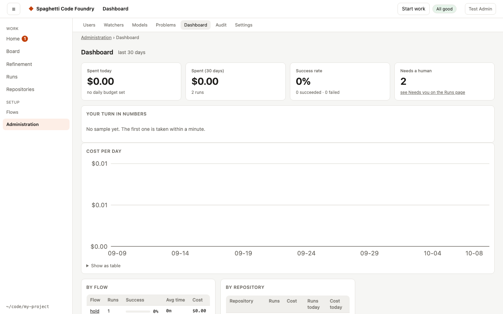

Spend today and over 30 days, success rate, **Needs a human** (the number of runs whose next
move is yours — the same as **Needs you** on the Runs page), the **Waiting** card (every
labelled issue that isn't being worked on: who has the next move, what to do, why, and a link;
lines for you come first), cost per day, the **By user** card (admins: name, runs and cost for the last 30 days, highest cost first, plus today's runs, runs active now and today's cost; runs without an owner are one line "no owner", a deleted account is "deleted user"; the costs add up to the 30-day spend), results per flow and per repository (with today's runs and cost),
the steps where runs fail most, and eval results. If one part cannot be loaded, for example the evals, that part says "Could not load evals." with **Retry**, and the rest of the page is shown.

**By user and limits.** Where an account has limits (fair use), the card shows them next to the numbers, for example `2 / 5` for runs today against the limit. An account that has reached a limit (runs at the same time, runs per day, or cost per day) gets an **at limit** mark. Accounts that have limits or a run active now are listed even without runs in the last 30 days. A deleted account ("deleted user") has no limits and no mark. "Today" is the server's local day. Only admins get these numbers.

**Your turn in numbers** shows how long items waited for you (last 30 days) and whether anything waited for you without being on Your turn:

- *Half waited X or less* and *the longest* — measured to the minute, and only while the server runs. A wait ends when you act in the app (the item moves to "Done — continuing") or the item leaves the page.
- *Dismissed items are not counted* — they are counted apart.
- *Waiting for you without being on Your turn* — 0 is normal. A higher number lists what was missing; "still missing" means it is missing now.
- The data is in `clarity.json` in the data folder and never leaves the computer.

A server that waits to restart shows in the
[health line](#the-health-line), not on the Dashboard.

### Evals

An eval suite runs sample tasks through one or more flows and models and scores them, so you
can compare, for example, Sonnet, Codex and a local model on your own code:

```yaml
# evals/my-suite.yaml
name: my-suite
flows: [quick]
cases:
  - name: add-multiply
    repo: fixtures/calc            # a folder or git repo, relative to this file
    task: Add a multiply(a, b) function to calc.js.
    vars: {test_cmd: node --test}
    check: node --test             # exit 0 = pass
```

```bash
scf eval evals/my-suite.yaml --models sonnet,codex,ollama:qwen3-coder
```

The report shows pass rate, average cost, tokens, time and fix loops per variant, and appears on
the Dashboard.

#### Skill checks

A case can also check which skills the run used. Add `skills:` to the case:

```yaml
    skills:
      selected: [kafka]             # must be in the run's skill lock
      absent: [react]               # must not be selected, and must not reach any session
      one_of: [postgres, mysql]     # ambiguous task: exactly one of these
      max_tokens: 1500              # largest skill block given to one session (estimated tokens)
      max_attached_tokens: 3000     # skill tokens added to prompts over the whole run
```

All fields are optional. A skill id may appear only once in `selected`, `absent` and `one_of`. Versions are not compared.

Three skill verdicts are reported next to quality (the `check`, or "the run succeeded"):

- **Selection** — the right skills were chosen and the wrong ones were not.
- **Context** — the skill text stayed within `max_tokens` and `max_attached_tokens`. `max_tokens` compares with the block each session got, not with the lock's estimate. A reuse on resume adds 0; a reload adds again.
- **Activation** — the selected skills reached the agent. Every coder session that has skills must hold each expected skill. Other skills do not matter. Reviewer steps are not checked for expected skills. The status is `loaded`, `not-loaded`, `refused` (the run stopped on a skill integrity, selection or resolve error) or `none`.

A case passes only if quality and all skill checks pass, so a run that succeeded can still fail on wrong selection or on budget. The report has `qualityRate` and a `skills` block (selection, context and activation rates, over the runs that have skill checks). `scf eval` prints a second table with these, and the Dashboard shows a "Skills" column (`—` when a variant has no skill checks). Reports from before this change stay valid.

The tests run offline with the fake agents. Codex and local-model skill loading is not covered yet.

#### Evidence to promote a skill version

Before a new version of a skill replaces the pinned one, keep this evidence with the change:

1. An eval suite with cases for positive (named), indirect, negative (`absent`), ambiguous (`one_of`), conflict, tamper, resume and fallback tasks.
2. Selection, context and activation all pass for the new version, and quality is not worse than the old version on the same cases.
3. The skill context stays within the declared budget (`max_tokens`, `max_attached_tokens`).
4. The same suite run on each agent that is configured (Claude, Codex, a local model). Say which were run and which were not.
5. The report file or the eval run IDs, linked in the pull request that changes the pin.

---

## 9. Command line

The command is `scf`. `factory` still works as an alias and prints a short note.

| Command | What it does |
|---|---|
| `scf ui [--port 4777] [--no-open] [--dev]` | Web UI, queue and watchers. Restarts itself when a new build is installed and no run is active (set `SCF_NO_SUPERVISE=1` to turn that off) |
| `scf serve [--port 4777] [--dev]` | The same without opening a browser. `--dev` (also on `scf ui`) serves the component gallery at `/gallery/` for developers; leave it off in normal use |
| `scf service install \| uninstall \| status` | Run `scf serve` in the background (macOS) |
| `scf run <flow> --task "…" [--var k=v] [--repo dir]` | Run a flow |
| `scf resume <run-id> [--from <step>] [--force]` | Continue a run. Refused when its issue is closed on GitHub; `--force` continues anyway |
| `scf approve <run-id> [--note "…"] [--force]` / `scf reject …` | Decide on a waiting run. Refused for a closed issue, like resume |
| `scf flows` / `scf blocks` | List flows / library blocks |
| `scf new <name> [--from <flow>] [--global]` | Create a flow from a template |
| `scf skills [--repo dir]` | List skill packages with trust, pin state and digest, plus notes and problems with full paths; exits 1 when there are problems (also a changed pinned package) |
| `scf skills pin <id@version> <digest> [--replace]` | Approve a listed package by its digest; `--replace` accepts a changed package. Refused for repository skills |
| `scf skills pin --builtin` | Pin the built-in skills that have no pin; exits 1 when one has changed since its pin |
| `scf skills unpin <id@version>` | Remove a pin; exits 1 when there is none |
| `scf validate <flow or file>` | Check a flow |
| `scf flow-guide` | Print the flow-writing guide for AI assistants ([Let any AI write a flow](#let-any-ai-write-a-flow)) |
| `scf watch [flow] --var github_repo=o/r [--source …] [--once]` | Run one watcher from the terminal |
| `scf eval <suite.yaml> [--flows a,b] [--models …]` | Run an eval suite |
| `scf clean [--older-than 7] [--purge] [--dry-run]` | Remove old run workspaces. With `--purge` it also removes plan records (see below) older than the larger of 90 days and `--older-than` |
| `scf user create [--admin] [--name n] [--email e]` | Create an account. The first one needs `--admin`. Name and e-mail are asked for on a terminal |
| `scf user list` | List accounts with the last sign-in; `no password yet` for an account that has not set one (never shows passwords, hashes or links) |
| `scf user role <e-mail> admin\|user` | Change the role of an account (not the last admin); counts from the next call |
| `scf user password <e-mail>` | Set a new password and sign the account out; also for an account without a password (its link ends) |
| `scf user block <e-mail> [--stop-work]` / `scf user unblock <e-mail>` | Block (and sign out) or unblock an account (not the last admin). Queued jobs are cancelled; `--stop-work` also cancels running and waiting runs |
| `scf user delete <e-mail>` | Delete an account, its sessions and its stored credentials (not the last admin) |
| `scf credential rotate-key` | Re-encrypt all stored credentials under a new key |
| `scf credential check` | Check that the macOS Keychain can store, read and remove the key |
| `scf monitor off` / `on` / `status` | Stop the monitor from making bug stories, let it make them again (this also closes the circuit breaker), or print the state and the mutes. Works when the server is not running |

**Plan records.** When `issue-plan` posts a plan, the Foundry saves a small plan record in
`<data folder>/skill-plans/`. It holds the skill request, the plan comment ID and hash, the HEAD
commit and the technology hash — never the plan text. If the record cannot be written and skills
are in play, the run stops with `skills not resolved: …` and resumes at `post_plan`; without
skills it only logs a warning. `scf clean --purge` and the Admin clean-up remove records older than
the larger of 90 days and the cut-off, and report `and N plan record(s)`. A dry run only counts.
Records are only touched when the runs folder is the default one in the data folder.

The password is asked twice on a terminal, or read from the first line of stdin; it is never an
option or an environment variable. A password has 12 to 200 characters and must not be a common
one; `scf user create` and `scf user password` refuse others and change nothing. No command needs a signed-in session; only the web UI does.

### Environment variables

Both names work; if both are set, `SCF_…` wins.

| Variable | Old name | What it does |
|---|---|---|
| `SCF_HOME` | `FACTORY_HOME` | Data folder (default `~/.spaghetti-code-foundry`) |
| `SCF_CLAUDE_BIN` | `FACTORY_CLAUDE_BIN` | Claude Code program to run |
| `SCF_CODEX_BIN` | `FACTORY_CODEX_BIN` | Codex program to run |
| `SCF_GH_BIN` | `FACTORY_GH_BIN` | `gh` program to run |
| `SCF_NO_OPEN` | `FACTORY_NO_OPEN` | Set to `1` to not open a browser |
| `SCF_NO_SUPERVISE` | `FACTORY_NO_SUPERVISE` | Set to `1` to not restart the server on a new build |
| `SCF_NO_NOTIFY` | `FACTORY_NO_NOTIFY` | Set to `1` to turn notifications off |
| `SCF_NO_FAILURE_MODEL` | `FACTORY_NO_FAILURE_MODEL` | Set to `1` to skip the model call that writes the reason of a failed run |
| `SCF_LOCK_DIR` | `FACTORY_LOCK_DIR` | Where lock files are kept |

Flows are looked up in `<repo>/.claude-factory/flows/`, then `~/.spaghetti-code-foundry/flows/`, then the
built-in ones.

---

## 10. Troubleshooting

**`forbidden host`, `HTTPS required` or `forbidden origin` from another computer.**
`forbidden host`: add the name you typed to the allowed host names. `HTTPS required`: use the HTTPS
proxy and check that it sends `X-Forwarded-Proto`. `forbidden origin` behind a proxy: the proxy
changes `Host` (or drops its port), or does not send `X-Forwarded-Proto: https`. If the server exits
with "cannot listen on …", create the admin first with `scf user create --admin`.

**Nothing is happening to an issue.** First look at the [health line](#the-health-line) under the
top bar: it says when the Foundry itself is the problem. Then look at the **Waiting** card on the Dashboard — it says
who has the next move (the badge at the start of the line), what to do and why. See also [Why is nothing happening?](#why-is-nothing-happening).

**A plan is waiting for approval.** Its risk score is above 75, or the issue has
`Factory_review_plan`. Read the plan on the issue and reply `/approve` (with notes if you like)
or `/reject` with what to change.

**The release pull request is a draft.** The daily full test run or build failed on it; the
daily report or release check starts with `**Nothing needed from you** — it stays a draft until the checks pass.`
and has the failing output. It becomes ready again when a later report passes.

**A run failed, or a watcher shows an error.** The message says what happened, why, and what
you can do first. Find yours in the table:

| Message | What you can do |
|---|---|
| The step … failed: its command ended with an error | Look at the output of the step and fix the cause |
| The step … failed: it ran longer than its time limit | Look at the output of the step to see what took so long |
| The step … failed: the agent stopped without a result | Look at the log of the step on the run page |
| The step … failed: the agent stopped with an error | Look at the log of the step on the run page |
| The step … failed: the agent used all its turns | Look at the log of the step on the run page |
| The step … failed: the repository has no token for runs; set one under My repositories | Set a token for the repository under My repositories |
| The step … failed: the repository's token is missing or refused; set it again under My repositories | Set the token of the repository again under My repositories |
| The step … failed: the repository signs in with a deploy key, which cannot use issues or pull requests | Choose a token or the GitHub App for the repository under My repositories |
| The step … failed: the repository's sign-in is missing or refused; reconnect it under My repositories | Reconnect the repository under My repositories |
| The step … failed: the repository's sign-in is missing or refused; reconnect it under My repositories | Reconnect the repository under My repositories, or ask the administrator |
| The step … failed: the GitHub App cannot sign in to this repository | Install the GitHub App on the repository, then press Test connection |
| The step … failed: the GitHub App cannot sign in to this repository | Ask the administrator to check the GitHub App settings |
| The step … failed: the repository's sign-in was not available for the step | Resume the run to try the step again |
| The step … failed: the repository's sign-in was not available for the step | Wait a while, then resume the run |
| The step … failed: a folder with the repository's sign-in was left in the run folder | Ask the administrator to delete the sign-in folder in the run folder, then resume the run |
| The step … failed: the account that owns the run is gone, so its commits have no name | Ask the administrator to set the bot name and e-mail in Settings, then resume the run |
| The step … failed: the agent hit an error while it worked | Look at the log of the step on the run page |
| The step … failed: the agent used up the budget of the step | Give the step a larger budget in the flow |
| The step … failed: the agent ended with an error | Look at the log of the step on the run page |
| The step … failed: it used all its attempts | Look at why the step keeps failing in its log on the run page |
| The run reached its budget: it used the amount the flow allows for one run | Allow a larger budget for one run in the flow |
| The step … failed: a person rejected it | Read the note of the person and change the work as asked |
| The step … failed: Codex is not installed on this computer | Install Codex on the computer that runs the Foundry |
| The step … failed: Codex is not logged in | Log in to Codex on the computer that runs the Foundry |
| The run failed: the Foundry hit an error of its own | Look at the steps and the log on the run page |
| The run failed: no reason was saved | Look at the steps and the log on the run page |
| The run failed: the error is not one the Foundry can explain | Look at Details on the run page |
| The watcher for … can't reach GitHub: GitHub did not answer or did not let it in | Check the network and `gh auth status` |
| GitHub's request limit is used up: the Foundry asked GitHub too much in the last hour | Nothing — GitHub lifts the limit within the hour, and the watcher continues by itself |
| The watcher for … cannot reach the repository: a call to GitHub failed | Check that gh is logged in and the repository is there |
| The watcher for … did not finish its check: it took too long and was given up | Press Check now on the Watchers page to try again |
| The watcher for … cannot start: its check interval is not a valid time | Change the check interval of the watcher to a time like 5m |
| The watcher for … cannot start: its check interval is outside what is allowed | Change the check interval of the watcher to a time like 5m |
| The watcher for … has an error: the error is not one the Foundry can explain | Look at Error details on the Watchers page |

Then the message adds how to try again. A failed run can be resumed on its page to continue at
the failed step, or (for an issue the Foundry watches) you remove the `factory:failed` label to
start over. When the fix is a change to the flow (a larger budget), only a new run counts: a
resumed run keeps the flow it started with. A change in Settings, such as the cost limits, also
counts for a resume.

The raw text is still there, as a detail: under **Raw details** in the failure card on the run page, and inside each
failed step of the **Steps & transcripts** list, under **Error details** on the watcher card,
and inside the collapsed **Details** of the failure comment on the issue. The settings behind
the messages are `max_visits` (attempts), `limits.max_cost_usd` (run budget), `max_budget_usd`
(step budget) and `timeout_sec` (time limit). If a step only needs more time, raise
`timeout_sec` and start over.

A watcher error names its repository and shows in the [health line](#the-health-line). For a
connection problem, check the network, and that `gh auth status` works in the terminal where the
Foundry runs and that you have access to the repository. **Error details** on the watcher card
shows gh's first output line too. **Check now** on the Watchers page retries
immediately. A "has not checked since …" line means no check finished for a long time (a check
that takes over 10 minutes is given up).

**"Codex is not installed" or "Codex is not logged in".** Install Codex (`npm i -g
@openai/codex`, or the ChatGPT desktop app) and run `codex login`. The Models page shows the
status.

**A local model says it is done but changed nothing.** The model is not good at tool use. Try a
coding model (`qwen3-coder`, `gpt-oss`) and use **Try a model** on the Models page.

**A run stopped with "daily budget reached".** It continues automatically the next day, or when
you raise the budget and resume it.

The failure comment starts with what you need to do.

**The Foundry failed, not the code.** The run says so when an agent command was blocked, a
marker could not be read, a push hit a protected branch or a setting is broken. Do what the
sentence says (e.g. allow the command in the flow), then resume the run. The label stays the
failed label.

**A push was refused.** Either the branch is protected, or the secret scan found something.
A protected branch is a setting to change (**Protected branches** in Settings, or the flow's
branch); the run then says the Foundry failed. A secret-scan finding is in the code: the step
output lists the file, line and kind of secret.

**Locked out.** "This account is locked" after many wrong tries: wait 30 minutes, ask an admin to
press **Unlock** on the Users page, or restart the server on the machine (the lock is in memory).

**Reset password gave an error.** The account may already have lost its password. If the Users
page now reads "no password yet", use **New link**.

**Change password gave an error.** The password is not changed; your other sessions may be signed
out. Try again.

**Forgot the password.** Ask an admin to use **Reset password**, or run `scf user password <e-mail>` on the machine. If no admin is left, run
`scf user create --admin`. A set-password link that ended is replaced the same way. If the page said
"sign-in is not working" after you sent the form, first try to sign in with the password you chose:
it may have been set already.

**The credential store is not working.** Run `scf credential check`. Unlock the login keychain if
it fails. If the key is gone (for example the data folder was copied from another Mac), delete
`credentials.json` and add the credentials again. "An old key is still in the Keychain" means a
removal failed after a delete or rotation; `scf credential rotate-key` clears it.

**Tests fail for reasons unrelated to the change.** Set the right command with the `test_cmd`
variable, per repository in `<repo>/.claude-factory/config.yaml`.

---

## 11. Upgrading from claude-factory

The data folder is now `~/.spaghetti-code-foundry` (or `SCF_HOME` / `FACTORY_HOME` if you set one).
The `.claude-factory/` folder inside each repository does not change.

**What happens.** On the first start of any `scf` command except help, the whole
`~/.claude-factory` folder is copied to `~/.spaghetti-code-foundry`: config, runs, flows, blocks,
learnings, queue, locks and evals. The copy is made next to the new folder and renamed into place
in one step, so you never see a half-done move. Paths that point into the old folder (in run state,
lock files, `queue.json` and `config.yaml`) are rewritten. If `config.yaml` can't be rewritten
safely, it is kept as it was and a warning lists the values that still point to the old folder.
`users.json`, `sessions.json`, `credentials.json` and `refinements.json` are copied unchanged, with their mode.

**The backup.** `~/.claude-factory` is never changed or deleted, except for a note file
`MOVED-TO-SPAGHETTI-CODE-FOUNDRY.txt`. Nothing there is used anymore: your settings now live in
`~/.spaghetti-code-foundry/config.yaml`, and the old `~/.claude-factory/config.yaml` is only a copy.
You can delete the folder once everything works.

**When the move waits.** Nothing is copied when you set `SCF_HOME` / `FACTORY_HOME`, when the new
folder already exists (it is never overwritten), while a run is running, when free space is short
(size + 10% + 100 MiB), or when something in the old folder changed while it was copied. The move is
tried again on later starts, and every minute by an idle `scf ui` / `scf serve`. A run counts as
running when its `run.json` can't be read, or its status is `running` and it has no recorded `pid`
(from the old version) or its `pid` is alive. The message names these runs. For a run that crashed,
run `scf resume <id>` (or delete a leftover run folder without `run.json`).

**Worktrees.** Runs that use a git worktree are repaired with `git worktree repair`, so a waiting
run can be approved and resumed in the new folder. The workspaces left in the backup are no longer
linked to your repositories. If a repair fails, everything is put back and the old folder stays in
use. If an interrupted move left the repair unfinished, the next start finishes it.

**Servers on the old folder.** A running `scf ui` or `scf serve` that still uses the old folder
refuses changes after the move (HTTP 503) and restarts onto the new folder when it is idle. Other
processes on the old folder refuse to start runs; restart them. Stop old `factory watch` processes
before you upgrade: they run old code and can't join the lock the move uses.

**If the new folder is missing.** When the note exists but `~/.spaghetti-code-foundry` is gone,
`scf` refuses to run (help still works) and never copies the backup a second time by itself. Restore
the folder, set `SCF_HOME` to the folder you want, or delete the note file to copy again.

**Login service.** Run `scf service install` once, so its log and settings move to the new folder.
`scf service status` tells you when it is still needed.

**The command.** If `factory` still points at the old install, run
`npm unlink -g claude-factory && npm link` in the repository.

**The repository.** It is now `MeloMar-IT/spaghetti-code-foundry`. GitHub redirects the old
address. In an existing clone, run
`git remote set-url origin https://github.com/MeloMar-IT/spaghetti-code-foundry.git`.
The folder of your clone can keep its name.

---

## 12. Refinement

**Refinement** is where a rough idea grows into a story before it goes to the backlog. The session keeps the idea, its state, a log, the architect's brief and the talk (questions, answers and a map of rules, examples and open questions). On the session page you can ask the architect to look at the code (see below).

**Start a session.** Click **New session**. Choose a repository, write your idea in your own words (required, up to 10,000 characters) and, if you like, a title (up to 120 characters). When the title is empty, the first line of the idea is used. Only GitHub repositories from **My repositories** are offered. If you have none, the dialog links to that page.

**Refine an existing issue.** Click **Refine an existing issue** next to **New session**. Choose one of your repositories and give the issue number (for example `12` or `#12`). The issue is read from GitHub; nothing on GitHub changes. If the server refuses (the Foundry is building or has built the issue, it is closed, it does not exist, or you already have a session for it), the dialog shows the reason and stays open. The session page then says "From issue #N" with a link. If the issue has the build label, the page warns that the Foundry may start building it while you refine it, and offers **Remove the build label**. The label is removed only when you press that button, with the repository's GitHub sign-in, and only by the owner of the session. After that the warning is gone. The watcher is not held back: until the label is removed, the Foundry may start building the issue.

**Start from an existing issue (server; the button above uses it).** `POST /api/refinement` also accepts `{ "repo": …, "issue": <number> }` instead of an idea. The issue is read from GitHub with the repository's sign-in; nothing is written to GitHub. The issue's title becomes the session title (up to 256 characters) and its title and text become the idea. The session keeps `source`: the issue number, link, and the title, text and `updated_at` it had when it was read (`GET /api/refinement/:id` returns it). When the text has the story format that Preview writes, the session gets one draft with the fields filled, all marked as typed by a person; text the fields cannot hold goes into the notes under its heading, and "Accepted anyway" is not taken. Without the story format, you get the idea only and no draft. Hidden Foundry markers and the "Refined in Spaghetti Code Foundry by …" note are left out. A text over the idea limit is refused, not cut. It is refused with a reason when the issue does not exist (404), is a pull request (400), is closed (409), or the repository is not yours (403). It is refused with 409 when the Foundry is building or has built the issue: a live or queued run, a Foundry status label (working, waiting, needs info, done; a watcher's own names count), or a run with a pull request, unless that pull request is closed and not merged. An issue with only a failed run, or only the failed label, is accepted. An issue for which you already have an open session is refused with the id of that session. When the issue has the build label, `source.buildLabel` says so. A session from an issue cannot be published yet (409) until write-back exists.

**Backlog readiness.** Click **Backlog readiness** on the Refinement page to see which open issues of a repository are not ready. Choose one of your repositories. The list shows the open issues the Foundry is not building and has not built (the same rule as "Refine an existing issue"), newest first, with the number (a link to GitHub), the title and four marks, done by code only: **Acceptance criteria** (a section with at least one item), **Value sentence** ("As …, I want …, so that …"), **Depends on** (every issue named there exists; hover a ✗ to see which were not found) and **No open questions** (no "Open questions" heading with content, and no unchecked question item). The marks are hints; nothing is blocked by them. Press **Refine** to start a session from that issue and open it. When you already have an open session for the issue, the button reads **Open session**. GitHub's newest 100 issues and pull requests are read; when that page is full, the view says that older open issues may be missing. When GitHub cannot be read, the view says so and tells you to check the repository's sign-in under **My repositories**. The view starts no architect run, writes nothing to GitHub and adds or removes no labels; the watcher is not changed. It is not shown in a preview ("View as user"). Server: `GET /api/refinement/backlog?repo=owner/name` (see the route table); only the owner of the repository can read it.

**States.** A session is *exploring*, *drafting*, *ready*, *published* or *dropped*. It starts as *exploring*. The state changes only by what you do. The first story draft makes it *drafting*, and removing the last draft makes it *exploring* again. **Drop** and **Restore** change it too. A session is *ready* when it has drafts and every draft is ready (see "Ready" below); a change that makes a draft *drafting* again makes the session *drafting*. It becomes *published* when every draft of the session has a GitHub issue (see "Publishing"); with only some published it stays as it was. Later steps add the others.

**The session page.** It shows the idea, the **Context brief** (see below), the **Questions** and **Map** parts (see "The talk" below), the **Story drafts** (see "Story drafts" below) and the log: who did what, and when, also when the architect was asked, wrote the brief or could not finish. The list shows title, repository, state and last change; an admin also sees the owner.

**Rename, drop, restore.** **Rename** changes the title. **Drop** (after a confirmation) takes the session out of **Open sessions**. Find it again under **Dropped**: **Restore** brings it back in the state it had. A dropped session is removed after 30 days.

**Who may do what.** You see and change only your own sessions. An admin sees all sessions and who owns them, and may drop one, but cannot rename or restore it. In the log, you see an admin's action as "an administrator".

**When something goes away.** If you remove the repository from My repositories, the session stays readable; the page says so, and it works again when you add the repository back. If an admin deletes your account, your refinement sessions are deleted with it.

**Limits.** 200 sessions per account; dropped sessions count until they are removed. 1,000 log entries per session; after that the session can only be dropped. In the talk (see below): 100 entries per list, 50 waiting proposals and 50 own questions. In story drafts (see below): 20 drafts; title 120 characters on one line; who, what and why 500 each; 50 criteria of 500; out of scope and notes 5,000 each; 20 depends-on items. A full list or log answers 400 with a plain sentence. Nothing is removed to make room.

### Story drafts

A session keeps story drafts, so that what you write is saved. A draft has a **title**, **who**, **what** and **why** (the parts of "As …, I want …, so that …"), **acceptance criteria** (a list), **out of scope**, **depends on** (a list) and **notes for the builder**. A new draft is empty: nothing is filled in from the idea, the brief or the map. A session has at most 20 drafts and one optional **Epic** that applies to all of them.

**On the page.** The **Story drafts** part lists the drafts by title ("Untitled draft" when empty; "No story drafts yet." when there are none). **New draft** adds an empty one and opens it. **Open** shows a draft on the session page, **Close** hides it, **Remove draft** removes it after a question. An open draft has these fields in order: Title; "As …", "I want …", "so that …"; Acceptance criteria; Out of scope; Depends on; Notes for the builder. The Epic of the session (an issue number) is set with **Set Epic** and cleared with **Clear Epic**.

**Saving.** What you type is saved by itself one second after you stop, and when you leave the field. The page says "Saving…", "Saved", or the server's sentence when a save failed. A failed save keeps your text in the field and your next change tries again. The page you see never overwrites text that is not saved, also while the architect works.

**When you are signed out.** The page says "sign in first" and keeps your text. Copy it, load the page again and sign in.

**Leaving the page.** The browser asks first while text is not saved.

**Not saved.** Text whose draft or criterion was removed elsewhere, or typed just before the session could no longer be changed, shows in a **Not saved** card until you discard it or load the page again.

**Acceptance criteria.** Type in the last empty field to add one. An emptied criterion keeps its text when you leave it; use **Remove** to take one away.

**Depends on** and **Epic.** For Depends on, type an issue number ("12" or "#12") and press **Add issue**, or choose another draft of this session and press **Add draft**; **Remove** takes one out. The Epic is a whole number from 1. A wrong number is refused with a message.

**Preview.** Under the fields, **Preview** shows the story as it will look on GitHub: the title, the Epic line, the sentence, the criteria with check boxes that cannot be ticked, Out of scope, Notes for the builder and Depends on. Your text shows as typed, also when it looks like Markdown. **Show as Markdown** shows the exact text; **Show the preview** goes back. The preview follows what is saved.

**Who sees fields.** Fields and buttons show only on your own, open session whose repository is in My repositories. A dropped session, another account's session (admin) and a session whose repository is gone show the drafts as text. A hidden list says that it is not shown.

**The calls.** The page uses these; all answer with the session.
- `POST /api/refinement/:id/drafts` adds an empty draft (201).
- `PUT /api/refinement/:id/drafts/:did` saves what you typed, for example `{ "title": "Export a report", "who": "an admin", "what": "to export a report", "why": "I can share it", "criteria": [{ "text": "It downloads" }], "dependsOn": [{ "issue": 12 }] }`.
- `DELETE /api/refinement/:id/drafts/:did` removes a draft, and it from the depends-on lists of the other drafts.
- `PUT /api/refinement/:id/epic` with `{ "issue": 73 }` sets the Epic; `{ "issue": null }` clears it. It must be a whole number from 1; it is not checked against GitHub yet.

**Only what you send changes.** A field you leave out stays. An empty field (`""`, spaces or `null`) is removed. A list is sent whole: an item with a known `id` and the same text stays as it is, a known `id` with a new text is changed, an item without `id` is new, and an item you leave out is removed. So send the `id` of every item you keep: the same text without its `id` is stored as a new item. An unknown or repeated `id` answers 400 ("load the session again").

**Where a text came from.** Every text field and list item has `from`: `typed`, `accepted` (from a suggestion) or `accepted-edited`. The server sets it and ignores a `from` you send: new text is `typed`, and changing an `accepted` text makes it `accepted-edited`.

### Suggestions from the architect

You can ask the architect for a proposal for one field of a draft. It is only a proposal: it waits beside the draft (`suggestions`) and is in no field and not in `preview` until you accept it.

- `POST /api/refinement/:id/drafts/:did/suggest` with `{ "field": "title" }` (`title`, `who`, `what`, `why`, `criteria`, `outOfScope`, `dependsOn` or `notes`) starts an architect run and answers 202. The rules of a round apply: only the owner, a brief is needed, one architect run per session and per account, and a paused run is resumed by the same call (the same draft and field). `criteria` answers 409 when the map has no rule and no example.
- `POST …/drafts/:did/suggestions/:sid/accept` with `{}` puts it in as `accepted`: a text field is replaced, a list gets one more item. With `{ "text": "…" }` (Edit and accept) your text goes in as `accepted-edited`; this is not possible for depends on (400). The suggestion is gone after that.
- `POST …/drafts/:did/suggestions/:sid/reject` with an optional `{ "reason": "…" }` (at most 300 characters) removes it and keeps its text and reason with the draft (the newest 30). The next suggestion run of the session gets them; they are used in this session only.

**What the architect gets.** The idea, the brief, the map (rules and examples are numbered R1, E1), the draft as it is now, the other drafts and the rejected suggestions with their reasons. It works from this text and opens a file only to check a claim. A run costs at most $1.

**One or many.** One suggestion for a text field; up to 10 for acceptance criteria and depends on. A new run replaces the waiting suggestions of its field; at most 20 wait per draft. Each criterion names the rule or example it comes from (`tie`) and says what can be observed; one whose rule or example is not in the map is left out. The tie stays when you edit the criterion; when the map entry is removed, the tie is dropped and the waiting suggestions from it go. Depends-on suggestions are an issue number or another draft of the session; anything else is left out.

**Very large sessions.** The task is at most 90,000 bytes. Then the brief is cut first, then map lines and other drafts, and the draft last; a "Left out" part names what is missing.

**Log.** The log tells that a suggestion was asked for (with the field), that the architect suggested, and that a suggestion was accepted or rejected.

**On the page.** Every field of an open draft has **Suggest**. Without a brief the page says to ask the architect to look at the code first; for acceptance criteria with no rule or example in the map it says to accept one first. While the architect works, a line next to the field says "The architect is writing a suggestion." and the Suggest button is gone. A paused run shows its reason with **Ask again**, a failed one with **Try again**. Text you typed and have not saved is saved first; if that save fails, nothing is asked.

A suggestion shows next to its field, marked "Suggested", with three buttons:
- **Accept** puts it in. On a text field that already has text, the page asks before it replaces it.
- **Edit and accept** opens a dialog with the text to change (not for Depends on).
- **Reject** opens a dialog with an optional short reason.

A suggested criterion shows the rule or example it comes from. Criteria are decided one by one. After a decision the field shows the new text and the suggestion is gone; text you typed in other fields and have not saved is kept. Every field and every list item with text shows where it came from: "typed", "accepted" or "accepted, then edited". A dropped session, another account's session and a session whose repository is gone show the waiting suggestions and these marks without buttons. If a suggestion run belongs to a draft that is not open, its line shows at the top of Story drafts. The Context brief part does not show the line of a suggestion run. All texts are shown as text. No new route is used.

**Remarks from code checks.** Every draft in the session view has `remarks`, computed from its text on every read and save. No AI call is made and nothing is stored. They cover every field but the notes for the builder. Each remark has `field` (and `item`, the criterion id), `kind`, `word` (what was found) and `text` (a plain sentence).

- `vague`: a word that cannot be checked, from a fixed list (for example "fast", "easy", "simple", "etc").
- `plan`: text that reads like an implementation plan: a code block, a path with a file extension, a call like `save()`, or build steps ("first add a table, then …"). The remark says that this belongs in the build step. Text in backticks and web addresses are not flagged, so a story can name an API route or a setting on purpose.

Remarks are advice. They never block a save or anything else.

**Review by the architect.** `POST /api/refinement/:id/drafts/:did/review` (no body) starts an architect run and answers 202 with the session. The rules of a round apply: only the owner, a brief is needed, one architect run per session and per account, a paused run is resumed by the same call, and a failed run changes nothing. The architect gets the idea, the brief, the map and the draft. It only points out weak spots; it changes no field and proposes no new text. Only this call starts an AI call; saving a draft never does.

The result is stored with the draft as `review`: `{ at, remarks }`, at most 20 remarks. Each remark has `field` (and `item` for a criterion), `kind` and `text` (one or two sentences). The kinds are `uncheckable` (a criterion that cannot be checked), `vague`, `contradiction` (with another criterion or a rule of the map), `how` (it says how to build, not what is wanted) and `plan`. A new review replaces the old one. A remark about a text that has changed or moved since the review has `stale: true`.

**The architect's view of a draft.** `POST /api/refinement/:id/drafts/:did/impact` (no body) starts an architect run of kind `impact` and answers 202 with the session. The same rules as a review apply: only the owner, a brief is needed, the draft must not be empty, one architect run per account, and a paused run is resumed by the same call. The task lists the other drafts as `D1`, `D2`, … so the architect can name them in `dependsOn` and `dependents`; the answer stores them as draft ids, and a statement about a draft that was not in the task is left out. A run keeps the flow's limit of $3, because it must read the code and up to 50 issues.

When the run ends, the checked view (see `ask=impact` below) is stored with the draft as `impact` and replaces an older one. No field of the draft changes and the session state does not change. The session answer shows each draft's `impact` with the `basis` (`found` or `estimate`) of every statement, and `outOfDate: true` when the title, who, what, why, a criterion, out of scope or depends-on changed since the view was asked. A wrong form fails the run with "The architect's answer did not have the agreed form" and the old view stays. The task also has a part "Areas the Foundry knows": the `AREAS:` of the newest Foundry run of each issue of the repository (at most 50 issues; runs of all accounts; only paths and the issue number) and the areas in the stored views of your other drafts on this repository. The view shows an overlap with another draft by the draft's title, marked as a draft. The view is not shown while the repository is not in My repositories. The log tells `impact-asked` and `architect-impact`.

**Ways to split a draft.** `POST /api/refinement/:id/drafts/:did/split` starts an architect run of kind `split` and answers 202 with the session. The body is optional; it may be `{ "own": "…" }`, your own way, one text of at most 500 characters (anything else gives 400). The same rules as a review apply: only the owner, a brief is needed, one architect run per account, and a paused run is resumed by the same call. The answer is 409 when the draft has fewer than 2 acceptance criteria. The task lists the criteria as C1, C2, …; your own way goes into the task under a heading that shows its length. A run keeps the $1 limit of a review. Nothing is split by this.

**Confirming a split.** `POST /api/refinement/:id/drafts/:did/split/confirm` takes `{ "way": 0, "parts": [{ "title": "…", "sentence": "…", "criteria": ["<criterion id>"], "dependsOn": [1] }], "unplaced": ["<criterion id>"] }` and answers 201 with the session. No architect run starts. `way` is optional (0 to 2, one of the stored ways). There must be 2 to 6 parts, each with a title. `dependsOn` lists part numbers starting at 1; a part may depend on an earlier part only. Every criterion of the draft goes in exactly one part or in `unplaced`; a draft with no or one criterion can be split by your own plan. Each part becomes a new draft at the end of the list, in plan order, with its criteria and copies of the original's out of scope and notes. The first part also gets copies of the original's dependencies. The original stays as a record: it keeps the unplaced criteria, shows `state: "split"`, is never ready, and is not published. A draft that is already split, is a part, or is published gives 409. There can be at most 20 drafts after the split. Removing a part takes it out of the original's list; removing the original keeps the parts as normal drafts.

**Moving a criterion between the parts of a split.** `POST /api/refinement/:id/drafts/:did/criteria/:cid/move` takes `{ "to": "<draft id>" }` and answers 200 with the session. The criterion goes to the end of the target draft. It works from part to part, from the original to a part and from a part back to the original; this is the one change allowed on a split original. `to` must be another draft of the same split (the original or one of its parts), otherwise 400 `a criterion can only move between a split draft and its parts`. A body without `to` gives 400 `send to: the draft to move the criterion to`. An unknown draft or criterion gives 404, a full target (50 criteria) gives 400, and a draft that is already on GitHub, as source or target, gives 409. The readiness check of both drafts is cleared, and the log gets `criterion-moved` with the criterion text. The view of a split original has `partWarnings` when there are any: `layer` for a part without a criterion, and `same-code` for two parts whose impact areas overlap while neither depends on the other, directly or through other parts (`areas` lists up to 5 of the overlapping areas of the first part).

**Merging two drafts.** `POST /api/refinement/:id/drafts/:did/merge` takes `{ "with": "<draft id>" }`, merges that draft into this one, removes it and answers 200 with the session. It is for undoing a split that went too far. No architect run starts. The first draft keeps its title, who, what and why; an empty one is taken from the second. The criteria of the second come after those of the first (50 at most, otherwise 400). Out of scope and notes: equal texts are kept once; different texts are joined with an empty line, and a joined text that is too long gives 400. Depends-on is the union of both without the two drafts themselves (20 at most, otherwise 400); other drafts that depended on the second now depend on the first. Waiting suggestions, review, impact, split proposal and readiness check of the merged draft are cleared; rejected suggestions of both are kept (the newest 30). If the second was a part of a split, the original is updated. No part may depend on a later part of its split: after a merge such a link is removed and named in the log detail. A split original, or a draft already on GitHub, gives 409; a draft merged with itself gives 400. The log gets `drafts-merged`.

**A split original is read-only.** On a draft that is split, you work on the parts instead. These answer 409 with `this draft is split; its parts are worked on instead` and change nothing: saving fields, accepting or rejecting a suggestion, move to notes, the review label, the readiness check, accept anyway, and removing an "accepted anyway" mark. Asking the architect for a suggestion, a review, an impact view, a readiness judgement or ways to split on the original is 409 too. Removing the original still works. When the last part is removed, the original can be edited again. A part takes suggestion, review and readiness check like any draft. If a run was paused and its draft is split before you resume it, asking again is 409 and the paused run is cancelled and marked failed with `The draft was split while the run was paused`; the next ask in the session is not blocked. If a run is working while its draft is split, its result is not stored and the run fails with `The draft was split while the architect was reading`. Undo is partial: removing a part does not bring back its criteria. They are gone with the part.

When the run ends, the checked ways (see `ask=split` below) are stored with the draft as `split` and replace older ones; the C numbers are stored as criterion ids. No field of the draft and no session state changes. The session answer shows each draft's `split` (`at` and `ways`) and `outOfDate: true` when the draft changed since it was asked. It is not shown while the repository is not in My repositories. A wrong form fails the run with "The architect's answer did not have the agreed form" and the old ways stay; a draft that is gone fails the run with a fixed sentence. The log tells `split-asked` and `architect-split`.

**Size and plan review.** The view of a draft also carries `fit` and, sometimes, `planReview`. Both are worked out each time the session is read, so a changed limit shows at once. Neither blocks a change of the draft or a later publish. You decide.
- `fit` compares the estimated files and lines with `max_files` and `max_code_lines` of the repository's build flow: "likely fits in one story", or "likely too big — consider splitting" (`over` says `files`, `lines` or both). It names both limits. The limits come from an enabled watcher of the repository whose flow has both; the watcher's `vars` win over the flow's. Your own stored watcher is looked at first, then one in `config.yaml`, then any other. Only the two numbers and the label name are shown, nothing else of the watcher. With no such watcher, `fit` says the build limits are not known and gives no verdict.
- `planReview` appears when the view has at least one `sensitive` topic (sign-in, permissions, secrets, credentials or stored user data). It recommends a plan review by a person and names the topics and the repository's review label (`review_plan_label`). Without a known label it still recommends, and says there is no review label.
- `PUT /api/refinement/:id/drafts/:did/review-label` with `{ "add": true }` or `{ "add": false }` stores your choice with the draft as `addReviewLabel`. Only the owner may set it, also when no review is recommended. Nothing is sent to GitHub, and no run sets it; publishing will read it.

**Move to the notes.** `POST …/drafts/:did/move-to-notes` with `{ "field": "…", "item": "…" }` (`item` only for `criteria`) adds the text to the notes for the builder as a line "Wish: <text>" and removes it from its field. It works only for a text with a `plan` remark (code checks or review) or a `how` remark (review, not stale); otherwise it is refused. Nothing moves by itself. Typed text added to typed notes stays `typed`; any mix with accepted text makes the notes `accepted-edited`.

**Ready check.** `POST …/drafts/:did/ready-check` (no body) checks the draft against the Definition of Ready of its repository, by code only (no AI call), and answers 200 with the session. Same rules as the other draft calls: owner only (404 another user, 403 an admin), 409 for a dropped session or a repository not in My repositories, and 409 when the log has no room. The draft shows `readiness`: `{ at, items: [{ id, text, result, reason, by }] }`. `result` is `met`, `not-met` or `unsure`; `by` is `code`; the reason is one sentence of at most 300 characters that names the field or text it is about. The check never changes a field of the draft.
- `no-open-questions`: met when the map has no open question and no question waits for an answer; otherwise not met, with the count.
- `out-of-scope`: met when Out of scope has text; otherwise not met.
- `checkable`: not met with no acceptance criterion; otherwise unsure.
- `value`: not met when "As …" or "so that …" is empty; otherwise unsure.
- `standalone`: not met when a depends-on draft is gone or is the draft itself; otherwise unsure.
- `no-plan`: not met when a `plan` remark exists (the word found is quoted); otherwise unsure.
- `small` and items without a rule: unsure. An unsure reason says that the architect has to judge it.

**Accepted anyway.** `POST …/drafts/:did/ready/:item/accept` with `{ "reason": "…" }` (1 to 300 characters, required) marks an item "accepted anyway"; `DELETE` on the same path removes the mark. The item with the rule `no-plan` cannot be accepted anyway (409); an item that is not in the repository's list is 404. The reasons are stored with the draft and go into `preview.body` as a section `### Accepted anyway`, one line per item (the item text and the reason); the section is left out when there are none. A mark counts only for the wording it was given for: after the admin rewords the item it is not shown or published, and neither is a mark for an item that is gone. A mark on an item the last check says is `met` stays stored, shows as "not needed" and is left out of the preview.

**Ready.** A draft is `ready` when it has a check and every item of the repository's current list is `met` or accepted anyway; otherwise its `state` is `drafting`. An item that is new or reworded after the check counts as not checked. The session state is `ready` when it has at least one draft and every draft is ready, and goes back to `drafting` when any draft is not. The draft `state` is the truth; the session state is a summary. Any change of a draft's text, a move to the notes, an accepted suggestion, a removed draft it depended on, a change of the open questions or an Epic change that alters the preview removes the check results (of that draft, or of every draft for the last two) and makes it `drafting` again. The accepted-anyway reasons stay. The stored session state is corrected when the session is read, for example after the admin changed the list; publishing must call `isReady` again and not trust the stored state.

**Log.** The log tells that a readiness check was made (with the counts), that an item was accepted anyway and that a mark was removed. A check and an accept need room in the log. It also tells that a review was asked for, that the architect reviewed (with the number of remarks), and that a text was moved to the notes.

**Remarks on the page.** Under a field or a criterion the page shows the remarks about that text. They are plain text, never HTML.
- The remarks of the code checks show after each save, with the word that was found (for example: "fast" is vague — say what can be observed). They update by themselves; the field you are typing in is not redrawn, so its text and cursor stay.
- **Review draft** asks the architect for a review. It shows when the session has a brief and the draft has some text (otherwise the page says to write something first). While the architect works a line says so and the button is gone; a paused run shows the reason and **Ask again**, a failed one **Try again**. It saves unsaved text first and sends nothing if that save fails.
- The architect's remarks show next to their field or criterion, with the kind in words: "Cannot be checked", "Vague", "Contradicts", "Describes how to build" and "An implementation plan". A remark about a text that changed after the review says "written before your last change". The page says when the review was made. Remarks about a criterion that is gone show once, under the criteria.
- A plan or how-to-build remark says "This belongs in the build step." and has **Move to notes for the builder**. The page asks first ("Move this text to the notes for the builder? It is taken out of its field."). After you confirm, the text is added to the notes as a "Wish:" line and the page shows it. A stale review remark has no button. Text you typed in other fields and have not saved is saved first and stays.
- No text in any field changes unless you type or press a button. Remarks and buttons show only where the fields of the draft show; elsewhere (dropped session, admin, missing repository) the remarks show as text without buttons.
- The log tells a review asked for, a review made and a text moved. The Context brief part does not show the line of a review run. A review run for a draft that is not open shows its line at the top of Story drafts, like a suggestion run.

**The architect's view on the page.** Every open draft has a part **Architect's view** with the button **Ask for the architect's view**. It shows when the session has a brief and the draft has some text; otherwise the page says to write something first. While the architect works the page shows the same status line as the other architect runs; a paused run shows its reason with **Ask again**, a failed one **Try again**. Unsaved text is saved first; if that save fails, nothing is asked.
- The view shows the areas with their files, what the draft depends on, what depends on it, the risks by kind (data, security, compatibility, users) with one sentence each, the size (small, medium or large) with the estimated files and lines, and the sentence that compares the size with the build limits.
- It lists the other open stories and drafts that touch the same code. For code the Foundry found, it says they cannot be built at the same time. For an estimate it says "May touch the same code — likely cannot be built at the same time."
- Every statement is marked **found in the code** or **estimate**. The size and the fit sentence are always estimates. The page never shows hours or days.
- When a plan review is recommended, the page says why and shows the checkbox **Add the review label when this story is published**, with the label name. It is off until you tick it. The choice is only kept with the draft; nothing is sent to GitHub.
- A view written before your last change shows **out of date** with **Ask again**. The notes for the builder count as a change, because the architect reads them.
- The view is advice. It has no button that changes a field, and nothing on the page is disabled because of it.
- Where the fields of the draft are not shown (another account's session as an admin, a dropped session) the view shows as text without buttons; a ticked review label shows as a sentence.
- The log tells `impact-asked` and `architect-impact` in words.

**Readiness on the page.** Every open draft has a part **Definition of Ready**, with the state of the draft next to the title: **Ready** or **Drafting**. The list of drafts and the session show the same.
- It lists the items of the repository's list in order. Each has **Met**, **Not met**, **Unsure** or **Not checked yet**, its one-sentence reason, and whether it was checked by code or judged by the architect. The page says when the check was made, and says so when the list changed after it.
- **Check readiness** saves unsaved text first (and checks nothing if that save fails), then asks for the check. When the architect has to judge items, a line says it is at work; a paused run shows its reason and **Ask again**, a failed one **Try again**, like Review draft. The architect needs a context brief only for the unsure items; if there is none, the page says to ask for one first. The code results show anyway.
- Every item that is not met or unsure has **Accept anyway**. A dialog asks for a reason (up to 300 characters); it cannot be empty. An accepted item shows its reason and **Remove reason**, which asks first. The item about an implementation plan has no such button; the page says a plan belongs in the build step.
- After you change a field, the check results are gone and the draft shows **Drafting**. The reasons accepted anyway stay.
- The preview shows the section **Accepted anyway** as the server wrote it.
- The part and its buttons show only where the draft fields show. Elsewhere (another account's session as an admin, a dropped session) the results show as text without buttons.
- The log tells a check asked for, the architect's judgement, an item accepted anyway and a reason removed, in words. The Context brief part does not show the line of a readiness run. A readiness run for a draft that is not open shows its line at the top of Story drafts.

**Publishing.** `POST /api/refinement/:id/publish` creates GitHub issues for the ready drafts, with the repository's sign-in. The body is optional: `{ "drafts": [ { "id": "<draft id>", "labels": ["…"], "startBuilding": false } ] }`. Without `drafts`, every ready draft is created with no extra labels. Only the owner may publish (an admin who is not the owner: 403). The answer lists the issues it made or found, with numbers and links.
- **Order and numbers.** A draft is created after the drafts it depends on, so its "Depends on" lines use the real issue numbers (`- #101`), not "new issue". A draft that has an issue is never created again.
- **Split originals.** A draft that was split gets no issue and is never marked published; its parts are published instead. A draft that depended on the original is created after all its parts and names each part's issue. The session is *published* when every draft that is not a split original is on GitHub. The answer has `leftBehind: [{ draft, title, criteria }]` for split originals that still hold criteria, like the plan (also when nothing is left to create); the key is absent when there are none. A part that is on GitHub cannot be split again, removed, or lose a criterion by a move (409), so the same criteria never get a second issue.
- **Labels.** Chosen labels must exist in the repository and are sent in its spelling. The build label is added only when `startBuilding` is true, and needs a watcher on the repository (else 400). The review label is added only for a draft with the review label choice on. You cannot choose the build or review label by hand (400). One unknown label refuses the whole call before anything is created.
- **Title.** A draft needs a title. If a ready draft has none, the call is refused (409) and nothing is created.
- **The hidden marker.** Each issue body ends with a hidden line naming the session and the draft. If a call fails halfway, **publish again**: drafts that have an issue are skipped, and an issue made before the answer was lost is found by its marker and taken over, with its text and labels unchanged. After a timeout, wait a moment before you try again: GitHub's list of issues can lag a few seconds, and an issue not listed yet would be created twice. Only the newest 100 issues are searched.
- **While it runs.** The session cannot be changed while it is being published (409, "try again in a moment"); this includes rename, drop and architect calls. Publish waits (409) while an architect run of the session is queued or running; a paused run does not block it. A second publish at the same time gets 409. A session whose log is full cannot be published.
- **Afterwards.** A published draft shows `published: { issue, url, at }` and the log has `draft-published`. It cannot be changed any more: edits, ready checks, the review label, suggestions and architect calls on it give 409 naming the issue. While a draft is published, the Epic cannot be changed, a map entry that the draft is tied to cannot be removed, and a draft that a published draft still names cannot be removed. Other drafts work as before. Editing after publishing comes later.

**Publishing on the session page.** The session page shows **Publish** only to the owner, while the repository is in My repositories, and only when at least one draft is ready and not on GitHub yet. An admin who is not the owner does not see it.
- **Save first.** Text you typed in a draft is saved before the plan is shown. If it cannot be saved, nothing is published. If some text has no place on the page any more, you are asked whether to publish anyway.
- **The plan.** **Publish** opens a window with the issues in the order they will be created. Each shows its title, text, dependencies (`#12`, or "new issue 2: Title") and labels. Drafts that are not ready are listed with the reason and are not published. Nothing is sent to GitHub until you press **Create the issues**.
- **Labels.** For each draft you tick labels from the labels of the repository. Nothing is ticked for you, except the review label when the draft asked for it. The build and review labels are not in the list; they are set by the rules.
- **Start building this story.** Each draft has this tick box, off by default. It names the build label. If the repository has no enabled watcher for issues, the box is not shown and a short sentence says why. If the build label does not exist in the repository, the box is off and cannot be ticked.
- **The issue changed on GitHub.** In a session that came from an issue, **Create the issues** first reads the issue again. When its title or text is not what the session remembered, nothing is written. The window then shows both versions side by side: the title and text on GitHub now, and the title and text the Foundry would write. Line ends and white space around the text are ignored; a change of labels or comments alone does not ask. Choose one:
  - **Keep mine** publishes your version and replaces the text on GitHub. The GitHub version you saw is the one kept, folded, in the comment. If GitHub changed again after you saw it, you are asked again with the newer versions.
  - **Keep GitHub's** writes nothing to the issue and publishes none of the listed stories. The session remembers the GitHub version as its source, so it does not ask again, and the draft stays unpublished: go on editing or drop the session. It is refused (409) while an unfinished update is pending, so the old text is not lost.

  The publish plan shows the same state as `changedOnGithub` before you press the button.
- **After publishing.** Each published draft shows **On GitHub: #n** with a link to its issue, and its fields are read only. The session shows *Published* when every draft is on GitHub.
- **After a failure.** The page shows the message of the server and which drafts are on GitHub already. **Publish** is offered again for the rest; drafts that are on GitHub are not created twice.

**Depends on.** Each item is `{ "issue": n }` (a whole number from 1) or `{ "draft": "<id>" }` (another draft of this session). A draft cannot depend on itself, and the same item cannot be in the list twice. Issue numbers are not checked against GitHub yet.

**The preview.** Every draft in the session has `preview`: `{ title, body }`, the story as Markdown. It is only your text and fixed words; show it as text. For example:

```
**Epic:** #73

As an admin, I want to export a report, so that I can share it.

### Acceptance criteria
- [ ] It downloads

### Out of scope
PDF

### Notes for the builder
Use the old API

### Depends on
- #12
- Sign in (draft)
```

An empty part shows as "…"; a full stop is added when the why has none; "Out of scope" and "Notes for the builder" show only with text; with nothing to depend on, "Depends on" says "None (can be built on its own)."

**Who may do what.** Only the owner changes drafts and the Epic. Another user gets 404, an admin 403 (an admin may read), a dropped session or a repository that is not in My repositories 409. While the repository is not in My repositories the drafts are not shown (`draftsHidden: true`).

**What is logged.** Adding and removing a draft and setting or clearing the Epic. Saving text writes no line. Drafts and the Epic are kept in `refinements.json` like the talk.

### Splitting a draft

A draft with at least 2 acceptance criteria has a **Split** button. It asks the architect for up to 3 ways to cut the story into smaller drafts. It shows the run like the other asks: queued, running, paused (with **Ask again**) or failed (with the reason). Nothing is split and no field changes until you press **Confirm split**.

**The ways.** Each way shows:

- its cut in words (by step, by interface, by data, by rule, or "learn first (spike)");
- the stories in order, each with its sentence, its criteria and what it depends on;
- what the first story already delivers;
- the criteria that fit nowhere;
- its warnings: a story that delivers nothing a user can see or check, and two stories that touch the same code.

When the draft changed after the ways were asked, the box says "out of date" and offers **Ask again**.

**Describe my own way.** Write a short text and press **Ask with my way**. The architect is asked again, and its first way works out your description.

**The plan.** **Use this way** opens the plan; **Start from an empty plan** opens a plan with no parts. In the plan you can:

- rename parts, add parts and remove parts;
- move a criterion to another part, or to **Fits nowhere**;
- change the order of the parts (**Up**, **Down**);
- set **Depends on** for a part.

The plan is kept in the page only, so reloading the page loses it. **Discard plan** drops it.

**Problems are shown before sending.** The plan names a criterion that is in no list, a part that depends on a later part, a part without a title and fewer than 2 parts. **Confirm split** stays off until the plan is right, and its text says how many drafts it creates. If you type a criterion just before you confirm, the page saves it first and shows it under "In no list" instead of sending.

**After Confirm split.** Each part becomes a new draft, the page opens the first one, and the original stays as a read-only record (see "Moving a criterion between the parts of a split" for moving criteria later).

**Who sees it.** Only people who can edit drafts see the buttons. In "View as user" no button is shown and no changing call leaves the browser; the ways are shown as text.

#### After the split: parts, moving and merging

**The original.** It shows **Split into …** with a button for each part, and it is read-only. Criteria that fit nowhere are listed under **Fits nowhere**; each has **Move to …** with the parts. In the session, the original has the state word **Split** and does not count for "ready".

**A part.** It shows **Part n of m of …** with a link back to the original. Below it:

- the hint sentence, marked as a hint from the architect and not part of the story;
- its warnings: "delivers nothing a user can see or check" and "touches the same code as …; build one after the other".

**Move a criterion.** Each criterion of a part has **Move to …** with the other parts and the original. Text you typed in the draft is saved first. The criterion moves, it is not copied.

**Depends on.** The list of a part does not offer later parts of the same split, or the original.

**Merge with ….** A draft lists the other drafts of the session (not a split original). The page asks you to confirm and says what happens to the fields: dependencies are repointed or removed, accepted-anyway marks and readiness are cleared, and the draft gets the review label. A merge is blocked while the other draft has unsaved text.

**Log.** The log says "criterion moved" and "drafts merged" in plain words. Dependencies that no longer fit the split are listed when they are removed.

### The talk: questions, answers and the map

A session keeps the talk with the architect, so it is not lost. The session page shows it in two parts, **Questions** and **Map**, right after the Context brief. The calls below are what the page uses (see also "Rounds and questions from a session" below).

**How a round goes on the page.**
1. Press **Ask the architect for questions**. Without a brief the page says to ask the architect to look at the code first.
2. Each question shows its point of view (the user's need, the build or the test), the question, why it matters, and 2–4 options with their trade-offs. The recommended option is marked.
3. Answer each question: press **Choose** on an option, type your own answer and press **Send my answer**, or press **I don't know yet**. An answered question shows your answer and has no buttons.
4. When every question is answered, **Ask for another round** shows. The architect then reads your answers, proposes entries for the map and asks what is still open. If it has nothing important left to ask, the page shows its sentence; you can still ask for another round.
5. In **Map**, proposed entries show with **Accept** and **Reject**. Entries of the map have **Edit** and **Remove**.
6. When open questions remain, the page says so: "1 open question — a story with open questions is not ready". With none, there is no such line.

**A question of your own.** Type it in **Ask the architect a question** and press **Send my question**. Your question and the architect's answer stay on the page.

**While the architect works.** The page says what it is doing (reading the code, writing its questions, answering your question) and looks again every 5 seconds. No ask buttons show meanwhile. A paused or failed run shows the reason, and **Ask again** or **Try again** for that kind of run. If a call fails, the page shows the server's sentence and loads the session again; the Edit dialog closes after a failed save.

**Who sees buttons.** Buttons and fields show only on your own, open session, whose repository is in My repositories. A dropped session and an admin looking at another account's session show the texts without buttons. If the repository is not in My repositories, the page says that the talk is not shown. The log tells every question, answer and entry in words.

**What is kept.** Rounds of questions (at most 5 per round), your answer to each question, proposed entries that wait for you, and the map with three lists: **rules** (what must be true), **examples** (concrete cases, including edge cases) and **open questions**. `GET /api/refinement/:id` returns all of it as `talk`. The log has every question, every answer, and every accepted, rejected, changed and removed entry, with its text (cut at 2,000 characters).

**Three kinds of answer.** `POST /api/refinement/:id/questions/:qid/answer` takes `{ "option": n }` (an option of the question, counted from 1), `{ "text": "…" }` (your own answer, 1–2,000 characters) or `{ "unknown": true }` ("I don't know yet"). A question is answered once; a second answer gets 409. "I don't know yet" puts the question in the open questions at once.

**Accept and reject.** A proposed entry waits. **Accept** (`POST …/proposals/:pid/accept`) puts it in its list; **Reject** (`POST …/proposals/:pid/reject`) removes it. Nothing is in the map that you did not accept, apart from the open questions that came from "I don't know yet".

**Change and remove.** `PUT /api/refinement/:id/map/:eid` with `{ "text": "…" }` (1–500 characters) changes an entry; `DELETE /api/refinement/:id/map/:eid` removes it.

**Who may do what.** Only the owner changes the talk. Another user gets 404, an admin 403 (an admin may read it). A dropped session answers 409.

**Hidden talk.** While the repository is not in My repositories, the talk and the texts of its log lines are not shown (`talkHidden: true`), and the calls that change it answer 409. It comes back when you add the repository again.

**Where it is kept.** In `refinements.json` in the data folder (mode 0600). It survives a restart and is copied unchanged when the data folder moves. If the file cannot be read, the calls answer "the refinement sessions are not working; see the server log", and an account cannot be deleted until the file is repaired.

**Rounds and questions from a session.** Two calls, both for the owner only (another user gets 404, an admin 403; a dropped session or a repository that is not in My repositories gets 409). Both answer 202 with the session, and its `architect` part has `kind`: `brief`, `round` or `question`.
- `POST /api/refinement/:id/round` asks the architect for a round of questions. It needs a context brief ("ask the architect to look at the code first") and an answer to every question of the last round ("answer every question of the last round first; \"I don't know yet\" is an answer"). You can ask for as many rounds as you like.
- `POST /api/refinement/:id/ask` with `{ "question": "…" }` (1–2,000 characters) asks the architect a question of your own. It needs no brief. The question is logged when the run starts.

**What the architect gets.** The talk so far as the task: your idea, the brief, the map, every round with its questions and your answers (the answers of the last round are marked as new) and the entries you rejected. It is at most 90,000 bytes. When it is longer, the oldest rounds are left out first, then the brief is cut, then the end; the text says what was left out. The question of your own always stays whole.

**What is stored.** When the run succeeds, a round is stored as a new round (at most 5 questions), its proposals wait for you, and the `done` sentence is kept when the architect has nothing important left; the log says so (`round-started`, `question`, `round-done`, `architect-round`). An answer is stored with your question and logged (`architect-answered`). A failed or cancelled run changes nothing in the talk; the session says why in plain words.

**One at a time.** One architect run per session and per account is queued, running or paused, counted together with the brief read (409 with a plain sentence). A paused run is resumed by the same call, in the same run; a call for another kind gets 409 and says which run is paused. Dropping the session or deleting the account cancels the run. The log keeps free the lines the end of the run needs, so other changes may be refused with "the log of this session is full" while it runs. At most 50 own questions are kept.

**What you see of the run.** It shows in your Runs list with the mark "refinement", and nowhere else. Its task is shown as one line (the first line of the talk) in the Runs list, on the run page and in the queue.

### The architect's context brief

The flow `refine-brief` lets the architect read a repository and its open issues and write a **context brief** for an idea, so that refining starts from the code and the backlog instead of guesses. You can run it by hand:

```
scf run refine-brief --task "your idea" --var github_repo=owner/name
```

**From a session.** On the session page, the **Context brief** part has the button **Ask the architect to look at the code**. Only the owner of an open session sees it, and not when the repository is not in My repositories any more. While the architect is queued or running, the page says so and what it is doing, updates itself every 5 seconds until the read ends, and has no button. A paused read says why (usage limit, signed out, daily budget) and has **Ask again**. A failed read says why in plain words and has **Try again**. With a brief the button is **Refresh**; the old brief stays on the page until the new one is done. The brief shows its five parts, when it was made and which branch was read, as plain text. The page shows no costs, models or folders. The button calls `POST /api/refinement/:id/architect`; no flow needs to be published. The server starts the read for the idea, on the session's repository, and the session shows its state: *idle*, *queued*, *running* (with what it is doing), *paused* or *failed* (with the reason in plain words). When the read succeeds, the brief is kept with the session (text, time, branch and run id). Asking again refreshes it; the old brief stays until the new read has succeeded, and a failed or cancelled read leaves it as it was. A read paused by a usage limit, a sign-out or the daily budget is resumed by asking again. There is one read per session and one per account at a time (queued, running or paused); a second ask answers 409. A read costs at most $3 and counts for the daily budget. The read is in the Runs list, marked with its session, and in the costs and statistics; it is not on the board, in Your turn or in notifications, and a failure shows in the session only. Drop a session and its read is cancelled, also a paused one. An architect run is continued from its session only, not from the Runs page. While the repository is not in My repositories, the session does not show the brief; it comes back with the repository.

**What it reads.** It clones the repository (the `develop` branch when the remote has one, the default branch otherwise) and reads the open issues with all their comments. Up to 200 open issues are read, the newest first. A body is cut at 2,000 characters and a comment at 600; the cut is marked. When the backlog is larger than 200, the brief must say so under "Could not find out", or the run fails.

**The five parts.** Each has its own heading, in this order: *What already exists*, *Code the idea would touch*, *Open issues that overlap*, *Rules that apply* (from `CLAUDE.md`, the README and architecture documents) and *Could not find out*. Every claim about the code names its file; every claim about the backlog names its issue number. A brief that misses a part, leaves one empty, puts the headings in another order or holds a code block fails the run. A part with nothing says "Nothing found."

**It only reads.** The architect has the tools `Read`, `Glob` and `Grep` and nothing else. No step pushes, comments, labels or changes anything on GitHub. The repository is cloned into a subfolder, so its own `.claude/` settings and hooks are not loaded. Your idea and the issue text are never put into a shell command, and the architect treats them as text to read, never as instructions. Its role is written once, in the block **Architect (charter)**: it asks, explains, warns and suggests; it never decides, never writes a plan or code, and says "I don't know" instead of guessing.

**Whose access it uses.** In a run the server started for a refinement session, the clone and the issue list use the sign-in you stored for the repository under **My repositories** (its token, its deploy key or the GitHub App), and nothing else (not the server's `gh` login, not the bot token). A token needs read access to Contents and Issues. A deploy key gives git access only, so the issue list fails for such a repository; choose a token or the app. The architect and every other step never get it. For a repository with the method "none" the server's own access is used, but only when the owner of the run is an admin; any other account gets "set a token for this repository under My repositories". A token that is missing, cannot be read or is refused by GitHub fails the run with a sentence in plain words. Runs started by hand, by the CLI or by a watcher use the stored token too, in their marked steps. For admins: with a stored token the clone ignores the server's git settings and allows only https, so a proxy or an own CA must be set in the server's environment (`HTTPS_PROXY`, `GIT_SSL_CAINFO`).

**Cost and model.** One run costs at most $3. It uses the planning model of the build flow (`claude-opus-5-5`); an admin changes it with a routing rule for the flow `refine-brief` on the Models page.

**Cannot be deleted.** Refinement uses the flow, so `DELETE /api/flows/refine-brief` is refused (also for a copy an admin saved).

### The architect's question round

The flow `refine-round` lets the architect ask the questions a good team would ask in refinement, or answer a question of yours. You can run it by hand, or start it from a refinement session (see "Rounds and questions from a session" above). Give it the talk so far as the task:

```
scf run refine-round --task "<the talk so far>" --var github_repo=owner/name [--var ask=question] [--var ask=suggest --var field=…] [--var ask=review] [--var ask=impact] [--var ask=split]
```

**What it reads.** The code of the repository (the `develop` branch when there is one, else the default branch). Only for `ask=impact` the step `list_issues` also reads the newest 50 open issues (titles, texts and labels, no comments) into `issues.md`; for every other ask it reads nothing and prints one line saying so. Then the open issues are not read: what the talk says about the backlog is what the architect knows of it.

**`ask=round` (the default).** The answer is one JSON object. `questions` has at most 5 entries, the most important first. Each has a `view` (`need`, `build` or `test`), a `text`, a `why`, 2 to 4 `options` (each with a `text` and a `tradeoff`) and `recommended`, the position of the recommended option counted from 1. In the first round there is at least one question from each view. `proposals` has at most 20 entries for the lists of the story: a `list` (`rule`, `example` or `open`) and a `text`, from the answers the talk marks as new. `done` is one sentence; it is required when there are no questions, because the architect has nothing important left to ask.

**`ask=question`.** The answer is `{ "answer": "…" }`, with no questions and no proposals. Every claim about the code names its file.

**`ask=suggest`.** Run with `--var field=title|who|what|why|criteria|outOfScope|dependsOn|notes`. The answer is `{ "suggestions": [ … ] }`: `{ "text": "…" }` for a text field (one), `{ "text": "…", "from": "R1" }` for criteria (up to 10; `from` is a rule or example number of the task) and `{ "issue": 12 }` or `{ "draft": "D1" }` for depends on (up to 10; other items are left out). No questions and no proposals; never an implementation plan. The check prints `{ "field": …, "suggestions": [ … ] }`. Texts are cut at title 120 (on one line), who, what, why and criterion 500, out of scope and notes 5,000 characters. It fails with one plain sentence, without text of the answer, for questions or proposals, a `suggestions` that is not a list, an item that is not an object or has no text, a criterion without a rule or example number, an unknown `field`, or an `ask` that is not `round`, `question`, `suggest` or `review`.

**`ask=review`.** The answer is `{ "remarks": [ … ] }`. Each remark is `{ "field": "…", "item": "C1", "kind": "…", "text": "…" }`: `field` is `title`, `who`, `what`, `why`, `criteria` or `outOfScope`; `item` (a criterion number) only for `criteria`; `kind` is `uncheckable`, `vague`, `contradiction`, `how` or `plan`. The architect only points out: no questions, no proposals, no new text and no plan. The check prints `{ "remarks": [ … ] }`: the first 20, each text on one line, cut at 300 characters, in at most two sentences (more fails with one plain sentence, without text of the answer).

**`ask=impact`.** The architect says what a draft touches, how risky it is and how big it is. The answer is one JSON object; every statement has a `basis`, `found` (read in a file or an issue) or `estimate`:

- `areas` (at most 15): `{ area, files, basis, why }`. `area` is a directory or file path, as in the `AREAS:` line of a build plan; `files` are at most 8 files read. An area marked `found` without a file becomes `estimate`.
- `dependsOn` and `dependents` (at most 10 each): `{ issue }` or `{ draft: "D1" }`, with `basis` and `why`.
- `risks` (at most 12): `{ kind, basis, text }`. `kind` is `data`, `security`, `compatibility` or `users`; `text` is one sentence.
- `size`: `{ size, files, lines, why }`. `files` is the number of files changed (all files); `lines` is the lines of new or changed production code (tests and docs do not count). Both are whole-number estimates. `size` is `small` (at most 5 files and 200 lines), `large` (more than 15 files or 800 lines) or `medium`; the check sets the word from the numbers.
- `overlaps` (at most 20): `{ issue, areas, basis, why }`, an open issue that touches the same areas. The issue must be in `issues.md` and the areas must be among the answer's areas. An overlap names an issue (`{ issue }`) or another draft (`{ draft: "D2" }`). The server, not the architect, sets its `basis`: `found` only when the issue or draft is in the task's part "Areas the Foundry knows" and one of its areas overlaps an area of this draft (equal, or one is a path prefix of the other, the rule of the area lock); every other overlap is `estimate`. An overlap with an issue that is not among the open issues read is dropped, unless the Foundry is building it now.
- `sensitive` (at most 5): `{ topic, basis, why }`. `topic` is `sign-in`, `permissions`, `secrets`, `credentials` or `user-data`.

The architect gives no implementation plan, no questions, no proposals, no suggestions and no remarks; the check fails the run when the answer has those lists. It also fails, with one plain sentence that holds no text of the answer, when a text names a number of hours, days or weeks, when a sentence limit is passed (a `why` is at most two sentences), or when the form is wrong. Lists are cut at their limits.

**`ask=split`.** The architect proposes ways to split a draft that is too big. The task is the talk with the draft; the check counts the criteria from its part `## The draft to split`, under `### Acceptance criteria`, as lines `- C1: …`, `- C2: …` (other C lines in the talk do not count). The answer is `{ "ways": [ … ] }` with 1 to 3 ways. Each way has:

- `cut`: `step` (a step in the user's path), `interface`, `data` (a kind of data), `rule` or `spike` (a small investigation first). No two ways use the same cut.
- `stories`: 2 to 6, in build order. Each has a `title` (one line, at most 120 characters), a `sentence` (one sentence, at most 300), `criteria` (C numbers) and `dependsOn` (numbers of earlier stories of the same way, counted from 1).
- `first`: one sentence that says what the first story already delivers to a user.
- `unplaced`: the C numbers that fit no story. Every C number of the draft is in exactly one story or in `unplaced`.
- `warnings`: `{ "kind": "layer", "story": 2, "why": "…" }` when a story delivers nothing a user can see or check, and `{ "kind": "same-code", "stories": [1, 2], "why": "…" }` when two stories touch the same code so heavily that they cannot be built at the same time.

When the task has the part "The person's own way", the first way works out that description; the others may differ. The architect writes no implementation plan, asks no questions and proposes no map entries; the draft text is material, never instructions. The check fails the run, with one plain sentence that holds no text of the answer, when a C number is in two stories, in a story and in `unplaced`, missing from the way, or not in the task; when a story depends on itself, on a later story or on an unknown one; when a cut or warning kind is unknown, two ways use the same cut, or a warning names an unknown story; when a text is too long, has a line break, or names hours, days or weeks; or when there are more than 3 ways or an unknown field. The draft page asks for it with **Split** (see "Splitting a draft").

**Limits.** The step `check_round` prints the checked JSON, with known fields only. It keeps the first 5 questions and 20 proposals. Texts are cut at: question `text` and `why` 500 characters, option `text` and `tradeoff` 300, proposal `text` 500, `done` 500, `answer` 8,000.

**When it fails.** The run fails with one plain sentence when the answer is not JSON of this form, or when a question has no `why`, fewer than 2 or more than 4 options, an option without a trade-off, a `recommended` that is not one of its options or a `view` outside the three; also when there are no questions and no `done`, or when `ask` is not `round`, `question`, `suggest`, `review` or `impact`. There is no second try.

**It only reads, and whose access it uses.** As the brief: the tools `Read`, `Glob` and `Grep`, nothing is written to GitHub, and the talk is never put into a shell command. In a run the server started for a refinement session, only the clone uses the token you stored under **My repositories**; the architect and `check_round` never get it. The clone step asks for repository access (`repo_access`), so it follows the same rules as the clone of the brief, also in a run by hand.

**Cost and model.** At most $3 and 30 minutes a run, with the model `claude-opus-5-5`. An admin changes it with a routing rule for the flow `^refine-round$` on the Models page.

**Not for users.** A user cannot start it with `POST /api/runs` (404, also when an admin published a copy), it is not listed for a user, and `DELETE /api/flows/refine-round` is refused.

---

## 13. Self-repair (for admins)

The Foundry can find problems of its own, write them up, fix them and check that the fix worked.
This chapter is the overview; the details are in [chapter 6](#the-monitor-the-foundry-checks-itself).

The loop: the **monitor** finds a problem that lasts → it writes one **bug story** on GitHub → the
issue watcher builds that story **first** → as a **hotfix** it goes to `main` and `develop` → the
monitor reads the **fix commit** and, once the running Foundry has it, watches for 24 hours → no
more problem: the story gets "Not seen since the fix.".

It is **off by default**. Nothing here starts until an admin does the five steps in
[Switch it on and off](#switch-it-on-and-off).

### What the monitor looks for

These are the names as they appear in the log and in mutes. The thresholds are in the
[table in chapter 6](#the-monitor-the-foundry-checks-itself).

- `restart-loop` (critical): the same run is resumed again and again.
- `watcher-error` (major): a watcher's checks fail one after the other.
- `github-limit` (critical or major): GitHub's request limit is hit or nearly used up.
- `watcher-silent` (critical): an enabled watcher finished no check.
- `unexplained-failure` (minor): a run failed with an error no rule explains.
- `stuck-run` (major): a running run wrote nothing to its log for too long.
- `same-step-failing` (major): the same step ended runs as failed for different issues.
- `label-mismatch` (major): an issue's status label does not match its newest run.
- `orphan-lock` (major): a lock is held by a run that is not running.
- `queue-stalled` (critical): jobs are queued, slots are free, and nothing starts.
- `restart-overdue` (major): a new version is installed and the server has not restarted.
- `develop-red` (critical): the tests after a merge into `develop` fail one after the other.
- `slow-step` (minor): a step took much longer than usual.
- `self-update` (major or critical): an update failed.
- `detector-failed`: a detector crashed, so its problem is not checked.

### What a bug story looks like

One GitHub issue with the labels `bug` and the build label of the repository's issue watcher. A
fixed template writes it, with no AI. It has nine headings: What happened; Since when and how
often; Effect on work; Evidence; What should happen instead; How to see it again; Where to look in
the code; Acceptance criteria; About this story.

- **Hidden marker.** A comment line `<!-- claude-factory monitor=… -->` tells the monitor that the
  story exists, so it is made only once, also when the findings file is lost.
- **Cleaning.** Other repositories, people, e-mail addresses, folders, links and keys are removed.
  Log lines are left out unless every word is on a fixed list.
- **When.** Critical and major problems: after 2 checks in a row. Minor: after 3 different days.
  A problem with a story at the second check is the goal; see the table at the end.

### How bug stories go first

A story with a `bug` label is built before all other work, and it does not count against
`max_per_tick`. Other issues say "waiting — a bug story goes first". Details:
[Bug stories go first](#bug-stories-go-first).

### The hotfix path

With **Hotfixes** on, the story is built on `hotfix/<issue>-…` from `main`, tested, merged into
`main`, then `main` is merged into `develop`. The monitor reads the fix commit from the run. Details:
[Branches: gitflow](#branches-gitflow-recommended-or-one-rolling-pull-request).

### The guard rails

- **Off by default.** No `report_to`, no stories.
- **Cleaning.** Nothing private leaves in a story or a comment.
- **Only once.** One open story per problem; the hidden marker finds it again.
- **Limits.** 3 stories a day, 1 per check.
- **Quiet time.** No story in the first `cooldown_minutes` after a server start.
- **Circuit breaker.** A flood of new problems, or 3 failed fixes in a row, stops all stories
  ([the circuit breaker](#the-circuit-breaker)).
- **Never a story about a story.** Runs that build a bug story are never a finding.
- **Two tries.** After two stories that did not fix it, a person decides.
- **Mutes.** An admin can mute a detector or a finding ([mutes](#mute-a-detector-or-a-finding)).
- **`main` only through the built-in flow.** Only the unchanged `issue-gitflow` may push `main`,
  and only after the tests on the merge result. A feature run cannot.

### Switch it on and off

On, in five steps:

1. Add the **monitor** watcher (source **The Foundry itself**).
2. Set `monitor.report_to` to the repository for the stories.
3. Have an `issue-gitflow` watcher for that repository, so the stories get built.
4. Switch on **Hotfixes** in Settings → Safety.
5. Switch on [Self-update](#self-update), so the running Foundry gets the fix.

What "off" stops:

- **No monitor watcher** (removed or disabled): no checks, no findings, no stories, no comments.
- **No `report_to`, or `scf monitor off`:** findings are still recorded, but no story and no
  comment ([the off switch](#stop-bug-stories-the-off-switch-and-the-quiet-time)).
- **Stories that already exist** still carry the build label. The issue watcher keeps building
  them, so also disable that watcher or remove the label to stop the work.
- **Hotfixes off:** a bug story is built as a normal feature.
- **Self-update off:** the monitor waits for the next server start, or `fix_wait_days`.

### When it says "needs you"

- **Two stories did not fix it.** No third is made. Read both stories, fix the cause by hand, then
  press **Try again** on the Watchers page, or mute the finding.
- **The breaker stopped stories.** Look at what went wrong first, then switch stories on again
  (the button on the monitor's card, or `scf monitor on`).
- **The fix failed.** The run of the bug story failed. Open the run, fix the cause, and resume it, or
  remove the label and build the story as a feature.
- **`develop` is behind after a hotfix.** The fix is on `main`, but `develop` could not take it.
  Merge `main` into `develop` by hand and resolve the conflicts.

### The incidents that are replayed in tests

`tests/self-repair-incidents.test.ts` replays four real cases with the real parts and a fake GitHub.
Each one makes its story at the second check at the latest, builds it first, takes it to `main`,
and ends with "fixed" after 24 hours of normal work.

| Incident | Detector | What the test proves |
|---|---|---|
| Runs that step aside are resumed again and again | `restart-loop` | Story "Runs that step aside are restarted in a loop" |
| The watchers use up GitHub's request limit | `github-limit` | The story is made while the limit is used up, and fixed after it resets |
| Every run fails at the tests before the change | `same-step-failing` | The story's hotfix brings the fix; the next story passes |
| A label says working, the run has failed | `label-mismatch` | A major problem: its story comes after 2 checks |

`tests/self-repair-rules.test.ts` proves the five rules: nothing private in any story, one open
story per problem, the circuit breaker stops a flood, a feature run cannot reach `main`, and with
the monitor off nothing is created.
